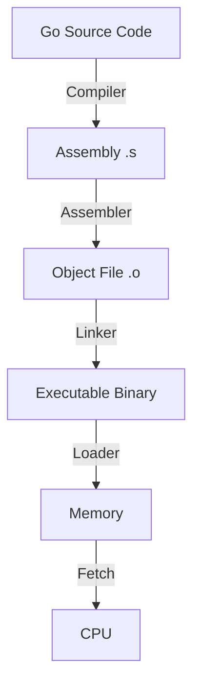

---
---

## Summary
**Instructions** are the fundamental commands a CPU understands (Machine Code). **Programs** are sequences of these instructions. High-level languages (like Go) are compiled into **Assembly** (human-readable instructions) and then assembled into **Machine Code** (binary).

## Detailed Explanation
### Instruction Set Architecture (ISA)
The "vocabulary" of the CPU.
*   **CISC (Complex Instruction Set Computer)**: x86/x64 (Intel, AMD). Many complex instructions (e.g., "Load from memory, add, and store" in one command).
*   **RISC (Reduced Instruction Set Computer)**: ARM (Apple M1, Mobile). Fewer, simpler instructions. Requires more lines of code but runs efficiently.

### Anatomy of an Instruction
Typically consists of:
1.  **Opcode**: What to do (ADD, MOV, JMP).
2.  **Operands**: What to do it *on* (Register A, Memory Address 0x1234, Value 5).

### Go Context
You can view the Assembly code Go generates using `go tool compile -S`.

```bash
# Command to see assembly
go tool compile -S main.go
```

Go Assembly is a "pseudo-assembly" based on the Plan 9 assembler. It abstracts slightly over specific hardware details.
*   `MOVQ`: Move Quad-word (64-bit value).
*   `ADDQ`: Add Quad-word.
*   `SP`: Stack Pointer (Virtual).

## Interview Questions
**Q: What is the difference between Machine Code and Assembly?**
A: **Machine Code** is binary (1s and 0s) that the CPU executes directly. **Assembly** is a human-readable text representation of that binary (e.g., `MOV AX, 1`). They map 1:1.

**Q: Does Go compile to C?**
A: No. The standard Go compiler (`gc`) compiles Go source code directly into Machine Code (Assembly), linking it with the Go Runtime. It does not transpile to C first.

**Q: What is an Opcode?**
A: The part of the machine instruction that specifies the operation to be performed (e.g., "Add", "Jump").

## Diagram

