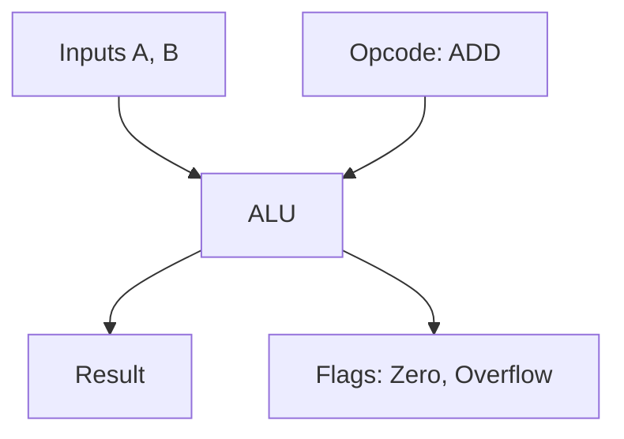

---
---

## Summary
Computers calculate using the **ALU (Arithmetic Logic Unit)**, a digital circuit inside the CPU. All data is represented in **Binary** (0s and 1s). It handles integer arithmetic (using adders) and logic operations (AND, OR, XOR). Floating-point math is handled by a specialized FPU using **IEEE 754** standard.

## Detailed Explanation
### Binary Arithmetic
*   **Adder Circuits**: Using logic gates (XOR, AND) to add bits. Half-Adder (2 bits) -> Full-Adder (2 bits + carry).
*   **Subtraction**: Computers don't subtract. They add negative numbers.
*   **Two's Complement**: The standard way to represent negative integers. To get `-X`:
    1.  Invert bits of `X` (NOT).
    2.  Add 1.
    *   *Example*: `001` (1) -> `110` -> `111` (-1). This allows the same Adder circuit to handle positive and negative numbers.

### Floating Point (IEEE 754)
Representing decimals ($3.14$) is complex.
*   **Structure**: Sign Bit | Exponent | Mantissa (Fraction).
*   **Issue**: Precision errors (e.g., `0.1 + 0.2 != 0.3` in binary).

### Go Context
*   **Integers**: `int`, `int8`, `uint64`. Go uses Two's Complement.
*   **Floats**: `float32`, `float64` (IEEE 754).
*   **Bitwise Ops**: Go supports `&` (AND), `|` (OR), `^` (XOR), `<<` (Left Shift).

```go
package main

import "fmt"

func main() {
	// Bitwise operations
	a := 10 // 1010
	b := 3  // 0011
	
	fmt.Printf("AND: %b\n", a & b) // 0010 (2)
	fmt.Printf("OR:  %b\n", a | b) // 1011 (11)
	
	// Floating point precision check
	var x float64 = 0.1
	var y float64 = 0.2
	fmt.Println(x + y == 0.3) // False! Prints 0.30000000000000004
}
```

## Interview Questions
**Q: Why does 0.1 + 0.2 not equal 0.3 in programming?**
A: Because 0.1 and 0.2 cannot be exactly represented in binary floating-point (they are repeating fractions in base-2), just like 1/3 is 0.333... in base-10. The tiny errors accumulate.

**Q: What is Two's Complement?**
A: It is a mathematical operation to represent negative numbers in binary. It allows the CPU to perform subtraction using standard addition circuits.

**Q: What is an Overflow?**
A: When the result of a calculation exceeds the maximum value a register can hold (e.g., adding 1 to an 8-bit value of 255 wraps around to 0).

## Diagram

