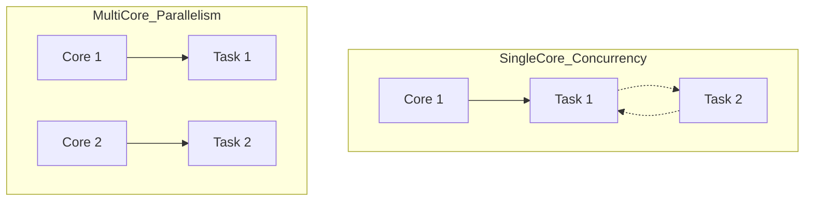

---
---

## Summary
**Concurrency** is the composition of independently executing processes (dealing with lots of things at once). **Parallelism** is the simultaneous execution of computations (doing lots of things at once). On a multi-core processor, parallel execution is possible.

## Detailed Explanation
### Concurrency vs Parallelism
*   **Concurrency**: Structure. Breaking a program into independent tasks (e.g., handling HTTP requests). Works on a single core (via context switching).
*   **Parallelism**: Execution. Running tasks on multiple cores at the exact same nanosecond.
*   *Rob Pike*: "Concurrency is about dealing with lots of things at once. Parallelism is about doing lots of things at once."

### Amdahl's Law
A formula to predict the theoretical speedup from parallelism.
$$ S(N) = \frac{1}{(1-P) + \frac{P}{N}} $$
*   $P$: Proportion of code that *can* be parallelized.
*   $N$: Number of processors.
*   **Takeaway**: If 5% of your code is sequential (locks, I/O), you can never be more than 20x faster, no matter how many cores you add.

### Race Conditions
Occur when multiple threads/processes access shared data concurrently, and at least one access is a write. The outcome depends on the non-deterministic ordering of execution.

### Go Context
Go makes concurrency easy with **Goroutines** (lightweight threads). The Go Runtime scheduler automatically multiplexes Goroutines onto OS threads (M:N scheduling) to utilize multiple cores.

```go
package main

import (
	"fmt"
	"runtime"
	"sync"
)

func main() {
	// Utilize all CPU cores
	runtime.GOMAXPROCS(runtime.NumCPU())

	var wg sync.WaitGroup
	wg.Add(2)

	// Goroutine 1
	go func() {
		defer wg.Done()
		fmt.Println("Task A running")
	}()

	// Goroutine 2
	go func() {
		defer wg.Done()
		fmt.Println("Task B running")
	}()

	wg.Wait()
}
```

## Interview Questions
**Q: Does adding more cores always make a program faster?**
A: No. Amdahl's Law dictates that the speedup is limited by the sequential part of the program (locks, I/O synchronization). Also, overhead from context switching and cache coherency can degrade performance.

**Q: Explain the difference between Concurrency and Parallelism.**
A: Concurrency is about *structure* (designing a system to handle multiple tasks). Parallelism is about *execution* (hardware actually running tasks simultaneously). You can have concurrency without parallelism (single core), but parallelism requires concurrency.

**Q: What is a Data Race?**
A: When two threads access the same memory location concurrently, at least one is a write, and there is no synchronization (like a Lock) between them.

## Diagram

