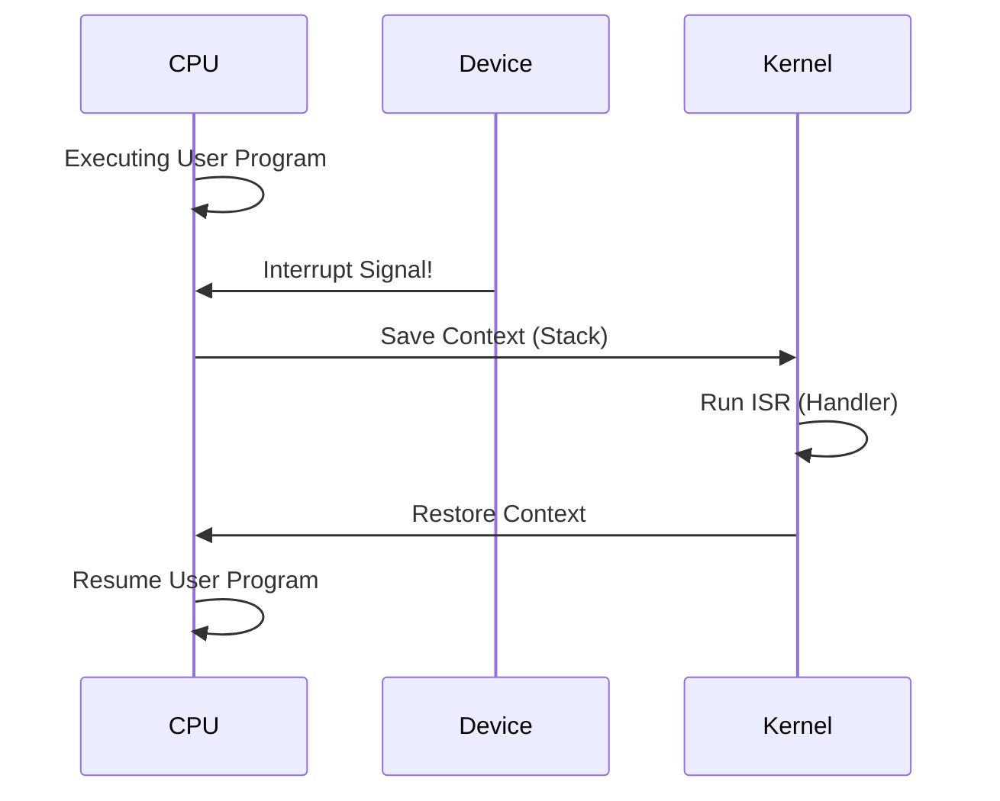

---
---

## Summary
**CPU Interrupts** are signals sent to the processor that stop the current execution flow to handle a high-priority event. They allow the CPU to respond to external events (Hardware) or internal errors (Software) without constantly polling devices.

## Detailed Explanation
### Types of Interrupts
1.  **Hardware Interrupts (Asynchronous)**: Generated by external devices.
    *   *Examples*: Keyboard press, Mouse move, Network packet arrived, Disk I/O complete.
2.  **Software Interrupts (Synchronous)**: Generated by the running program.
    *   **Traps**: Intentional calls to OS (System Calls).
    *   **Exceptions**: Errors (Divide by Zero, Page Fault, Illegal Instruction).

### The Interrupt Cycle
1.  CPU finishes current instruction.
2.  CPU checks Interrupt Line. If signal exists:
3.  **Context Save**: Save PC and Registers to Stack.
4.  **ISR Lookup**: Use Interrupt Vector Table to find the address of the **Interrupt Service Routine (ISR)**.
5.  **Execute ISR**: Run the handler code (Kernel Mode).
6.  **Context Restore**: Restore Registers and PC.
7.  **Resume**: Continue original program.

### Go Context
While Go code runs in User Mode and doesn't handle hardware interrupts directly, the **Go Preemptive Scheduler** relies on signals (software interrupts) to pause Goroutines that have been running too long (preventing loops from blocking the GC).

## Interview Questions
**Q: Difference between Polling and Interrupts?**
A: **Polling**: The CPU constantly checks "Are you ready?" (wastes CPU cycles). **Interrupts**: The device notifies the CPU "I am ready!" (CPU can do other work meanwhile).

**Q: What happens during a Context Switch?**
A: The state of the currently running process (Program Counter, Stack Pointer, General Registers) is saved to memory (Process Control Block), and the state of the next process is loaded. This is expensive (cache invalidation).

**Q: What is an ISR?**
A: Interrupt Service Routine. A special, small function in the OS kernel designed to handle a specific type of interrupt quickly.

## Diagram

