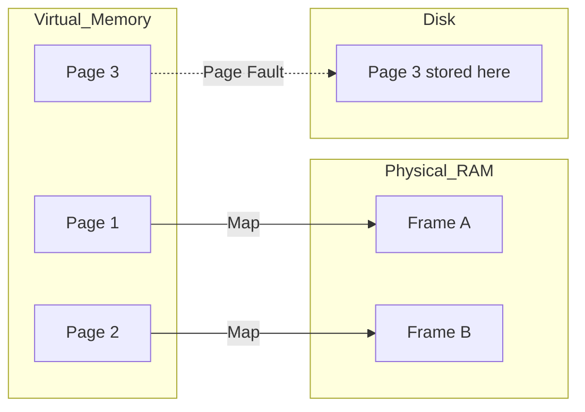

---
---

## Summary
**Memory Management** is the function of the OS that manages primary memory (RAM). It keeps track of each byte, allocates memory to processes, and handles swapping between RAM and Disk. Key concepts include **Virtual Memory**, **Paging**, and **Segmentation**.

## Detailed Explanation
### Virtual Memory
Processes do not access physical RAM directly. They see a contiguous "Virtual Address Space". The **MMU (Memory Management Unit)** hardware translates Virtual Addresses to Physical Addresses.
*   **Benefit**: Isolation (Process A cannot read Process B), Security, ability to use more memory than physically available (Swap).

### Paging
Memory is divided into fixed-size blocks called **Pages** (e.g., 4KB).
*   **Page Table**: Maps Virtual Pages to Physical Frames.
*   **Page Fault**: When a process accesses a page not currently in RAM. The OS must fetch it from disk (Swap).

### Stack vs Heap (OS Level)
*   **Stack**: Grows automatically (usually downwards). Stores function frames. Fast.
*   **Heap**: Managed manually (C/C++) or by GC (Go/Java). Grows upwards. Stores dynamic objects.

### Go Context
Go has a specialized memory allocator based on **TCMalloc** (Thread-Caching Malloc).
*   It allocates memory in "Spans" (groups of pages).
*   Each P (Processor) has a local cache (`mcache`) for tiny objects (no locks needed!).
*   **Garbage Collection**: Go uses a Concurrent Mark-Sweep GC to clean up the Heap.

## Interview Questions
**Q: What is a Memory Leak?**
A: When a program allocates memory on the Heap but fails to free it (or remove references to it in GC languages), causing memory usage to grow indefinitely until the OS kills the process (OOM).

**Q: Difference between Stack and Heap allocation?**
A: Stack allocation is just moving a pointer (instant). Heap allocation involves searching for a free block of the right size (slower) and eventual garbage collection.

**Q: What is Thrashing?**
A: When the system spends more time swapping pages in and out of disk than executing instructions. Caused by overcommitting memory.

## Diagram

