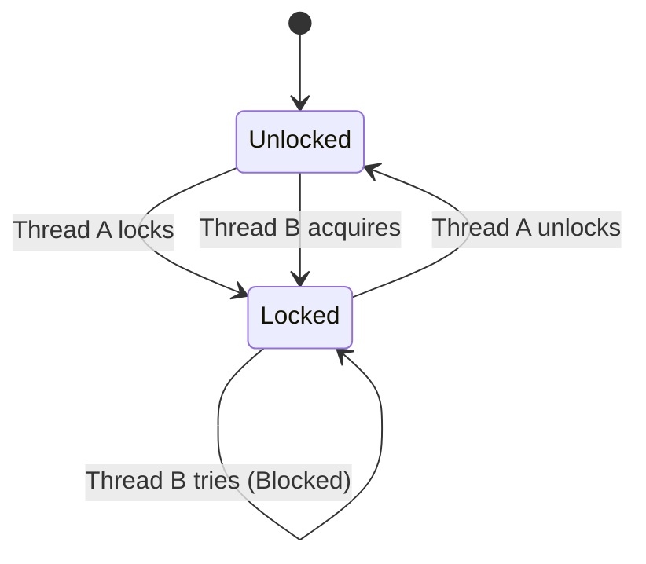

---
---

## Summary
**Locks**, **Mutexes**, and **Semaphores** are synchronization primitives used to control access to shared resources in a concurrent environment. They prevent **Race Conditions** by ensuring mutual exclusion or coordinating thread execution.

## Detailed Explanation
### Mutex (Mutual Exclusion)
*   **Concept**: A "key" to a room. Only one thread can hold the key at a time.
*   **Ownership**: The thread that locks it *must* unlock it.
*   **Go**: `sync.Mutex`.

### Semaphore
*   **Concept**: A "bouncer" with a counter. Allows $N$ threads to enter.
*   **Binary Semaphore**: Counter = 1. Similar to Mutex but no ownership (Thread A can wait, Thread B can signal).
*   **Counting Semaphore**: Counter = N. Used for resource pools (e.g., Database connection pool).
*   **Go**: Buffered Channels (`make(chan struct{}, N)`).

### Deadlock
A situation where two or more threads are blocked forever, waiting for each other.
*   **Conditions**: Mutual Exclusion, Hold and Wait, No Preemption, Circular Wait.

### Go Context
Go prefers **Channels** for communication ("Do not communicate by sharing memory; instead, share memory by communicating"), but `sync.Mutex` is standard for protecting shared state like maps or counters.

```go
package main

import (
	"fmt"
	"sync"
)

type SafeCounter struct {
	mu    sync.Mutex
	value int
}

func (c *SafeCounter) Inc() {
	c.mu.Lock()
	defer c.mu.Unlock() // Ensure unlock happens
	c.value++
}

func main() {
	c := SafeCounter{}
	var wg sync.WaitGroup
	
	for i := 0; i < 1000; i++ {
		wg.Add(1)
		go func() {
			defer wg.Done()
			c.Inc()
		}()
	}
	
	wg.Wait()
	fmt.Println("Count:", c.value)
}
```

## Interview Questions
**Q: Mutex vs Semaphore?**
A: Use a Mutex for **Mutual Exclusion** (protecting a variable). Use a Semaphore for **Signaling** (waiting for an event) or **Throttling** (limiting concurrency to N).

**Q: What is a Spinlock?**
A: A lock where the thread simply waits in a loop ("spins") repeatedly checking if the lock is available. Efficient for very short waits (avoids context switch overhead), wasteful for long waits.

**Q: What is a Reader-Writer Lock (`sync.RWMutex`)?**
A: Allows multiple readers to access the resource simultaneously (Shared Lock), but requires exclusive access for writers. Great for "Read-Many, Write-Rarely" scenarios.

## Diagram

