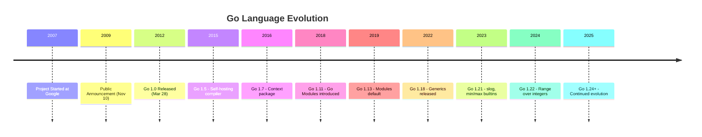

#Golang
---
---

## Summary

Go was created at Google in 2007 by Robert Griesemer, Rob Pike, and Ken Thompson to address frustrations with existing languages when building large-scale distributed systems. Publicly announced in November 2009 and reaching version 1.0 in March 2012, Go has evolved through consistent releases while maintaining backward compatibility, with major milestones including modules (1.11) and generics (1.18).

## Detailed Explanation

### **Origins at Google (2007-2009)**

Go was conceived in September 2007 at Google by three distinguished engineers:

- **Robert Griesemer**: Worked on the V8 JavaScript engine and Java HotSpot VM
- **Rob Pike**: Co-created UTF-8, Plan 9 OS, and the Limbo programming language
- **Ken Thompson**: Co-creator of Unix, B programming language, and UTF-8

#### The Problem They Solved

Google engineers faced daily frustrations:

```
Problem: C++ builds taking 45+ minutes
Problem: Python too slow for production systems
Problem: Java too verbose, complex deployment
Problem: No modern language designed for multicore/networked systems
```

> "We were waiting for a C++ build one day when we started talking about how we could do better."
> — Rob Pike

### **Design Goals**

The creators wanted a language that combined:

1. **C's efficiency** and static typing
2. **Python's readability** and ease of use
3. **Modern features** for concurrent, networked systems

```go
// Result: Clean syntax, fast compilation, built-in concurrency
package main

import "fmt"

func main() {
    // Simple, readable, efficient
    go func() {
        fmt.Println("Concurrent by design")
    }()
}
```

### **Timeline of Major Releases**



### **Key Milestones Explained**

#### Go 1.0 (March 2012) - The Stability Promise

Go 1.0 introduced the compatibility guarantee: code written for Go 1.0 will compile and run on all future Go 1.x versions.

```go
// This Go 1.0 code still works in Go 1.24
package main

import "fmt"

func main() {
    fmt.Println("Backward compatible since 2012")
}
```

#### Go 1.5 (August 2015) - Self-Hosting

The compiler was rewritten from C to Go, making Go fully self-hosting:

```bash
# Before 1.5: C compiler needed
# After 1.5: Only Go needed to build Go
```

#### Go 1.11 (August 2018) - Modules Revolution

Introduced Go Modules, replacing GOPATH-based dependency management:

```bash
# Old way (GOPATH)
export GOPATH=$HOME/go
# Code must live in $GOPATH/src/github.com/user/project

# New way (Modules)
go mod init github.com/user/project
# Work from any directory
```

```go
// go.mod
module github.com/user/project

go 1.21

require github.com/gin-gonic/gin v1.9.1
```

#### Go 1.18 (March 2022) - Generics

After years of debate, Go added type parameters (generics):

```go
// Before Go 1.18: Separate function for each type
func MaxInt(a, b int) int { if a > b { return a }; return b }
func MaxFloat(a, b float64) float64 { if a > b { return a }; return b }

// Go 1.18+: Generic function
func Max[T comparable](a, b T) T {
    if a > b {
        return a
    }
    return b
}

// Usage
fmt.Println(Max(1, 2))       // Works with int
fmt.Println(Max(1.5, 2.5))   // Works with float64
fmt.Println(Max("a", "b"))   // Works with string
```

#### Go 1.21 (August 2023) - Modern Ergonomics

Added structured logging (`slog`) and built-in functions:

```go
package main

import (
    "log/slog"
)

func main() {
    // New structured logging
    slog.Info("user login",
        "user_id", 123,
        "ip", "192.168.1.1",
    )

    // New builtins
    minimum := min(1, 2, 3)  // 1
    maximum := max(1, 2, 3)  // 3
}
```

### **Version Numbering**

Go uses semantic versioning with a twist:

| Version | Meaning |
| --- | --- |
| Go 1.X | Major feature release (twice yearly, Feb & Aug) |
| Go 1.X.Y | Patch release (bug fixes, security) |

```bash
# Check your Go version
go version
# go version go1.24.0 linux/amd64
```

### **The Gopher Mascot**

The Go gopher was designed by Renée French (wife of Rob Pike). It has become one of the most recognizable mascots in programming.

## Interview Questions

**Q: Who created Go and why?**
**A:** Go was created by Robert Griesemer, Rob Pike, and Ken Thompson at Google in 2007. They were frustrated with long C++ compilation times and the complexity of existing languages for building distributed systems. Go was designed to combine C's efficiency with Python's readability while adding modern concurrency primitives.

**Q: What is Go's compatibility guarantee?**
**A:** The Go 1 compatibility promise guarantees that code written for Go 1.0 will continue to compile and run correctly on all future Go 1.x releases. This has held true since March 2012, providing exceptional stability for production code.

**Q: What were the major changes in Go 1.18?**
**A:** Go 1.18 introduced type parameters (generics), fuzzing support in the standard testing package, and workspace mode. Generics were the most anticipated feature, allowing functions and types to work with multiple types without code duplication.

**Q: How did Go Modules change dependency management?**
**A:** Before Go 1.11, code had to live in a specific GOPATH directory structure. Go Modules (introduced in 1.11, default in 1.13) allow projects to exist anywhere, with dependencies tracked in `go.mod` and checksums in `go.sum`, enabling reproducible builds and semantic versioning.
