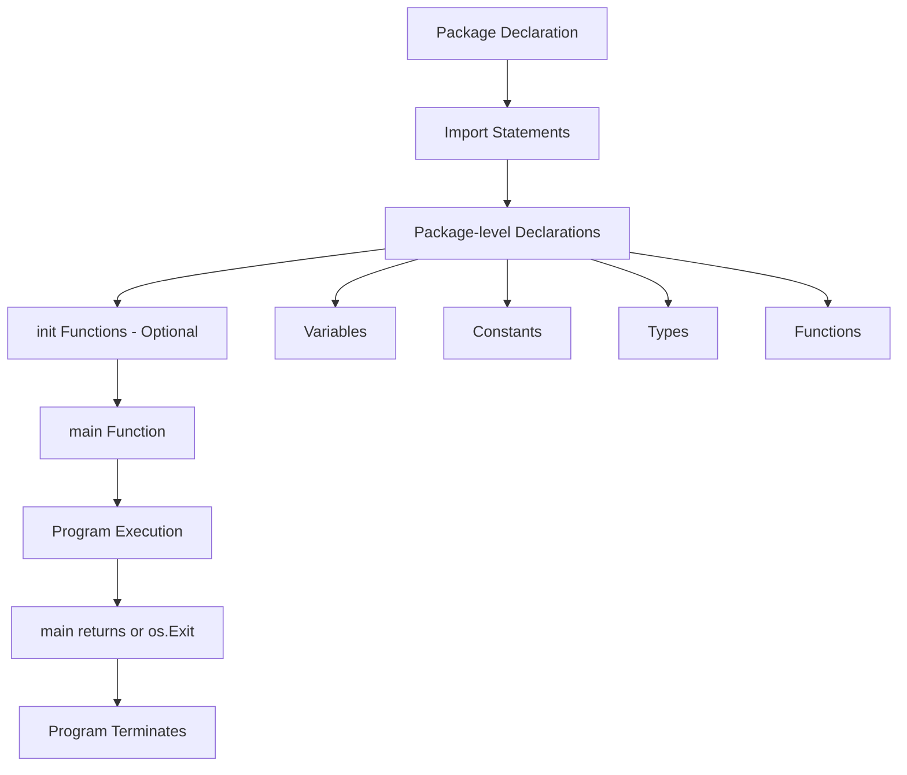

#Golang
---
---

## Summary

The "Hello, World!" program in Go introduces the fundamental structure of every Go application: package declaration, imports, and the `main` function. Go programs start execution from the `main` function in `package main`, using the standard library's `fmt` package for output. This simple program demonstrates Go's clean syntax, implicit semicolons, and the `go run` command for quick execution.

## Detailed Explanation

### **The Minimal Go Program**

```go
package main

import "fmt"

func main() {
    fmt.Println("Hello, World!")
}
```

Run it:

```bash
go run main.go
# Output: Hello, World!
```

### **Anatomy of a Go Program**

```go
package main          // 1. Package declaration

import "fmt"          // 2. Import statement

func main() {         // 3. Main function
    fmt.Println("Hello, World!")  // 4. Function call
}
```

#### 1. Package Declaration

Every Go file starts with a package declaration:

```go
package main  // Executable program
package utils // Importable library
```

- `package main` is special: it defines an executable program
- The compiler looks for `func main()` in `package main` as the entry point
- Library packages use any other name

#### 2. Import Statement

```go
// Single import
import "fmt"

// Multiple imports (parenthesized)
import (
    "fmt"
    "os"
    "strings"
)

// Aliased import
import (
    f "fmt"                    // Use as f.Println()
    _ "database/sql"           // Import for side effects only
    . "math"                   // Import into current namespace (avoid)
)
```

#### 3. The main Function

```go
func main() {
    // Entry point - no arguments, no return value
    // Program exits when main() returns
}
```

Key points:
- **No arguments**: Use `os.Args` for command-line arguments
- **No return value**: Use `os.Exit(code)` for exit codes
- **Automatic exit**: Program terminates when `main()` returns

```go
package main

import (
    "fmt"
    "os"
)

func main() {
    if len(os.Args) < 2 {
        fmt.Println("Usage: greet <name>")
        os.Exit(1)
    }
    fmt.Printf("Hello, %s!\n", os.Args[1])
}
```

#### 4. The fmt Package

The `fmt` package provides formatted I/O functions:

```go
package main

import "fmt"

func main() {
    name := "Gopher"
    age := 10

    // Print functions
    fmt.Print("No newline")
    fmt.Println("With newline")
    fmt.Printf("Formatted: %s is %d years old\n", name, age)

    // Sprint functions (return string)
    s := fmt.Sprintf("%s is %d", name, age)

    // Fprint functions (write to io.Writer)
    fmt.Fprintln(os.Stdout, "To stdout")
    fmt.Fprintln(os.Stderr, "To stderr")
}
```

### **Building and Running**

#### Quick Run (Development)

```bash
# Compile and run in one step (temporary binary)
go run main.go

# Run multiple files
go run main.go utils.go

# Run all files in directory
go run .
```

#### Build Binary (Production)

```bash
# Build executable
go build -o myapp main.go

# Run the binary
./myapp

# Build with optimizations
go build -ldflags="-s -w" -o myapp main.go
```

### **Go Syntax Essentials**

#### No Semicolons (Usually)

Go uses implicit semicolons. The lexer inserts them after certain tokens:

```go
// These are equivalent
fmt.Println("hello")
fmt.Println("hello");  // Semicolon optional

// BUT: Opening brace must be on same line
func main() {  // ✓ Correct
}

func main()    // ✗ Wrong: semicolon inserted after )
{
}
```

#### Case Sensitivity for Visibility

```go
package mypackage

var PublicVar = "exported"   // Uppercase = public (exported)
var privateVar = "internal"  // Lowercase = private (unexported)

func PublicFunc() {}   // Accessible from other packages
func privateFunc() {}  // Only accessible within this package
```

### **Expanded Hello World Examples**

#### With User Input

```go
package main

import (
    "bufio"
    "fmt"
    "os"
    "strings"
)

func main() {
    reader := bufio.NewReader(os.Stdin)
    fmt.Print("Enter your name: ")
    
    name, _ := reader.ReadString('\n')
    name = strings.TrimSpace(name)
    
    fmt.Printf("Hello, %s!\n", name)
}
```

#### With Error Handling

```go
package main

import (
    "fmt"
    "os"
)

func main() {
    if len(os.Args) < 2 {
        fmt.Fprintln(os.Stderr, "Error: name required")
        os.Exit(1)
    }

    name := os.Args[1]
    if _, err := fmt.Printf("Hello, %s!\n", name); err != nil {
        fmt.Fprintln(os.Stderr, "Error writing output:", err)
        os.Exit(1)
    }
}
```

#### With Multiple Files

```go
// main.go
package main

func main() {
    greet("World")
}

// greet.go (same directory, same package)
package main

import "fmt"

func greet(name string) {
    fmt.Printf("Hello, %s!\n", name)
}
```

```bash
go run main.go greet.go
# Or simply:
go run .
```

### **Program Structure Diagram**



### **The init Function**

Go supports special `init()` functions that run before `main()`:

```go
package main

import "fmt"

var message string

func init() {
    // Runs before main()
    message = "initialized"
    fmt.Println("init() called")
}

func main() {
    fmt.Println("main() called")
    fmt.Println(message)
}

// Output:
// init() called
// main() called
// initialized
```

- Multiple `init()` functions can exist (per file or package)
- Execution order: package-level variables → init() → main()

## Interview Questions

**Q: What is the significance of `package main` in Go?**
**A:** `package main` is a special package name that tells the Go compiler this is an executable program, not a library. The compiler looks for a `func main()` in this package as the program's entry point. Without `package main`, you cannot create a runnable binary.

**Q: Why doesn't Go require semicolons at the end of statements?**
**A:** Go's lexer automatically inserts semicolons after certain tokens (identifiers, literals, closing brackets). This is why the opening brace `{` must be on the same line as `func` or `if`—otherwise a semicolon is inserted, causing a syntax error.

**Q: What is the difference between `go run` and `go build`?**
**A:** `go run` compiles the code to a temporary binary and immediately executes it—ideal for development. `go build` creates a permanent executable binary that can be distributed and run without the Go toolchain. For production deployment, always use `go build`.

**Q: How do you handle command-line arguments in Go?**
**A:** Use `os.Args`, a slice where `os.Args[0]` is the program name and subsequent elements are arguments. For complex argument parsing, use the standard library's `flag` package or third-party libraries like `cobra` or `urfave/cli`.
