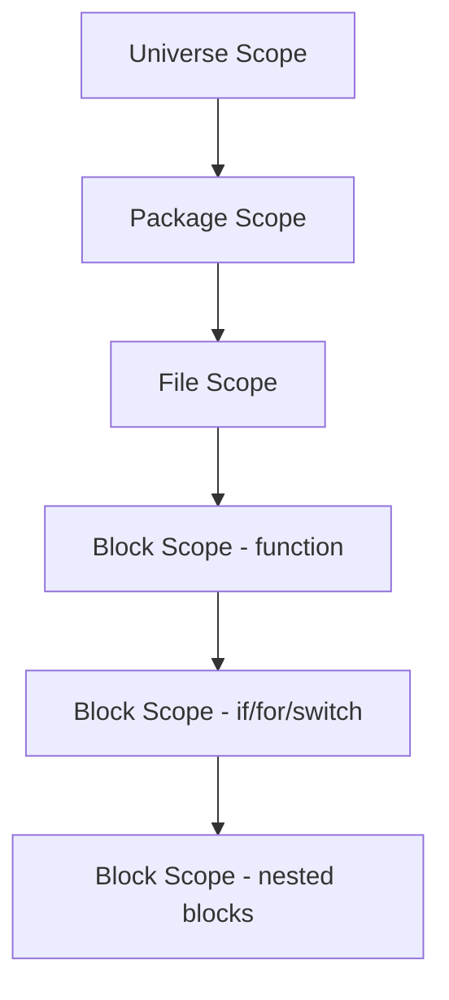

#Golang
---
---

## Summary

Variable scope in Go determines where a variable is accessible in code. Go uses lexical (block) scoping with four levels: universe, package, file, and block scope. Shadowing occurs when an inner scope declares a variable with the same name as an outer scope, hiding the outer variable. Understanding scope and shadowing is crucial for avoiding subtle bugs.

## Detailed Explanation

### **Scope Levels in Go**



#### 1. Universe Scope (Predeclared)

Built-in identifiers available everywhere:

```go
// Predeclared types
bool, int, float64, string, error, ...

// Predeclared constants
true, false, nil, iota

// Predeclared functions
len, cap, make, new, append, copy, delete, panic, recover, ...
```

#### 2. Package Scope

Variables declared outside functions, visible throughout the package:

```go
package main

// Package-level: visible in all files of this package
var GlobalConfig = "default"
const MaxRetries = 3

func main() {
    fmt.Println(GlobalConfig)  // Accessible
}

func helper() {
    fmt.Println(GlobalConfig)  // Also accessible
}
```

#### 3. File Scope

Only for imports; each file has its own import namespace:

```go
// file1.go
package main
import "fmt"  // fmt only available in file1.go

// file2.go
package main
import f "fmt"  // Different alias, only in file2.go
```

#### 4. Block Scope

Variables declared in `{ }` are only visible within that block:

```go
func main() {
    x := 10  // Function block scope
    
    if true {
        y := 20  // if-block scope
        fmt.Println(x)  // ✓ x visible
        fmt.Println(y)  // ✓ y visible
    }
    
    fmt.Println(x)  // ✓ x visible
    // fmt.Println(y)  // ✗ Error: y not visible
}
```

### **Block Scope Examples**

#### if/else Blocks

```go
func process(n int) string {
    // x is only visible inside if/else
    if x := compute(n); x > 10 {
        return fmt.Sprintf("big: %d", x)
    } else {
        return fmt.Sprintf("small: %d", x)  // x visible in else too
    }
    
    // fmt.Println(x)  // Error: x not declared
}
```

#### for Loops

```go
func main() {
    // i only visible inside for
    for i := 0; i < 5; i++ {
        fmt.Println(i)
    }
    // fmt.Println(i)  // Error: i not declared
    
    // Range variable scope
    nums := []int{1, 2, 3}
    for idx, val := range nums {
        fmt.Println(idx, val)
    }
    // fmt.Println(idx, val)  // Error: not declared
}
```

#### switch Statements

```go
func typeSwitch(x interface{}) {
    switch v := x.(type) {  // v scoped to switch
    case int:
        fmt.Println("int:", v*2)
    case string:
        fmt.Println("string:", v+"!")
    }
    // fmt.Println(v)  // Error: v not declared
}
```

### **Variable Shadowing**

Shadowing occurs when an inner scope declares a variable with the same name as an outer scope:

```go
func main() {
    x := 10
    fmt.Println("outer x:", x)  // 10
    
    {
        x := 20  // Shadows outer x
        fmt.Println("inner x:", x)  // 20
    }
    
    fmt.Println("outer x:", x)  // Still 10!
}
```

### **Common Shadowing Scenarios**

#### Shadowing with :=

```go
func danger() {
    err := errors.New("initial error")
    
    if true {
        // BUG: This shadows err, doesn't update it!
        result, err := doSomething()
        if err != nil {
            fmt.Println("inner error:", err)
        }
        _ = result
    }
    
    // err is still "initial error"
    fmt.Println("outer error:", err)
}

// Fix: Use = instead of :=
func safe() {
    var err error
    var result string
    
    if true {
        result, err = doSomething()  // = updates outer err
        if err != nil {
            return
        }
    }
    
    fmt.Println(result, err)
}
```

#### Shadowing Named Returns

```go
// BUG: Shadowed named return
func divide(a, b float64) (result float64, err error) {
    if b == 0 {
        err := errors.New("division by zero")  // Shadows!
        return 0, err  // Returns shadowed err
    }
    result = a / b  // Modifies named return
    return  // Returns named values
}

// Fix: Use = or explicit return
func divideFixed(a, b float64) (result float64, err error) {
    if b == 0 {
        err = errors.New("division by zero")  // Updates named return
        return
    }
    result = a / b
    return
}
```

#### Shadowing Package Names

```go
import "fmt"

func bad() {
    fmt := "oops"  // Shadows fmt package!
    // fmt.Println()  // Error: fmt is string, not package
    _ = fmt
}

// Fix: Use different variable name
func good() {
    fmtStr := "better"
    fmt.Println(fmtStr)
}
```

#### Shadowing Built-ins

```go
func dangerous() {
    // Shadowing predeclared identifiers - legal but BAD
    true := false  // Shadows true!
    len := 5       // Shadows len()!
    nil := "oops"  // Shadows nil!
    
    // Now you can't use the built-ins
    // if true {  // Uses the variable, not constant
    // len(slice)  // Error: len is int, not function
}
```

### **Detecting Shadowing**

Use the `shadow` linter (part of go vet and golangci-lint):

```bash
# Install shadow analyzer
go install golang.org/x/tools/go/analysis/passes/shadow/cmd/shadow@latest

# Run it
shadow ./...

# Or use golangci-lint
golangci-lint run --enable govet
```

Example output:

```
main.go:15:3: declaration of "err" shadows declaration at line 10
```

### **Scope Resolution Rules**

Go resolves identifiers from innermost to outermost scope:

```go
var x = "package"

func main() {
    fmt.Println(x)  // "package"
    
    x := "function"
    fmt.Println(x)  // "function"
    
    {
        x := "block"
        fmt.Println(x)  // "block"
    }
    
    fmt.Println(x)  // "function"
}
```

### **Best Practices**

```go
// ✓ Good: Minimal scope for variables
func process(items []string) {
    for _, item := range items {
        result := transform(item)  // Scoped to loop
        save(result)
    }
}

// ✓ Good: Declare at point of use
func readFile(path string) ([]byte, error) {
    file, err := os.Open(path)  // Declared where needed
    if err != nil {
        return nil, err
    }
    defer file.Close()
    return io.ReadAll(file)
}

// ✓ Good: Use different names to avoid shadows
func fetchData() error {
    initialErr := validate()
    
    if initialErr != nil {
        log.Warn("validation failed:", initialErr)
    }
    
    data, fetchErr := fetch()  // Different name
    if fetchErr != nil {
        return fetchErr
    }
    
    return process(data)
}

// ✗ Bad: Accidental shadowing
func bad() error {
    err := step1()
    if err != nil {
        return err
    }
    
    if result, err := step2(); err != nil {  // Shadows outer err
        return err  // Works, but confusing
    }
    
    return nil
}
```

### **Short Variable Declarations and Scope**

```go
func main() {
    // := creates new variable in current scope
    x := 1
    
    {
        x := 2      // New x in inner scope (shadows)
        x = 3       // Modifies inner x
        fmt.Println(x)  // 3
    }
    
    fmt.Println(x)  // 1 (outer x unchanged)
    
    // To modify outer variable, use =
    {
        x = 4       // Modifies outer x
    }
    
    fmt.Println(x)  // 4
}
```

## Interview Questions

**Q: What is variable shadowing in Go?**
**A:** Variable shadowing occurs when a variable declared in an inner scope has the same name as a variable in an outer scope. The inner variable "shadows" the outer one, making it inaccessible within that scope. This can cause subtle bugs when you intend to modify the outer variable but accidentally create a new one.

**Q: What are the different scope levels in Go?**
**A:** Go has four scope levels: (1) Universe scope for predeclared identifiers (true, nil, len, etc.), (2) Package scope for top-level declarations visible throughout the package, (3) File scope for imports only, and (4) Block scope for variables declared within `{ }` blocks (functions, if, for, switch).

**Q: How can you accidentally shadow the `err` variable in Go?**
**A:** Using `:=` when you intend to update an existing `err` creates a new shadowed variable. Example: `if result, err := fn(); err != nil` creates a new `err` in the if-block scope, leaving the outer `err` unchanged. Use separate declaration or `=` to avoid this.

**Q: How do you detect variable shadowing?**
**A:** Use the `shadow` analyzer: `go install golang.org/x/tools/go/analysis/passes/shadow/cmd/shadow@latest` and run `shadow ./...`. Alternatively, use golangci-lint with the govet linter enabled, which includes shadow detection: `golangci-lint run --enable govet`.
