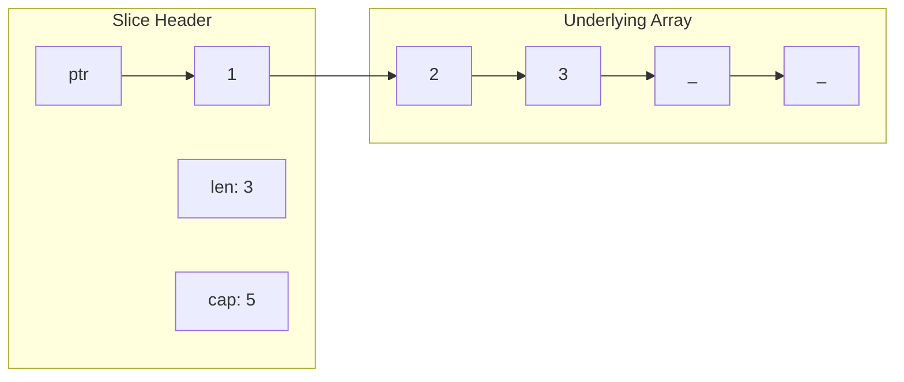

#Golang
---
---

## Summary

Slice capacity is the size of the underlying array from the slice's start position. When appending exceeds capacity, Go allocates a new, larger array and copies elements. Understanding this growth strategy is crucial for writing efficient Go code—pre-allocating capacity with `make` when the size is known avoids expensive reallocations during append operations.

## Detailed Explanation

### **Slice Internal Structure**

A slice is a descriptor with three components:

```go
// Conceptual slice header (runtime representation)
type slice struct {
    array unsafe.Pointer  // Pointer to underlying array
    len   int             // Current number of elements
    cap   int             // Capacity (max elements before reallocation)
}
```



### **Length vs Capacity**

```go
package main

import "fmt"

func main() {
    // Create slice with length 3, capacity 5
    s := make([]int, 3, 5)
    
    fmt.Println("Length:", len(s))    // 3
    fmt.Println("Capacity:", cap(s))  // 5
    fmt.Println("Slice:", s)          // [0 0 0]
    
    // Can append up to capacity without reallocation
    s = append(s, 4, 5)
    fmt.Println("After append:", s)   // [0 0 0 4 5]
    fmt.Println("Length:", len(s))    // 5
    fmt.Println("Capacity:", cap(s))  // 5 (still same)
    
    // Next append exceeds capacity - triggers reallocation
    s = append(s, 6)
    fmt.Println("After exceed:", s)   // [0 0 0 4 5 6]
    fmt.Println("Length:", len(s))    // 6
    fmt.Println("Capacity:", cap(s))  // 10 (doubled!)
}
```

### **Growth Strategy**

Go's slice growth algorithm (as of Go 1.18+):

```go
// Simplified growth logic
func growSlice(oldCap, needed int) int {
    newCap := oldCap
    doubleCap := oldCap + oldCap
    
    if needed > doubleCap {
        newCap = needed
    } else {
        const threshold = 256
        if oldCap < threshold {
            newCap = doubleCap  // Double for small slices
        } else {
            // Grow by 25% + threshold/4 for larger slices
            for newCap < needed {
                newCap += (newCap + 3*threshold) / 4
            }
        }
    }
    return newCap
}
```

Practical example:

```go
func main() {
    var s []int
    prevCap := 0
    
    for i := 0; i < 20; i++ {
        s = append(s, i)
        if cap(s) != prevCap {
            fmt.Printf("len=%2d cap=%2d (grew from %d)\n", len(s), cap(s), prevCap)
            prevCap = cap(s)
        }
    }
}

// Output:
// len= 1 cap= 1 (grew from 0)
// len= 2 cap= 2 (grew from 1)
// len= 3 cap= 4 (grew from 2)
// len= 5 cap= 8 (grew from 4)
// len= 9 cap=16 (grew from 8)
// len=17 cap=32 (grew from 16)
```

### **Cost of Reallocation**

```go
func appendWithoutPrealloc(n int) []int {
    var s []int
    for i := 0; i < n; i++ {
        s = append(s, i)  // Multiple reallocations
    }
    return s
}

func appendWithPrealloc(n int) []int {
    s := make([]int, 0, n)  // Pre-allocate capacity
    for i := 0; i < n; i++ {
        s = append(s, i)  // No reallocations
    }
    return s
}

// Benchmark shows pre-allocation is ~10x faster for large n
```

### **Slicing Affects Capacity**

```go
func main() {
    original := []int{0, 1, 2, 3, 4, 5, 6, 7, 8, 9}
    fmt.Printf("original: len=%d cap=%d\n", len(original), cap(original))
    // original: len=10 cap=10
    
    // Slice from index 2 to 5
    s1 := original[2:5]
    fmt.Printf("s1[2:5]: len=%d cap=%d %v\n", len(s1), cap(s1), s1)
    // s1[2:5]: len=3 cap=8 [2 3 4]
    // Capacity is 8 (from index 2 to end of underlying array)
    
    // Slice with explicit capacity (three-index slice)
    s2 := original[2:5:6]
    fmt.Printf("s2[2:5:6]: len=%d cap=%d %v\n", len(s2), cap(s2), s2)
    // s2[2:5:6]: len=3 cap=4 [2 3 4]
    // Capacity is 4 (from index 2 to 6)
}
```

### **Three-Index Slice for Capacity Control**

```go
// Syntax: slice[low:high:max]
// len = high - low
// cap = max - low

func main() {
    data := []int{0, 1, 2, 3, 4, 5, 6, 7, 8, 9}
    
    // Without max: shares underlying array
    s1 := data[2:5]
    s1 = append(s1, 100)  // Overwrites data[5]!
    fmt.Println(data)  // [0 1 2 3 4 100 6 7 8 9]
    
    // With max: limits capacity, forces new array on append
    data = []int{0, 1, 2, 3, 4, 5, 6, 7, 8, 9}
    s2 := data[2:5:5]  // cap = 5 - 2 = 3, same as len
    s2 = append(s2, 100)  // Creates new array
    fmt.Println(data)  // [0 1 2 3 4 5 6 7 8 9] (unchanged)
    fmt.Println(s2)    // [2 3 4 100]
}
```

### **Pre-allocation Best Practices**

```go
// ✓ Known size: Pre-allocate with exact capacity
func processItems(n int) []Result {
    results := make([]Result, 0, n)
    for i := 0; i < n; i++ {
        results = append(results, process(i))
    }
    return results
}

// ✓ Known size: Use length directly (no append needed)
func processItemsDirect(n int) []Result {
    results := make([]Result, n)  // len=n, cap=n
    for i := 0; i < n; i++ {
        results[i] = process(i)
    }
    return results
}

// ✓ Unknown size: Estimate if possible
func readLines(r io.Reader) []string {
    lines := make([]string, 0, 100)  // Estimate 100 lines
    scanner := bufio.NewScanner(r)
    for scanner.Scan() {
        lines = append(lines, scanner.Text())
    }
    return lines
}

// ✗ Avoid: Growing from nil when size is known
func bad(n int) []int {
    var s []int  // nil slice
    for i := 0; i < n; i++ {
        s = append(s, i)  // Multiple allocations
    }
    return s
}
```

### **Detecting Reallocation**

```go
func main() {
    s := make([]int, 0, 4)
    originalPtr := &s[0:1][0]  // Pointer to first element
    
    for i := 0; i < 10; i++ {
        s = append(s, i)
        currentPtr := &s[0]
        if currentPtr != originalPtr {
            fmt.Printf("Reallocation at len=%d, cap=%d\n", len(s), cap(s))
            originalPtr = currentPtr
        }
    }
}
// Output:
// Reallocation at len=5, cap=8
// Reallocation at len=9, cap=16
```

### **Memory Layout Visualization**

```go
func main() {
    s := make([]int, 3, 6)
    s[0], s[1], s[2] = 1, 2, 3
    
    // Memory: [1][2][3][_][_][_]
    //          ^        ^     ^
    //          |        |     |
    //         ptr    len=3  cap=6
    
    s = append(s, 4, 5)
    // Memory: [1][2][3][4][5][_]
    //          ^              ^
    //         ptr          cap=6
    
    s = append(s, 6, 7)  // Exceeds capacity!
    // New array allocated, elements copied
    // Memory: [1][2][3][4][5][6][7][_][_][_][_][_]
    //          ^                    ^
    //         ptr                cap=12
}
```

## Interview Questions

**Q: What is the difference between slice length and capacity?**
**A:** Length (`len`) is the number of elements currently in the slice. Capacity (`cap`) is the number of elements the underlying array can hold from the slice's start position. Length ≤ Capacity. When append exceeds capacity, a new larger array is allocated.

**Q: How does Go's slice growth strategy work?**
**A:** For small slices (< 256 elements), capacity doubles when exceeded. For larger slices, it grows by about 25% plus a threshold. This balances memory efficiency (large slices) with minimizing reallocations (small slices). The exact algorithm has evolved across Go versions.

**Q: Why should you pre-allocate slice capacity when the size is known?**
**A:** Pre-allocation with `make([]T, 0, n)` avoids reallocations during append. Each reallocation copies all elements to a new array—O(n) operation. Without pre-allocation, growing from 0 to n elements triggers O(log n) reallocations, making total complexity O(n log n) instead of O(n).

**Q: What is a three-index slice and when would you use it?**
**A:** Syntax `slice[low:high:max]` creates a slice with controlled capacity (`cap = max - low`). Use it to prevent appends from overwriting the original array's data by forcing a new allocation. This is important when passing sub-slices to functions that might append.
