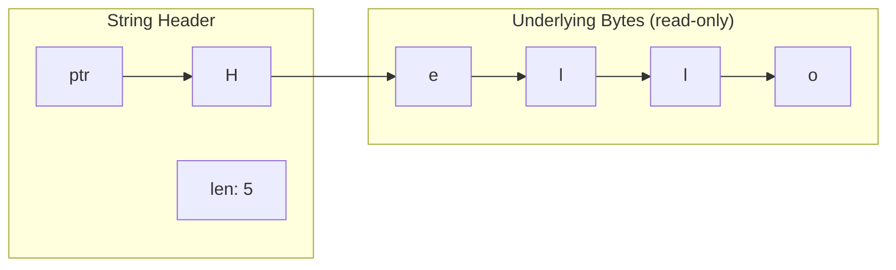

#Golang
---
---

## Summary

Strings in Go are immutable sequences of bytes, typically representing UTF-8 encoded text. Unlike slices, strings cannot be modified in place—any "modification" creates a new string. Strings are internally a read-only slice of bytes with a pointer and length (no capacity). Understanding string internals, the `strings` and `bytes` packages, and efficient string building with `strings.Builder` is essential for performant Go code.

## Detailed Explanation

### **String Internal Representation**

```go
// Conceptual string header (runtime representation)
type stringHeader struct {
    Data uintptr  // Pointer to underlying bytes
    Len  int      // Length in bytes (not runes!)
}
```



### **Immutability**

```go
func main() {
    s := "Hello"
    
    // Cannot modify individual bytes
    // s[0] = 'h'  // Error: cannot assign to s[0]
    
    // Must create new string
    s = "h" + s[1:]
    fmt.Println(s)  // "hello"
    
    // Or convert to []byte, modify, convert back
    b := []byte(s)
    b[0] = 'H'
    s = string(b)
    fmt.Println(s)  // "Hello"
}
```

### **String Length: Bytes vs Runes**

```go
import "unicode/utf8"

func main() {
    s := "Hello, 世界"
    
    // len() returns byte count
    fmt.Println(len(s))  // 13 (7 + 3 + 3)
    
    // RuneCountInString returns character count
    fmt.Println(utf8.RuneCountInString(s))  // 9
    
    // For ASCII-only, they're equal
    ascii := "Hello"
    fmt.Println(len(ascii))  // 5
    fmt.Println(utf8.RuneCountInString(ascii))  // 5
}
```

### **String Comparison**

```go
func main() {
    a := "apple"
    b := "banana"
    c := "apple"
    
    // Equality
    fmt.Println(a == c)  // true
    fmt.Println(a == b)  // false
    
    // Lexicographic ordering
    fmt.Println(a < b)   // true ("a" < "b")
    fmt.Println(b < a)   // false
    
    // Case-insensitive comparison
    import "strings"
    fmt.Println(strings.EqualFold("HELLO", "hello"))  // true
}
```

### **Substrings and Slicing**

```go
func main() {
    s := "Hello, World!"
    
    // Substring (slicing)
    sub := s[0:5]
    fmt.Println(sub)  // "Hello"
    
    // From start
    fmt.Println(s[:5])  // "Hello"
    
    // To end
    fmt.Println(s[7:])  // "World!"
    
    // Single byte (not rune!)
    fmt.Printf("%c\n", s[0])  // 'H'
    
    // Substrings share underlying data (efficient)
    // But are still immutable
}
```

### **String Concatenation**

```go
func main() {
    // Using + operator (creates new string each time)
    s := "Hello"
    s = s + ", " + "World"
    
    // Using fmt.Sprintf (convenient, slower)
    s = fmt.Sprintf("%s, %s!", "Hello", "World")
    
    // Using strings.Join (efficient for slices)
    parts := []string{"Hello", "World"}
    s = strings.Join(parts, ", ")
    
    // Using strings.Builder (most efficient for many operations)
    var builder strings.Builder
    builder.WriteString("Hello")
    builder.WriteString(", ")
    builder.WriteString("World")
    s = builder.String()
}
```

### **strings.Builder (Efficient Building)**

```go
import "strings"

func buildString(n int) string {
    var builder strings.Builder
    
    // Pre-allocate if size known
    builder.Grow(n * 10)  // Estimate: 10 chars per item
    
    for i := 0; i < n; i++ {
        builder.WriteString("item")
        builder.WriteByte('-')
        builder.WriteString(strconv.Itoa(i))
        builder.WriteByte('\n')
    }
    
    return builder.String()
}

// Benchmark comparison:
// + concatenation:   O(n²) - creates new string each time
// strings.Builder:   O(n) - grows buffer efficiently
```

### **Common strings Package Functions**

```go
import "strings"

func main() {
    s := "Hello, World!"
    
    // Searching
    strings.Contains(s, "World")     // true
    strings.HasPrefix(s, "Hello")    // true
    strings.HasSuffix(s, "!")        // true
    strings.Index(s, "o")            // 4 (first occurrence)
    strings.LastIndex(s, "o")        // 8
    strings.Count(s, "l")            // 3
    
    // Transforming
    strings.ToUpper(s)               // "HELLO, WORLD!"
    strings.ToLower(s)               // "hello, world!"
    strings.Title(s)                 // "Hello, World!" (deprecated)
    strings.TrimSpace("  hi  ")      // "hi"
    strings.Trim("!!hi!!", "!")      // "hi"
    strings.TrimPrefix("Hello", "He")  // "llo"
    strings.TrimSuffix("Hello", "lo")  // "Hel"
    
    // Splitting
    strings.Split("a,b,c", ",")      // ["a", "b", "c"]
    strings.SplitN("a,b,c", ",", 2)  // ["a", "b,c"]
    strings.Fields("a  b  c")        // ["a", "b", "c"] (whitespace)
    
    // Joining
    strings.Join([]string{"a", "b"}, "-")  // "a-b"
    
    // Replacing
    strings.Replace(s, "l", "L", 2)  // "HeLLo, World!" (first 2)
    strings.ReplaceAll(s, "l", "L")  // "HeLLo, WorLd!"
    
    // Repeating
    strings.Repeat("ab", 3)          // "ababab"
}
```

### **Converting Between String and Bytes**

```go
func main() {
    s := "Hello"
    
    // String to []byte (creates copy)
    b := []byte(s)
    fmt.Println(b)  // [72 101 108 108 111]
    
    // []byte to string (creates copy)
    s2 := string(b)
    fmt.Println(s2)  // "Hello"
    
    // Modifications don't affect original
    b[0] = 'h'
    fmt.Println(s)   // "Hello" (unchanged)
    fmt.Println(string(b))  // "hello"
}
```

### **Converting Between String and Runes**

```go
func main() {
    s := "Hello, 世界"
    
    // String to []rune
    runes := []rune(s)
    fmt.Println(len(runes))  // 9 (character count)
    
    // []rune to string
    s2 := string(runes)
    fmt.Println(s2)  // "Hello, 世界"
    
    // Modify by rune
    runes[7] = '🌍'
    fmt.Println(string(runes))  // "Hello, 🌍界"
}
```

### **String Interning and Memory**

```go
func main() {
    // Literal strings may be interned (shared)
    s1 := "hello"
    s2 := "hello"
    // s1 and s2 might share underlying bytes
    
    // Substrings share underlying data
    big := "This is a very long string..."
    small := big[0:4]  // "This" - shares memory with big
    
    // To release big's memory, copy the substring
    smallCopy := string([]byte(small))
    // Now big can be garbage collected
    _ = smallCopy
}
```

### **Performance Tips**

```go
// ✗ Avoid: String concatenation in loop
func badConcat(n int) string {
    s := ""
    for i := 0; i < n; i++ {
        s += "x"  // O(n²) - copies entire string each time
    }
    return s
}

// ✓ Better: Use strings.Builder
func goodConcat(n int) string {
    var b strings.Builder
    b.Grow(n)
    for i := 0; i < n; i++ {
        b.WriteByte('x')
    }
    return b.String()
}

// ✓ Better: Use bytes.Buffer for mixed operations
func buildWithBuffer() string {
    var buf bytes.Buffer
    buf.WriteString("Hello")
    fmt.Fprintf(&buf, " %d", 42)
    return buf.String()
}

// ✓ Pre-allocate for known sizes
func buildKnownSize(items []string) string {
    total := 0
    for _, s := range items {
        total += len(s)
    }
    
    var b strings.Builder
    b.Grow(total)
    for _, s := range items {
        b.WriteString(s)
    }
    return b.String()
}
```

### **bytes Package for Mutable Operations**

```go
import "bytes"

func main() {
    // When you need mutable string-like operations
    buf := bytes.NewBufferString("Hello")
    
    buf.WriteString(", World")
    buf.WriteByte('!')
    
    s := buf.String()
    fmt.Println(s)  // "Hello, World!"
    
    // bytes.Buffer is also an io.Writer
    fmt.Fprintf(buf, " Count: %d", 42)
}
```

## Interview Questions

**Q: Are strings in Go mutable or immutable?**
**A:** Strings are immutable. You cannot modify individual bytes of a string. Any operation that "modifies" a string actually creates a new string. To modify string content, convert to `[]byte`, modify, then convert back to string.

**Q: What is the difference between `len(s)` and `utf8.RuneCountInString(s)` for strings?**
**A:** `len(s)` returns the byte count, while `RuneCountInString(s)` returns the Unicode character (rune) count. For ASCII text they're equal, but for Unicode text like "世界", `len()` returns 6 (bytes) while rune count returns 2 (characters).

**Q: Why should you use `strings.Builder` instead of `+=` for concatenation?**
**A:** String concatenation with `+=` creates a new string each time, copying all existing bytes—O(n²) for n concatenations. `strings.Builder` maintains a growing buffer and only copies when converting to string—O(n) total. Use `Grow()` to pre-allocate if the final size is known.

**Q: Do substrings in Go share memory with the original string?**
**A:** Yes, substrings like `s[i:j]` share the underlying byte array with the original string. This is efficient but can prevent garbage collection of the original if only a small substring is kept. To release the original, copy the substring: `string([]byte(sub))`.
