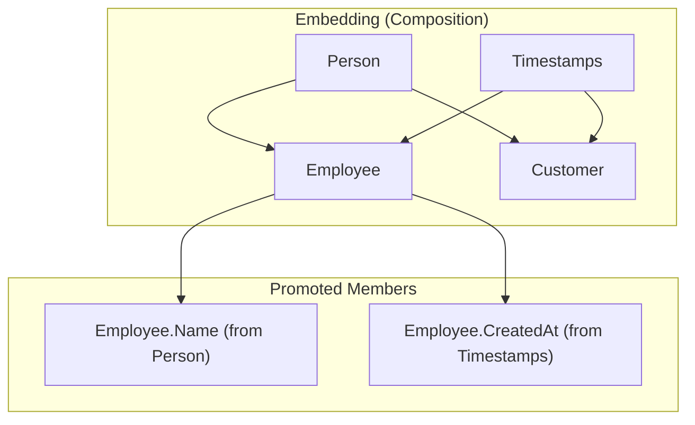

#Golang
---
---

## Summary

Struct embedding is Go's mechanism for composition over inheritance. By embedding a struct (or interface) without a field name, the embedded type's fields and methods are "promoted" to the outer struct, making them accessible directly. This enables code reuse, polymorphism through interfaces, and elegant API design without the complexity of class hierarchies.

## Detailed Explanation

### **Basic Embedding Syntax**

```go
package main

import "fmt"

// Base struct
type Person struct {
    Name string
    Age  int
}

// Embedding Person (no field name)
type Employee struct {
    Person          // Embedded struct
    EmployeeID string
    Department string
}

func main() {
    e := Employee{
        Person: Person{
            Name: "Alice",
            Age:  30,
        },
        EmployeeID: "E123",
        Department: "Engineering",
    }
    
    // Access embedded fields directly (promoted)
    fmt.Println(e.Name)       // Alice (promoted from Person)
    fmt.Println(e.Age)        // 30
    fmt.Println(e.EmployeeID) // E123
    
    // Or access through the embedded type
    fmt.Println(e.Person.Name) // Alice (explicit access)
}
```

### **Named Field vs Embedding**

```go
// Named field (has-a relationship)
type Car struct {
    Engine Engine  // Car has an Engine
}

// Embedding (is-a-kind-of relationship)
type SportsCar struct {
    Car           // SportsCar is a kind of Car
    TopSpeed int
}

func main() {
    // Named field: must access through field name
    car := Car{Engine: Engine{Horsepower: 200}}
    fmt.Println(car.Engine.Horsepower)
    
    // Embedding: fields are promoted
    sports := SportsCar{
        Car: Car{Engine: Engine{Horsepower: 500}},
        TopSpeed: 200,
    }
    fmt.Println(sports.Horsepower)  // Promoted from Engine via Car
    fmt.Println(sports.TopSpeed)
}
```

### **Method Promotion**

Embedded struct's methods are promoted to the outer struct:

```go
type Animal struct {
    Name string
}

func (a Animal) Speak() string {
    return "..."
}

func (a Animal) Describe() string {
    return fmt.Sprintf("I am %s", a.Name)
}

type Dog struct {
    Animal        // Embed Animal
    Breed string
}

// Dog can override embedded methods
func (d Dog) Speak() string {
    return "Woof!"
}

func main() {
    dog := Dog{
        Animal: Animal{Name: "Buddy"},
        Breed:  "Golden Retriever",
    }
    
    // Promoted method
    fmt.Println(dog.Describe())  // I am Buddy (from Animal)
    
    // Overridden method
    fmt.Println(dog.Speak())     // Woof! (Dog's version)
    
    // Access original method
    fmt.Println(dog.Animal.Speak())  // ... (Animal's version)
}
```

### **Interface Satisfaction Through Embedding**

```go
type Reader interface {
    Read(p []byte) (n int, err error)
}

type Writer interface {
    Write(p []byte) (n int, err error)
}

// Embed interfaces to create combined interface
type ReadWriter interface {
    Reader
    Writer
}

// Or embed structs that implement interfaces
type MyReader struct{}

func (r MyReader) Read(p []byte) (int, error) {
    return 0, nil
}

type MyWriter struct{}

func (w MyWriter) Write(p []byte) (int, error) {
    return len(p), nil
}

// Embed both to satisfy ReadWriter
type MyReadWriter struct {
    MyReader
    MyWriter
}

func main() {
    var rw ReadWriter = MyReadWriter{}
    _ = rw
    // MyReadWriter satisfies ReadWriter through embedding
}
```

### **Multiple Embedding**

```go
type Timestamps struct {
    CreatedAt time.Time
    UpdatedAt time.Time
}

func (t Timestamps) Format() string {
    return t.CreatedAt.Format(time.RFC3339)
}

type SoftDelete struct {
    DeletedAt *time.Time
}

func (s SoftDelete) IsDeleted() bool {
    return s.DeletedAt != nil
}

// Embed multiple types
type BaseModel struct {
    ID uint
    Timestamps
    SoftDelete
}

type User struct {
    BaseModel  // All fields from BaseModel, Timestamps, SoftDelete
    Email string
    Name  string
}

func main() {
    user := User{
        BaseModel: BaseModel{
            ID: 1,
            Timestamps: Timestamps{
                CreatedAt: time.Now(),
                UpdatedAt: time.Now(),
            },
        },
        Email: "alice@example.com",
        Name:  "Alice",
    }
    
    // All methods are promoted
    fmt.Println(user.ID)          // 1
    fmt.Println(user.Format())    // 2024-01-15T10:30:00Z
    fmt.Println(user.IsDeleted()) // false
}
```

### **Embedding Pointer Types**

```go
type Engine struct {
    Horsepower int
}

func (e *Engine) Start() {
    fmt.Println("Engine started")
}

// Embed pointer to Engine
type Car struct {
    *Engine  // Pointer embedding
    Model string
}

func main() {
    // Must initialize the embedded pointer
    car := Car{
        Engine: &Engine{Horsepower: 300},
        Model:  "Sedan",
    }
    
    car.Start()  // Works: method promoted
    fmt.Println(car.Horsepower)  // 300
    
    // Danger: nil embedded pointer
    car2 := Car{Model: "Coupe"}
    // car2.Start()  // PANIC: nil pointer dereference
    // car2.Horsepower  // PANIC
}
```

### **Field Name Conflicts**

```go
type A struct {
    Value int
}

type B struct {
    Value string
}

type C struct {
    A
    B
    Value float64  // C has its own Value
}

func main() {
    c := C{
        A:     A{Value: 1},
        B:     B{Value: "hello"},
        Value: 3.14,
    }
    
    // Direct access uses C's Value (most shallow wins)
    fmt.Println(c.Value)    // 3.14
    
    // Access embedded fields explicitly
    fmt.Println(c.A.Value)  // 1
    fmt.Println(c.B.Value)  // hello
    
    // If C didn't have Value, this would be ambiguous error:
    // "ambiguous selector c.Value"
}
```

### **Embedding for Mixins**

```go
// Mixin: adds logging capability
type Logger struct{}

func (l Logger) Log(msg string) {
    fmt.Printf("[LOG] %s\n", msg)
}

func (l Logger) Error(msg string) {
    fmt.Printf("[ERROR] %s\n", msg)
}

// Mixin: adds validation
type Validator struct{}

func (v Validator) Validate() error {
    // Validation logic
    return nil
}

// Compose service with mixins
type UserService struct {
    Logger     // Add logging capability
    Validator  // Add validation capability
}

func (s *UserService) CreateUser(name string) {
    s.Log("Creating user: " + name)
    if err := s.Validate(); err != nil {
        s.Error("Validation failed")
        return
    }
    s.Log("User created successfully")
}
```

### **Embedding vs Interfaces**

```go
// Embedding: compile-time composition
type Writer struct{}
func (w Writer) Write(data []byte) {}

type Logger struct {
    Writer  // Has all Writer methods at compile time
}

// Interface: runtime polymorphism
type WriterInterface interface {
    Write(data []byte)
}

type FlexibleLogger struct {
    output WriterInterface  // Can be any Writer implementation
}

func (l FlexibleLogger) Log(msg string) {
    l.output.Write([]byte(msg))
}
```

### **Real-World Pattern: Repository Base**

```go
type BaseRepository struct {
    db *sql.DB
}

func (r *BaseRepository) GetDB() *sql.DB {
    return r.db
}

func (r *BaseRepository) BeginTx() (*sql.Tx, error) {
    return r.db.Begin()
}

type UserRepository struct {
    *BaseRepository  // Embed pointer for shared DB
}

func (r *UserRepository) FindByID(id int) (*User, error) {
    row := r.GetDB().QueryRow("SELECT * FROM users WHERE id = ?", id)
    // ...
}

type OrderRepository struct {
    *BaseRepository
}

func (r *OrderRepository) FindByUserID(userID int) ([]Order, error) {
    rows, _ := r.GetDB().Query("SELECT * FROM orders WHERE user_id = ?", userID)
    // ...
}

// Usage
func main() {
    db, _ := sql.Open("postgres", "...")
    base := &BaseRepository{db: db}
    
    userRepo := &UserRepository{BaseRepository: base}
    orderRepo := &OrderRepository{BaseRepository: base}
    
    // Both share the same DB connection
}
```

### **Composition Diagram**



### **Best Practices**

```go
// ✓ Good: Use embedding for "is-a" relationships
type HTTPError struct {
    error        // Embed error interface
    StatusCode int
}

// ✓ Good: Use embedding for code reuse (mixins)
type BaseController struct {
    Logger
    Validator
}

// ✓ Good: Use embedding for interface composition
type ReadWriteCloser interface {
    io.Reader
    io.Writer
    io.Closer
}

// ✗ Avoid: Deep embedding hierarchies
type A struct{}
type B struct { A }
type C struct { B }
type D struct { C }  // Too deep, hard to understand

// ✗ Avoid: Embedding when you only need one method
type BadDesign struct {
    http.Client  // Exposes ALL Client methods
}
// ✓ Better: Use named field and wrap specific methods
```

## Interview Questions

**Q: What is struct embedding in Go and how does it differ from inheritance?**
**A:** Struct embedding is Go's composition mechanism where you include a type without a field name, promoting its fields and methods to the outer struct. Unlike inheritance, there's no "is-a" type relationship at compile time—the embedded and outer types remain distinct. This enables code reuse through composition rather than class hierarchies.

**Q: What is method promotion and how does it work?**
**A:** When you embed a struct, all its methods become accessible on the outer struct as if they were defined there. If the outer struct defines a method with the same name, it shadows the embedded method. You can still access the original via explicit selector: `outer.EmbeddedType.Method()`.

**Q: How does embedding help with interface satisfaction?**
**A:** If an embedded type implements an interface, the outer type automatically satisfies that interface through method promotion. This allows composing types that satisfy complex interfaces by embedding simpler types that each implement part of the interface.

**Q: What happens when two embedded structs have fields or methods with the same name?**
**A:** If the outer struct doesn't define its own field/method with that name, accessing it causes an "ambiguous selector" compile error. You must use explicit selectors (`outer.TypeA.Field` or `outer.TypeB.Field`). If the outer struct defines the field/method, it shadows both embedded versions.
