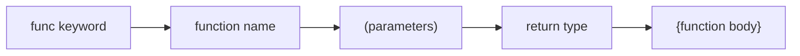

#Golang
---
---

## Summary

Functions in Go are first-class citizens that encapsulate reusable logic. They are declared with the `func` keyword, can accept parameters with explicit types, and optionally return values. Go functions support multiple return values natively, making error handling idiomatic. Functions can be assigned to variables, passed as arguments, and returned from other functions.

## Detailed Explanation

### Function Declaration Syntax

```go
func functionName(param1 type1, param2 type2) returnType {
    // function body
    return value
}
```

### Basic Function Examples

```go
package main

import "fmt"

// Function with no parameters and no return
func greet() {
    fmt.Println("Hello, World!")
}

// Function with parameters
func add(a int, b int) int {
    return a + b
}

// Shorthand: consecutive parameters of same type
func multiply(a, b, c int) int {
    return a * b * c
}

// Function with no return value (void equivalent)
func logMessage(msg string) {
    fmt.Printf("[LOG]: %s\n", msg)
}

func main() {
    greet()                          // Hello, World!
    sum := add(5, 3)                 // 8
    product := multiply(2, 3, 4)     // 24
    logMessage("Application started")
}
```

### Function Anatomy



### Parameter Types

| Type | Description | Example |
|------|-------------|---------|
| Value | Copy of data passed | `func f(x int)` |
| Pointer | Reference to data | `func f(x *int)` |
| Slice | Reference to underlying array | `func f(x []int)` |
| Map | Reference to hash table | `func f(x map[string]int)` |
| Function | Function as parameter | `func f(fn func(int) int)` |

### Functions as Values

```go
package main

import "fmt"

func main() {
    // Assign function to variable
    operation := func(a, b int) int {
        return a + b
    }
    
    result := operation(10, 20)
    fmt.Println(result) // 30
    
    // Reassign to different function
    operation = func(a, b int) int {
        return a * b
    }
    
    result = operation(10, 20)
    fmt.Println(result) // 200
}
```

### Functions as Parameters

```go
package main

import "fmt"

func apply(nums []int, transformer func(int) int) []int {
    result := make([]int, len(nums))
    for i, n := range nums {
        result[i] = transformer(n)
    }
    return result
}

func main() {
    numbers := []int{1, 2, 3, 4, 5}
    
    doubled := apply(numbers, func(n int) int {
        return n * 2
    })
    
    fmt.Println(doubled) // [2 4 6 8 10]
}
```

### Exported vs Unexported Functions

```go
package mypackage

// Exported: starts with uppercase, accessible from other packages
func PublicFunction() {
    // ...
}

// Unexported: starts with lowercase, only accessible within package
func privateFunction() {
    // ...
}
```

### Best Practices

1. **Keep functions small** - Single responsibility principle
2. **Use descriptive names** - Verb-based for actions (`calculateTotal`, `fetchUser`)
3. **Limit parameters** - More than 3-4 suggests need for struct
4. **Return early** - Avoid deep nesting with guard clauses

```go
// Bad: deep nesting
func process(data *Data) error {
    if data != nil {
        if data.Valid {
            // process...
            return nil
        }
    }
    return errors.New("invalid data")
}

// Good: early return
func process(data *Data) error {
    if data == nil {
        return errors.New("data is nil")
    }
    if !data.Valid {
        return errors.New("data is invalid")
    }
    // process...
    return nil
}
```

## Interview Questions

**Q: What is the difference between a function and a method in Go?**

**A:** A function is a standalone block of code declared with `func`. A method is a function with a receiver argument that binds it to a type. Methods are declared with `func (receiver Type) methodName()`. The receiver appears between `func` and the method name. This allows types to have behavior attached to them, enabling object-oriented patterns without classes.

**Q: Can Go functions be overloaded (same name, different parameters)?**

**A:** No, Go does not support function overloading. Each function in a package must have a unique name. This design decision simplifies the language and avoids ambiguity. Instead, Go encourages using different function names or variadic functions to handle varying parameters.

**Q: How do you make a function accessible from another package?**

**A:** Export the function by starting its name with an uppercase letter. Go uses naming conventions for visibility: uppercase = exported (public), lowercase = unexported (package-private). There are no explicit keywords like `public` or `private`.

**Q: What happens if a function declares a return type but doesn't return a value?**

**A:** The Go compiler will throw a compile-time error: "missing return at end of function". Go enforces that all code paths in a function with a declared return type must explicitly return a value, ensuring type safety and preventing undefined behavior.
