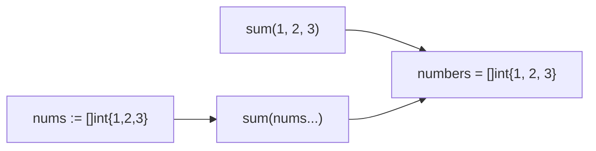

#Golang
---
---

## Summary

Variadic functions accept a variable number of arguments of the same type using the `...` syntax. The variadic parameter must be the last parameter in the function signature and is received as a slice inside the function. Go's `fmt.Println`, `append`, and many standard library functions are variadic. You can pass a slice to a variadic function using the spread operator `slice...`.

## Detailed Explanation

### Basic Syntax

```go
func functionName(params ...Type) {
    // params is a []Type slice
}
```

### Simple Variadic Function

```go
package main

import "fmt"

func sum(numbers ...int) int {
    total := 0
    for _, n := range numbers {
        total += n
    }
    return total
}

func main() {
    fmt.Println(sum())           // 0 (empty slice)
    fmt.Println(sum(1))          // 1
    fmt.Println(sum(1, 2, 3))    // 6
    fmt.Println(sum(1, 2, 3, 4, 5)) // 15
}
```

### Variadic Parameter is a Slice

```go
package main

import "fmt"

func debugArgs(args ...string) {
    fmt.Printf("Type: %T\n", args)   // Type: []string
    fmt.Printf("Length: %d\n", len(args))
    fmt.Printf("Values: %v\n", args)
}

func main() {
    debugArgs("a", "b", "c")
    // Type: []string
    // Length: 3
    // Values: [a b c]
}
```

### Mixing Regular and Variadic Parameters

```go
package main

import "fmt"

// Regular parameters MUST come before variadic
func formatMessage(prefix string, messages ...string) string {
    result := prefix + ": "
    for i, msg := range messages {
        if i > 0 {
            result += ", "
        }
        result += msg
    }
    return result
}

func main() {
    msg := formatMessage("WARN", "disk full", "memory low", "CPU high")
    fmt.Println(msg) // WARN: disk full, memory low, CPU high
}
```

### Passing a Slice to Variadic Function

Use the spread operator `...` to unpack a slice:

```go
package main

import "fmt"

func sum(numbers ...int) int {
    total := 0
    for _, n := range numbers {
        total += n
    }
    return total
}

func main() {
    nums := []int{10, 20, 30, 40}
    
    // Spread operator unpacks slice into individual arguments
    result := sum(nums...)
    fmt.Println(result) // 100
    
    // Can also combine with additional values
    // This WON'T work: sum(5, nums...) - spread must be alone
    
    // To prepend, create new slice
    combined := append([]int{5}, nums...)
    fmt.Println(sum(combined...)) // 105
}
```

### Variadic Flow



### Common Standard Library Variadic Functions

| Function | Signature | Description |
|----------|-----------|-------------|
| `fmt.Println` | `func Println(a ...any) (n int, err error)` | Print with newline |
| `fmt.Printf` | `func Printf(format string, a ...any)` | Formatted print |
| `append` | `func append(slice []T, elems ...T) []T` | Append to slice |
| `errors.Join` | `func Join(errs ...error) error` | Combine errors |

### Empty Variadic Arguments

```go
package main

import "fmt"

func printAll(items ...string) {
    if len(items) == 0 {
        fmt.Println("No items provided")
        return
    }
    for _, item := range items {
        fmt.Println(item)
    }
}

func main() {
    printAll()          // No items provided
    printAll("one")     // one
}
```

### Variadic with Interface Type

```go
package main

import "fmt"

func logValues(values ...any) {
    for i, v := range values {
        fmt.Printf("[%d] Type: %T, Value: %v\n", i, v, v)
    }
}

func main() {
    logValues(42, "hello", true, 3.14)
    // [0] Type: int, Value: 42
    // [1] Type: string, Value: hello
    // [2] Type: bool, Value: true
    // [3] Type: float64, Value: 3.14
}
```

### Variadic Rules Summary

| Rule | Example |
|------|---------|
| Must be last parameter | `func f(a int, b ...string)` ✓ |
| Only one variadic allowed | `func f(a ...int, b ...string)` ✗ |
| Received as slice | `b` is `[]string` inside function |
| Spread to pass slice | `f("x", slice...)` |
| Can be empty | `f("x")` → `b = []string{}` |

## Interview Questions

**Q: What is the difference between `func f(a []int)` and `func f(a ...int)`?**

**A:** With `[]int`, you must pass a slice: `f([]int{1, 2, 3})`. With `...int` (variadic), you can pass individual values: `f(1, 2, 3)` or a slice with spread: `f(slice...)`. Inside both functions, `a` is a `[]int` slice. The variadic version provides syntactic convenience for callers.

**Q: Can you have multiple variadic parameters in a Go function?**

**A:** No. Go allows only one variadic parameter, and it must be the last parameter. This is because the compiler wouldn't know where one variadic ends and another begins when parsing arguments.

**Q: What is the type of a variadic parameter inside the function?**

**A:** It's a slice of the declared type. For `func f(nums ...int)`, inside `f`, `nums` has type `[]int`. If no arguments are passed, it's an empty slice (not nil), so `len(nums)` returns 0.

**Q: How does `append` use variadic parameters?**

**A:** `append` has signature `func append(slice []T, elems ...T) []T`. This lets you append single elements (`append(s, 1, 2)`) or entire slices (`append(s, other...)`). The variadic design makes the API flexible while the compiler ensures type safety.
