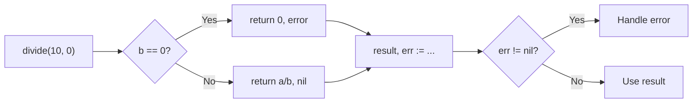

#Golang
---
---

## Summary

Go functions can return multiple values, a feature central to idiomatic error handling. Functions declare multiple return types in parentheses, and callers receive all values simultaneously. The pattern `result, err := function()` is ubiquitous in Go. This design eliminates the need for exceptions, output parameters, or result wrapper types found in other languages.

## Detailed Explanation

### Basic Syntax

```go
func functionName() (Type1, Type2) {
    return value1, value2
}
```

### Simple Example

```go
package main

import "fmt"

func divide(a, b float64) (float64, error) {
    if b == 0 {
        return 0, fmt.Errorf("division by zero")
    }
    return a / b, nil
}

func main() {
    result, err := divide(10, 2)
    if err != nil {
        fmt.Println("Error:", err)
        return
    }
    fmt.Println("Result:", result) // Result: 5
}
```

### Multiple Return Flow



### Common Patterns

#### Pattern 1: Value + Error

```go
func ReadFile(path string) ([]byte, error) {
    data, err := os.ReadFile(path)
    if err != nil {
        return nil, fmt.Errorf("reading %s: %w", path, err)
    }
    return data, nil
}
```

#### Pattern 2: Value + Boolean (ok idiom)

```go
func getUser(id int) (User, bool) {
    user, exists := users[id]
    return user, exists
}

// Usage
if user, ok := getUser(42); ok {
    fmt.Println(user.Name)
}
```

#### Pattern 3: Multiple Data Values

```go
func minMax(nums []int) (int, int) {
    min, max := nums[0], nums[0]
    for _, n := range nums {
        if n < min {
            min = n
        }
        if n > max {
            max = n
        }
    }
    return min, max
}

// Usage
min, max := minMax([]int{3, 1, 4, 1, 5, 9})
fmt.Printf("Min: %d, Max: %d\n", min, max) // Min: 1, Max: 9
```

### Ignoring Return Values

Use the blank identifier `_` to ignore values:

```go
package main

import "fmt"

func getCoordinates() (int, int, int) {
    return 10, 20, 30
}

func main() {
    x, _, z := getCoordinates() // Ignore y
    fmt.Printf("x=%d, z=%d\n", x, z)
    
    // Ignore all returns (rare, usually for side effects)
    _, _, _ = getCoordinates()
}
```

### Return Value Comparison with Other Languages

| Language | Error Handling | Multiple Returns |
|----------|---------------|------------------|
| Go | `val, err := f()` | Native |
| Python | `val, other = f()` | Native (tuple) |
| Java | `try/catch` | Not native (use wrapper) |
| JavaScript | `try/catch` or callbacks | Not native |
| Rust | `Result<T, E>` | Native (tuples) |

### Swapping Values

```go
func swap(a, b int) (int, int) {
    return b, a
}

x, y := 1, 2
x, y = swap(x, y)
fmt.Println(x, y) // 2 1

// Or directly without function:
x, y = y, x
```

### Returning Structs for Complex Data

When returning many values, prefer a struct:

```go
// Avoid: too many return values
func getUserDetails() (string, string, int, string, bool, error) {
    // ...
}

// Prefer: struct for clarity
type UserDetails struct {
    Name     string
    Email    string
    Age      int
    Address  string
    IsActive bool
}

func getUserDetails() (UserDetails, error) {
    return UserDetails{
        Name:     "Alice",
        Email:    "alice@example.com",
        Age:      30,
        Address:  "123 Main St",
        IsActive: true,
    }, nil
}
```

### Multiple Returns in Defer

```go
func readConfig() (config Config, err error) {
    file, err := os.Open("config.json")
    if err != nil {
        return Config{}, err
    }
    defer func() {
        if closeErr := file.Close(); closeErr != nil && err == nil {
            err = closeErr // Modifies named return
        }
    }()
    // ... read config
    return config, nil
}
```

## Interview Questions

**Q: Why does Go use multiple return values instead of exceptions?**

**A:** Go's designers chose explicit error handling over exceptions for clarity and control. Exceptions create hidden control flow and can be ignored. With `val, err := f()`, errors are visible at call sites, and the compiler warns if `err` is unused. This makes error handling explicit, predictable, and forces developers to consider failure cases.

**Q: What happens if you ignore an error return value?**

**A:** The compiler allows it with `_`, but it's generally bad practice. Ignoring errors can lead to silent failures, corrupted state, or panics later. Linters like `errcheck` flag ignored errors. Only ignore errors when you're certain the operation cannot fail or failure is acceptable.

**Q: How do you handle multiple errors from different operations?**

**A:** Handle each error as it occurs, or use `errors.Join` (Go 1.20+) to combine them:
```go
var errs []error
if err := op1(); err != nil { errs = append(errs, err) }
if err := op2(); err != nil { errs = append(errs, err) }
return errors.Join(errs...)
```

**Q: When should you use (value, bool) vs (value, error)?**

**A:** Use `(value, bool)` for simple presence checks like map lookups or type assertions where absence isn't an error. Use `(value, error)` when the operation can fail for multiple reasons and the caller needs context about what went wrong. The `ok` idiom signals "found/not found"; `error` signals "something went wrong."
