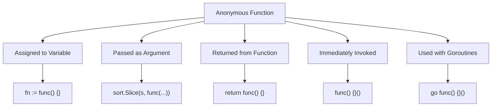

#Golang
---
---

## Summary

Anonymous functions (function literals) are functions without a name, defined inline where they're used. They can be assigned to variables, passed as arguments, returned from functions, and executed immediately (IIFE pattern). Anonymous functions capture variables from their enclosing scope, forming closures. They're essential for callbacks, goroutines, and functional patterns in Go.

## Detailed Explanation

### Basic Syntax

```go
// Anonymous function assigned to variable
fn := func(params) returnType {
    // body
}

// Immediately invoked
func(params) returnType {
    // body
}(arguments)
```

### Simple Examples

```go
package main

import "fmt"

func main() {
    // Assign to variable
    greet := func(name string) string {
        return "Hello, " + name
    }
    fmt.Println(greet("Alice")) // Hello, Alice
    
    // Immediately invoked function expression (IIFE)
    result := func(a, b int) int {
        return a + b
    }(3, 4)
    fmt.Println(result) // 7
}
```

### Anonymous Function Patterns



### As Callback Arguments

```go
package main

import (
    "fmt"
    "sort"
)

func main() {
    people := []struct {
        Name string
        Age  int
    }{
        {"Alice", 30},
        {"Bob", 25},
        {"Charlie", 35},
    }
    
    // Sort by age using anonymous function
    sort.Slice(people, func(i, j int) bool {
        return people[i].Age < people[j].Age
    })
    
    fmt.Println(people)
    // [{Bob 25} {Alice 30} {Charlie 35}]
}
```

### With Goroutines

```go
package main

import (
    "fmt"
    "sync"
)

func main() {
    var wg sync.WaitGroup
    
    for i := 0; i < 3; i++ {
        wg.Add(1)
        // Capture i by passing as parameter
        go func(n int) {
            defer wg.Done()
            fmt.Printf("Goroutine %d\n", n)
        }(i)
    }
    
    wg.Wait()
}
```

### IIFE for Initialization

```go
package main

import "fmt"

var config = func() map[string]string {
    // Complex initialization logic
    m := make(map[string]string)
    m["env"] = "production"
    m["version"] = "1.0.0"
    return m
}()

func main() {
    fmt.Println(config["env"]) // production
}
```

### Function Type Definitions

```go
package main

import "fmt"

// Define function type for clarity
type MathOp func(int, int) int

func calculate(a, b int, op MathOp) int {
    return op(a, b)
}

func main() {
    add := func(a, b int) int { return a + b }
    mul := func(a, b int) int { return a * b }
    
    fmt.Println(calculate(5, 3, add)) // 8
    fmt.Println(calculate(5, 3, mul)) // 15
}
```

### Returning Anonymous Functions

```go
package main

import "fmt"

func multiplier(factor int) func(int) int {
    return func(n int) int {
        return n * factor
    }
}

func main() {
    double := multiplier(2)
    triple := multiplier(3)
    
    fmt.Println(double(5))  // 10
    fmt.Println(triple(5))  // 15
}
```

### Common Use Cases

| Use Case | Example |
|----------|---------|
| Sorting callbacks | `sort.Slice(s, func(i, j int) bool { ... })` |
| HTTP handlers | `http.HandleFunc("/", func(w, r) { ... })` |
| Goroutines | `go func() { ... }()` |
| Defer with logic | `defer func() { recover() }()` |
| Test table loops | `t.Run(name, func(t *testing.T) { ... })` |
| Middleware | `return func(next Handler) Handler { ... }` |

### Anonymous vs Named Functions

| Aspect | Anonymous | Named |
|--------|-----------|-------|
| Reusability | Single use point | Multiple call sites |
| Recursion | Needs variable assignment | Direct self-call |
| Documentation | Inline context | Standalone with comments |
| Testing | Harder to test directly | Easy to unit test |
| Stack traces | Shows as `func1`, `func2` | Shows actual name |

### Recursion with Anonymous Functions

```go
package main

import "fmt"

func main() {
    // Must declare variable first for self-reference
    var factorial func(n int) int
    factorial = func(n int) int {
        if n <= 1 {
            return 1
        }
        return n * factorial(n-1)
    }
    
    fmt.Println(factorial(5)) // 120
}
```

## Interview Questions

**Q: What is an IIFE and when would you use it in Go?**

**A:** IIFE (Immediately Invoked Function Expression) is an anonymous function that executes immediately: `func() { ... }()`. Use it for one-time initialization logic, creating a scope for temporary variables, or package-level variable initialization where complex logic is needed. The result is assigned, but the function itself isn't stored.

**Q: How do you handle the loop variable capture problem with goroutines?**

**A:** The classic bug is capturing a loop variable that changes each iteration. Fix by passing it as a parameter: `go func(n int) { use(n) }(i)`. In Go 1.22+, loop variables have per-iteration scope, fixing this automatically. For older versions, always pass loop variables explicitly to goroutine functions.

**Q: Can anonymous functions be recursive?**

**A:** Yes, but you must first declare a variable of the function type, then assign the anonymous function that references that variable. Direct recursion without a variable (`func(n int) { ...self()... }`) doesn't work because the function has no name to reference itself.

**Q: Why might stack traces show `func1` instead of a meaningful name?**

**A:** Anonymous functions don't have names, so the runtime generates synthetic names like `main.func1`. For debugging, consider extracting frequently-used or complex anonymous functions into named functions. Use anonymous functions for simple, short callbacks where the surrounding context makes the purpose clear.
