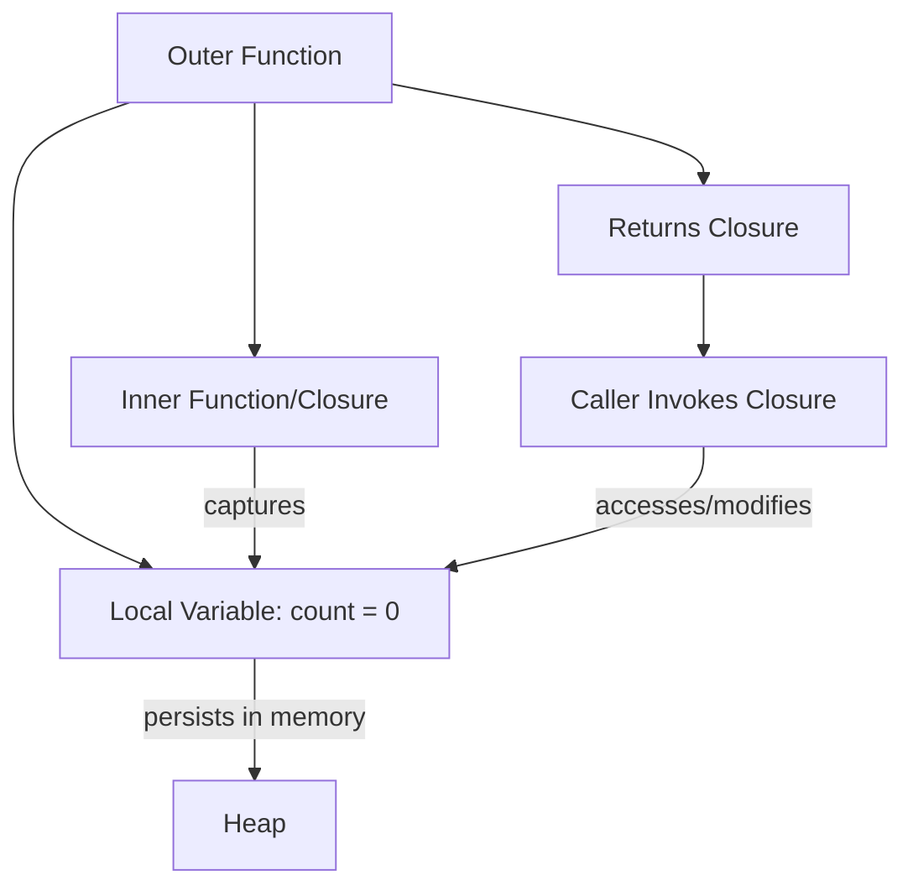

#Golang
---
---

## Summary

A closure is a function that captures and retains access to variables from its enclosing scope, even after that scope has exited. In Go, anonymous functions naturally form closures when they reference outer variables. Closures enable stateful functions, factory patterns, and functional programming techniques. The captured variables are shared by reference, meaning modifications inside the closure affect the original variable.

## Detailed Explanation

### How Closures Work



### Basic Closure Example

```go
package main

import "fmt"

func counter() func() int {
    count := 0 // Captured by closure
    return func() int {
        count++ // Modifies captured variable
        return count
    }
}

func main() {
    next := counter()
    
    fmt.Println(next()) // 1
    fmt.Println(next()) // 2
    fmt.Println(next()) // 3
    
    // New closure, independent state
    another := counter()
    fmt.Println(another()) // 1
}
```

### Variable Capture by Reference

```go
package main

import "fmt"

func main() {
    x := 10
    
    modify := func() {
        x = 20 // Modifies outer x
    }
    
    fmt.Println(x) // 10
    modify()
    fmt.Println(x) // 20
}
```

### The Loop Capture Gotcha

```go
package main

import (
    "fmt"
    "time"
)

func main() {
    // BUG: All goroutines capture same variable
    for i := 0; i < 3; i++ {
        go func() {
            fmt.Println(i) // Likely prints: 3, 3, 3
        }()
    }
    time.Sleep(time.Second)
    
    // FIX 1: Pass as parameter
    for i := 0; i < 3; i++ {
        go func(n int) {
            fmt.Println(n) // Prints: 0, 1, 2 (order varies)
        }(i)
    }
    time.Sleep(time.Second)
    
    // FIX 2: Shadow variable (pre-Go 1.22)
    for i := 0; i < 3; i++ {
        i := i // New variable each iteration
        go func() {
            fmt.Println(i)
        }()
    }
    time.Sleep(time.Second)
}
```

> **Note:** Go 1.22+ changed loop variable semantics. Each iteration creates a new variable, eliminating this issue for `for` loops.

### Practical Closure Patterns

#### Factory Pattern

```go
package main

import "fmt"

func newAdder(base int) func(int) int {
    return func(n int) int {
        return base + n
    }
}

func main() {
    add5 := newAdder(5)
    add10 := newAdder(10)
    
    fmt.Println(add5(3))  // 8
    fmt.Println(add10(3)) // 13
}
```

#### Middleware/Decorator

```go
package main

import (
    "fmt"
    "time"
)

func withTiming(fn func()) func() {
    return func() {
        start := time.Now()
        fn()
        fmt.Printf("Took: %v\n", time.Since(start))
    }
}

func main() {
    slow := func() {
        time.Sleep(100 * time.Millisecond)
        fmt.Println("Done")
    }
    
    timed := withTiming(slow)
    timed()
    // Done
    // Took: 100.1234ms
}
```

#### Memoization

```go
package main

import "fmt"

func memoize(fn func(int) int) func(int) int {
    cache := make(map[int]int)
    return func(n int) int {
        if result, ok := cache[n]; ok {
            return result
        }
        result := fn(n)
        cache[n] = result
        return result
    }
}

func main() {
    var fib func(int) int
    fib = func(n int) int {
        if n <= 1 {
            return n
        }
        return fib(n-1) + fib(n-2)
    }
    
    fastFib := memoize(fib)
    fmt.Println(fastFib(40)) // Fast with caching
}
```

#### Configuration Builder

```go
package main

import "fmt"

type Config struct {
    Host    string
    Port    int
    Timeout int
}

type Option func(*Config)

func WithHost(h string) Option {
    return func(c *Config) {
        c.Host = h
    }
}

func WithPort(p int) Option {
    return func(c *Config) {
        c.Port = p
    }
}

func NewConfig(opts ...Option) Config {
    cfg := Config{Host: "localhost", Port: 8080, Timeout: 30}
    for _, opt := range opts {
        opt(&cfg)
    }
    return cfg
}

func main() {
    cfg := NewConfig(WithHost("api.example.com"), WithPort(443))
    fmt.Printf("%+v\n", cfg)
    // {Host:api.example.com Port:443 Timeout:30}
}
```

### Closure vs Regular Function

| Aspect | Closure | Regular Function |
|--------|---------|------------------|
| State | Can maintain state | Stateless |
| Variables | Captures from outer scope | Only parameters |
| Memory | Keeps captured vars alive | No external references |
| Use case | Factories, callbacks | General computation |

### Memory Implications

```go
func createHandlers() []func() {
    handlers := make([]func(), 1000)
    for i := range handlers {
        largeData := make([]byte, 1<<20) // 1MB
        handlers[i] = func() {
            // largeData is captured, stays in memory!
            _ = len(largeData)
        }
    }
    return handlers // 1GB+ memory retained
}
```

**Fix:** Only capture what you need:

```go
handlers[i] = func() {
    size := len(largeData) // Capture only the size
    _ = size
}
```

## Interview Questions

**Q: What is the difference between a closure and an anonymous function?**

**A:** An anonymous function is simply a function without a name. A closure is an anonymous function that captures variables from its enclosing scope. All closures are anonymous functions, but not all anonymous functions are closures. A closure only exists when the function references variables from outside its own scope.

**Q: Why does the loop variable capture problem occur?**

**A:** In Go before 1.22, loop variables are reused each iteration—same memory address, updated value. When closures capture this variable, they all reference the same address. By the time goroutines execute, the loop has finished, so all closures see the final value. Pass the variable as a parameter to create a copy.

**Q: How do closures affect garbage collection?**

**A:** Closures keep captured variables alive as long as the closure exists. If a closure captures a large data structure, that memory cannot be reclaimed until the closure is garbage collected. Be mindful of what closures capture, especially in long-lived functions or when returning closures from functions.

**Q: Can closures cause race conditions?**

**A:** Yes. If multiple goroutines execute closures that capture and modify the same variable without synchronization, you have a data race. Use mutexes, channels, or pass copies to avoid races:
```go
var mu sync.Mutex
counter := 0
go func() { mu.Lock(); counter++; mu.Unlock() }()
```
