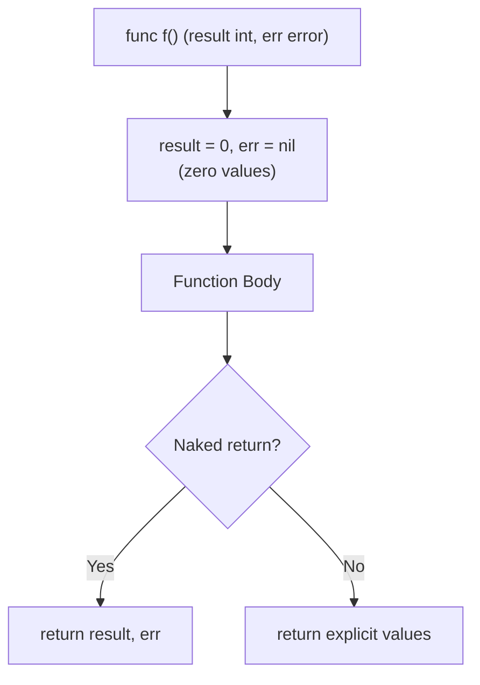

#Golang
---
---

## Summary

Named return values declare variables in the function signature that are automatically initialized to their zero values and returned by a "naked" `return` statement. They serve as documentation, enable modification in deferred functions, and can simplify complex return logic. However, they can reduce readability in longer functions and are best used sparingly for short functions or when `defer` needs to access return values.

## Detailed Explanation

### Basic Syntax

```go
// Named return values
func split(sum int) (x, y int) {
    x = sum * 4 / 9
    y = sum - x
    return // Naked return: returns x and y
}

// Equivalent without named returns
func split2(sum int) (int, int) {
    x := sum * 4 / 9
    y := sum - x
    return x, y
}
```

### How Named Returns Work



### Zero Value Initialization

```go
package main

import "fmt"

func getDefaults() (name string, age int, active bool) {
    // name = "", age = 0, active = false
    return // Returns zero values
}

func main() {
    name, age, active := getDefaults()
    fmt.Printf("name=%q age=%d active=%t\n", name, age, active)
    // name="" age=0 active=false
}
```

### Modifying Returns in Defer

This is the most compelling use case for named returns:

```go
package main

import (
    "fmt"
    "os"
)

func readFile(path string) (content []byte, err error) {
    f, err := os.Open(path)
    if err != nil {
        return nil, err
    }
    
    defer func() {
        closeErr := f.Close()
        // Only override if no previous error
        if err == nil {
            err = closeErr
        }
    }()
    
    content, err = io.ReadAll(f)
    return // Returns content and potentially modified err
}
```

### Recover with Named Returns

```go
package main

import "fmt"

func safeDiv(a, b int) (result int, err error) {
    defer func() {
        if r := recover(); r != nil {
            err = fmt.Errorf("panic: %v", r)
        }
    }()
    
    result = a / b // May panic if b == 0
    return
}

func main() {
    r, err := safeDiv(10, 0)
    if err != nil {
        fmt.Println(err) // panic: runtime error: integer divide by zero
    }
    fmt.Println(r) // 0
}
```

### When to Use Named Returns

| Situation | Recommendation |
|-----------|----------------|
| Short functions (< 10 lines) | ✅ Good |
| Multiple returns of same type | ✅ Good for documentation |
| Need to modify return in `defer` | ✅ Required |
| Long functions | ❌ Avoid, reduces clarity |
| Complex control flow | ❌ Avoid naked returns |
| Godoc documentation | ✅ Names appear in docs |

### Documentation Benefit

```go
// Without names - unclear what ints represent
func GetDimensions() (int, int, int)

// With names - self-documenting
func GetDimensions() (width, height, depth int)
```

### Pitfall: Shadow Variables

```go
func calculate() (result int, err error) {
    result = 10
    
    if true {
        result, err := someFunc() // SHADOWS outer result and err!
        fmt.Println(result, err)
    }
    
    return // Returns outer result (10), outer err (nil)
}

// Fix: use assignment, not declaration
func calculateFixed() (result int, err error) {
    result = 10
    
    if true {
        result, err = someFunc() // Assigns to named returns
    }
    
    return
}
```

### Naked Return Controversy

```go
// Controversial: what does this return?
func process(data []byte) (result []byte, err error) {
    result, err = transform(data)
    if err != nil {
        return // Returns nil result and the error
    }
    
    result, err = validate(result)
    if err != nil {
        return // Returns partially processed result and error
    }
    
    result, err = finalize(result)
    return // What's result here? Have to read whole function
}

// Clearer: explicit returns
func processClear(data []byte) ([]byte, error) {
    result, err := transform(data)
    if err != nil {
        return nil, err
    }
    
    result, err = validate(result)
    if err != nil {
        return nil, err
    }
    
    return finalize(result)
}
```

### Style Guide Recommendations

From the [Go Code Review Comments](https://github.com/golang/go/wiki/CodeReviewComments#named-result-parameters):

> Named result parameters should be used for documentation. Naked returns should be avoided in longer functions.

```go
// Good: short, clear
func min(a, b int) (min int) {
    if a < b {
        min = a
    } else {
        min = b
    }
    return
}

// Good: documentation value
func (f *File) Read(p []byte) (n int, err error)

// Bad: long function with naked returns
func complexOperation() (result Data, err error) {
    // 50 lines of code...
    return // What are we returning?!
}
```

## Interview Questions

**Q: What is a "naked return" in Go?**

**A:** A naked return is a `return` statement without arguments in a function with named return values. It returns the current values of the named return variables. While concise, naked returns can reduce readability in longer functions because the reader must track variable values through the function body.

**Q: When are named return values necessary, not just convenient?**

**A:** Named returns are necessary when you need to modify return values inside a `defer` statement. Deferred functions can only access named return values, not variables declared inside the function body. This is critical for error handling patterns where you need to wrap or check errors during cleanup.

**Q: What is the "shadowing" problem with named returns?**

**A:** Inside a function with named returns, using `:=` can accidentally declare new local variables that shadow the named returns. The function then returns the original named values (zero or previously assigned), not the shadowed ones. Use `=` instead of `:=` when assigning to named returns in inner scopes.

**Q: How do named returns affect function documentation?**

**A:** Named returns appear in godoc and IDE tooltips, making them self-documenting. Compare `func Size() (int, int)` (unclear) vs `func Size() (width, height int)` (clear). This is especially valuable for functions returning multiple values of the same type where the meaning isn't obvious from types alone.
