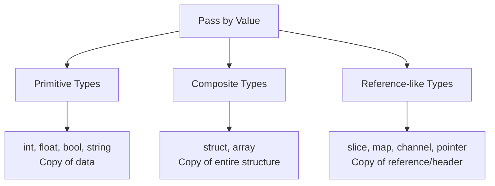
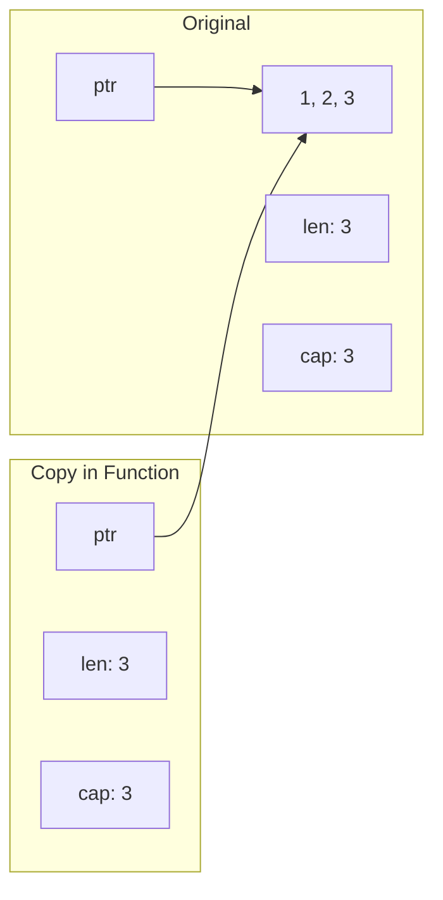

#Golang
---
---

## Summary

Go uses pass-by-value semantics: when you pass an argument to a function, a copy of that value is made. This applies to all types, including structs. However, slices, maps, channels, and pointers contain references to underlying data, so while the reference itself is copied, both copies point to the same data. Understanding this distinction is crucial for writing correct, efficient Go code.

## Detailed Explanation

### The Fundamental Rule

**Everything in Go is passed by value.** The question is: what is the value?



### Primitive Types (True Copy)

```go
package main

import "fmt"

func double(n int) {
    n = n * 2
    fmt.Println("Inside:", n) // 20
}

func main() {
    x := 10
    double(x)
    fmt.Println("Outside:", x) // 10 (unchanged)
}
```

### Structs (Copy of Entire Struct)

```go
package main

import "fmt"

type Person struct {
    Name string
    Age  int
}

func birthday(p Person) {
    p.Age++
    fmt.Println("Inside:", p.Age) // 31
}

func main() {
    alice := Person{Name: "Alice", Age: 30}
    birthday(alice)
    fmt.Println("Outside:", alice.Age) // 30 (unchanged)
}
```

### Pointers (Copy of Address)

```go
package main

import "fmt"

func birthdayPtr(p *Person) {
    p.Age++ // Modifies original through pointer
}

func main() {
    alice := Person{Name: "Alice", Age: 30}
    birthdayPtr(&alice)
    fmt.Println(alice.Age) // 31 (modified!)
}
```

### What Gets Copied

| Type | What's Copied | Modification Affects Original? |
|------|--------------|-------------------------------|
| `int`, `float64`, `bool` | The value | No |
| `string` | Header (pointer + length) | No (strings immutable) |
| `struct` | All fields | No |
| `array` | All elements | No |
| `*T` (pointer) | Memory address | Yes (via dereference) |
| `[]T` (slice) | Header (ptr, len, cap) | Yes (same backing array) |
| `map` | Map pointer | Yes (same hash table) |
| `chan` | Channel pointer | Yes (same channel) |
| `func` | Function pointer | N/A (functions immutable) |

### Slices: The Subtlety

```go
package main

import "fmt"

func appendItem(s []int) {
    s = append(s, 999)
    fmt.Println("Inside:", s) // [1 2 3 999]
}

func modifyItem(s []int) {
    s[0] = 999
    fmt.Println("Inside:", s) // [999 2 3]
}

func main() {
    nums := []int{1, 2, 3}
    
    appendItem(nums)
    fmt.Println("After append:", nums) // [1 2 3] (unchanged!)
    
    modifyItem(nums)
    fmt.Println("After modify:", nums) // [999 2 3] (changed!)
}
```

**Why?**
- `append` may create a new backing array → local slice header updated, original unchanged
- Direct index access modifies the shared backing array

### Slice Header Visualization



Both point to same underlying array!

### Maps (Always Reference Behavior)

```go
package main

import "fmt"

func addEntry(m map[string]int) {
    m["new"] = 100
}

func main() {
    data := map[string]int{"a": 1}
    addEntry(data)
    fmt.Println(data) // map[a:1 new:100] (modified!)
}
```

### When to Use Pointers

| Scenario | Value | Pointer |
|----------|-------|---------|
| Small structs (≤ 3 fields) | ✅ Prefer | |
| Large structs | | ✅ Prefer |
| Need to modify original | | ✅ Required |
| Consistency with methods | | ✅ Often |
| Optional/nullable value | | ✅ Use `*T` for nil option |

### Performance Consideration

```go
// Large struct - copying is expensive
type HeavyData struct {
    Buffer [1024 * 1024]byte // 1MB
}

// Bad: copies 1MB every call
func processValue(d HeavyData) { /* ... */ }

// Good: copies 8 bytes (pointer)
func processPointer(d *HeavyData) { /* ... */ }
```

### Defensive Copying

When you need isolation:

```go
package main

import "fmt"

func processData(data []int) []int {
    // Create independent copy
    local := make([]int, len(data))
    copy(local, data)
    
    // Safe to modify
    local[0] = 999
    return local
}

func main() {
    original := []int{1, 2, 3}
    result := processData(original)
    
    fmt.Println("Original:", original) // [1 2 3]
    fmt.Println("Result:", result)     // [999 2 3]
}
```

### Interface Gotcha

```go
type Counter interface {
    Inc()
    Value() int
}

type counter struct { n int }

func (c counter) Inc()     { c.n++ }      // Value receiver - modifies copy!
func (c counter) Value() int { return c.n }

func main() {
    var c Counter = counter{}
    c.Inc()
    c.Inc()
    fmt.Println(c.Value()) // 0, not 2!
}
```

**Fix:** Use pointer receiver:

```go
func (c *counter) Inc() { c.n++ }
```

## Interview Questions

**Q: Is Go pass-by-value or pass-by-reference?**

**A:** Go is always pass-by-value. Every argument is copied. However, some types (slices, maps, channels, pointers) contain internal references to shared data. So while the reference itself is copied, modifications through that reference affect the original data. True pass-by-reference (like C++ `&param`) doesn't exist in Go.

**Q: Why does modifying a slice element affect the original, but `append` might not?**

**A:** A slice is a header (pointer + length + capacity) that references a backing array. When passed, the header is copied but both point to the same array. Direct element modification (`s[0] = x`) changes the shared array. `append` may allocate a new array if capacity is exceeded, updating only the local header. The original header still points to the old array.

**Q: When should you pass a struct by pointer vs by value?**

**A:** Pass by value for small, immutable data (safety, simplicity). Pass by pointer when: (1) you need to modify the original, (2) the struct is large and copying is expensive, (3) the type has methods with pointer receivers, or (4) nil is a meaningful value. Consistency matters—if most methods use pointer receivers, parameters should too.

**Q: What happens if you pass a nil pointer to a function?**

**A:** The function receives a copy of the nil pointer. Dereferencing it causes a panic. Always check for nil before dereferencing:
```go
func process(p *Data) {
    if p == nil { return }
    // safe to use p
}
```
