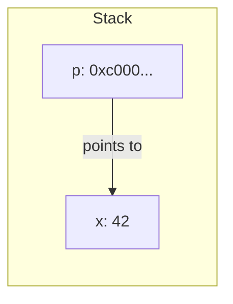
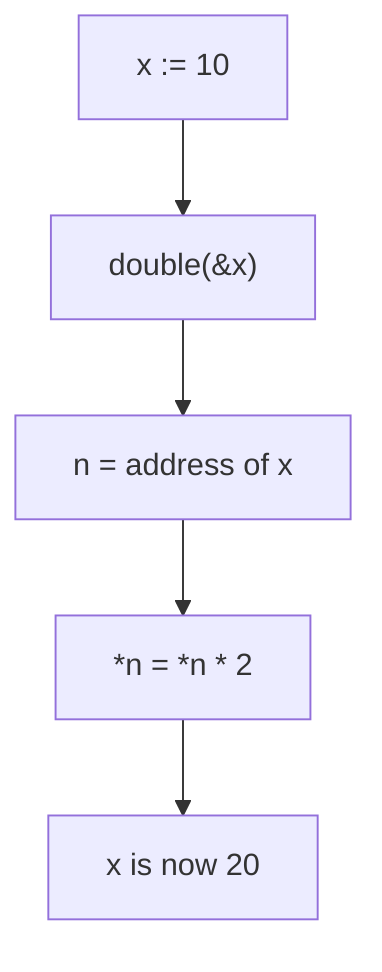

#Golang
---
---

## Summary

A pointer holds the memory address of a value. In Go, the `&` operator gets a value's address, and `*` dereferences a pointer to access the value at that address. Pointers enable efficient data sharing, mutation of function parameters, and building complex data structures. Unlike C, Go has no pointer arithmetic, and the garbage collector manages memory automatically, making pointers safer while retaining their power.

## Detailed Explanation

### Pointer Basics

```go
package main

import "fmt"

func main() {
    x := 42
    
    p := &x        // p is a pointer to x (type *int)
    fmt.Println(p) // 0xc0000140a8 (memory address)
    
    fmt.Println(*p) // 42 (dereference to get value)
    
    *p = 100        // Modify x through pointer
    fmt.Println(x)  // 100
}
```

### Pointer Visualization



### Pointer Operators

| Operator | Name | Description | Example |
|----------|------|-------------|---------|
| `&` | Address-of | Gets memory address of variable | `p := &x` |
| `*` | Dereference | Accesses value at address | `val := *p` |
| `*T` | Pointer type | Type that holds address of T | `var p *int` |

### Zero Value of Pointers

```go
package main

import "fmt"

func main() {
    var p *int       // nil pointer
    fmt.Println(p)   // <nil>
    
    if p == nil {
        fmt.Println("p is nil, can't dereference!")
    }
    
    // *p = 10 // PANIC: runtime error: invalid memory address
    
    // Safe: allocate first
    p = new(int)     // Allocates memory, returns pointer
    *p = 10
    fmt.Println(*p)  // 10
}
```

### `new` vs `&`

```go
package main

import "fmt"

func main() {
    // Using new - allocates zeroed memory, returns pointer
    p1 := new(int)
    fmt.Println(*p1) // 0
    
    // Using & - takes address of existing value
    x := 42
    p2 := &x
    fmt.Println(*p2) // 42
    
    // Shorthand for struct
    type Point struct{ X, Y int }
    
    p3 := new(Point)            // *Point with zero values
    p4 := &Point{X: 1, Y: 2}    // *Point with initialized values
    
    fmt.Println(*p3) // {0 0}
    fmt.Println(*p4) // {1 2}
}
```

### Passing Pointers to Functions

```go
package main

import "fmt"

func double(n *int) {
    *n = *n * 2
}

func main() {
    x := 10
    double(&x)
    fmt.Println(x) // 20
}
```

### Pointer Flow



### Pointers vs Values: When to Use

| Use Pointer | Use Value |
|-------------|-----------|
| Need to modify original | Read-only access |
| Large data (avoid copy) | Small data (int, bool, small struct) |
| Optional value (nil valid) | Always required |
| Shared mutable state | Immutable data |
| Implementing linked structures | Simple computations |

### Pointer Safety in Go

Go prevents common pointer errors:

```go
package main

func main() {
    var arr [5]int
    
    // C-style pointer arithmetic - NOT ALLOWED in Go
    // p := &arr[0]
    // p++          // Compile error: invalid operation
    
    // Instead, use slices and indices
    slice := arr[:]
    for i := range slice {
        slice[i] = i * 10
    }
}
```

### Returning Pointers (Safe in Go)

```go
package main

import "fmt"

func createPointer() *int {
    x := 42      // Local variable
    return &x    // Safe! Go escapes x to heap
}

func main() {
    p := createPointer()
    fmt.Println(*p) // 42 (valid, not dangling)
}
```

Go's escape analysis moves variables to the heap when their addresses escape the function scope.

### Double Pointers

```go
package main

import "fmt"

func allocate(pp **int) {
    n := 100
    *pp = &n
}

func main() {
    var p *int         // nil
    allocate(&p)       // Pass pointer to pointer
    fmt.Println(*p)    // 100
}
```

### Common Mistakes

```go
// Mistake 1: Dereferencing nil pointer
var p *int
*p = 10  // PANIC!

// Fix: Check for nil or initialize
if p != nil {
    *p = 10
}

// Mistake 2: Comparing pointers vs values
a := 1
b := 1
pa := &a
pb := &b

fmt.Println(pa == pb)   // false (different addresses)
fmt.Println(*pa == *pb) // true (same values)
```

### Type Safety

```go
package main

func main() {
    x := 42
    var p *int = &x
    
    // var q *string = &x  // Compile error: cannot use &x (type *int) as type *string
    
    // Pointers are strongly typed
    var f *float64
    // f = p  // Compile error: cannot use p (type *int) as type *float64
    _ = f
}
```

## Interview Questions

**Q: What is the difference between `*T` and `&x` in Go?**

**A:** `*T` is a type—it declares a pointer to type T (e.g., `var p *int`). `&x` is an operation—it takes the address of variable x, producing a pointer. `*` before a type means "pointer to," while `&` before a value means "address of." Additionally, `*p` (dereference) accesses the value a pointer points to.

**Q: Why is returning a pointer to a local variable safe in Go but not in C?**

**A:** Go performs escape analysis at compile time. When a variable's address escapes its function (by being returned), Go automatically allocates it on the heap instead of the stack. The garbage collector then manages its lifetime. In C, local variables live on the stack and are destroyed when the function returns, making returned pointers dangling.

**Q: Why doesn't Go support pointer arithmetic?**

**A:** Pointer arithmetic is a major source of bugs: buffer overflows, out-of-bounds access, and memory corruption. Go prioritizes safety and simplicity. Instead, Go provides slices with bounds checking, and the `unsafe` package for rare low-level needs. This design prevents entire classes of security vulnerabilities while remaining efficient.

**Q: When should you use `new(T)` vs `&T{}`?**

**A:** Both allocate memory and return a pointer. `new(T)` returns a pointer to a zero-valued T—useful for basic types or when you'll set fields later. `&T{...}` (composite literal) lets you initialize fields immediately, making it preferred for structs. For non-composite types like `int`, only `new(int)` or `&variable` work.
