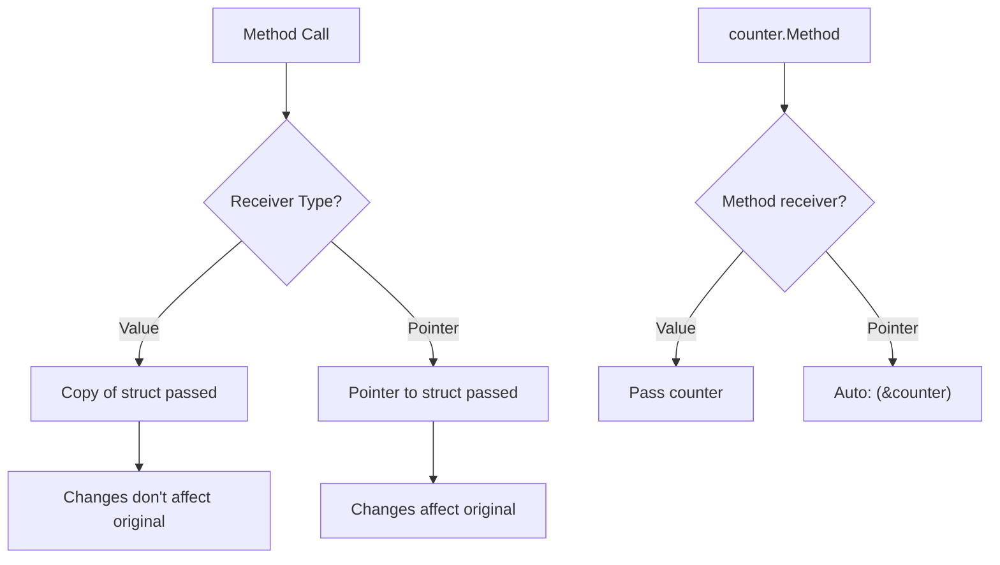

#Golang
---
---

## Summary

Pointers and structs work together to enable efficient data manipulation and object-oriented patterns in Go. Pointer receivers allow methods to modify their receiver, while value receivers work on copies. Go automatically dereferences struct pointers when accessing fields (`p.Field` instead of `(*p).Field`). Understanding when to use pointer vs value receivers is fundamental to writing idiomatic Go code.

## Detailed Explanation

### Pointer to Struct

```go
package main

import "fmt"

type Person struct {
    Name string
    Age  int
}

func main() {
    // Create struct
    alice := Person{Name: "Alice", Age: 30}
    
    // Pointer to struct
    p := &alice
    
    // Access fields - Go auto-dereferences
    fmt.Println(p.Name)     // Alice (not (*p).Name)
    
    // Modify through pointer
    p.Age = 31
    fmt.Println(alice.Age)  // 31
}
```

### Creating Struct Pointers

```go
package main

import "fmt"

type Config struct {
    Host string
    Port int
}

func main() {
    // Method 1: Address of literal
    c1 := &Config{Host: "localhost", Port: 8080}
    
    // Method 2: new() - zero valued
    c2 := new(Config)
    c2.Host = "localhost"
    c2.Port = 8080
    
    // Method 3: Address of variable
    c3 := Config{Host: "localhost", Port: 8080}
    c3Ptr := &c3
    
    fmt.Printf("%+v\n", c1)    // &{Host:localhost Port:8080}
    fmt.Printf("%+v\n", c2)    // &{Host:localhost Port:8080}
    fmt.Printf("%+v\n", c3Ptr) // &{Host:localhost Port:8080}
}
```

### Value Receiver vs Pointer Receiver

```go
package main

import "fmt"

type Counter struct {
    value int
}

// Value receiver - works on copy
func (c Counter) IncrementValue() {
    c.value++ // Modifies copy, original unchanged
}

// Pointer receiver - works on original
func (c *Counter) IncrementPointer() {
    c.value++ // Modifies original
}

func (c Counter) Value() int {
    return c.value
}

func main() {
    counter := Counter{value: 0}
    
    counter.IncrementValue()
    fmt.Println(counter.Value()) // 0 (unchanged!)
    
    counter.IncrementPointer()
    fmt.Println(counter.Value()) // 1 (modified)
    
    // Go auto-takes address for pointer receiver
    // counter.IncrementPointer() == (&counter).IncrementPointer()
}
```

### Receiver Type Flow



### When to Use Pointer Receivers

| Situation | Receiver | Reason |
|-----------|----------|--------|
| Method modifies receiver | Pointer | Changes persist |
| Large struct | Pointer | Avoid copying |
| Consistency | Pointer | If any method needs pointer, all should use it |
| Concurrency with sync.Mutex | Pointer | Mutex must not be copied |
| Nil receiver handling | Pointer | Can check for nil |
| Immutable type | Value | Signals no modification |
| Small struct, no mutation | Value | Simpler, stack-friendly |

### Nil Pointer Receivers

```go
package main

import "fmt"

type List struct {
    data []int
}

// Handle nil receiver gracefully
func (l *List) Len() int {
    if l == nil {
        return 0
    }
    return len(l.data)
}

func (l *List) Append(v int) {
    if l == nil {
        panic("cannot append to nil List")
    }
    l.data = append(l.data, v)
}

func main() {
    var list *List = nil
    fmt.Println(list.Len()) // 0 (safe!)
    
    // list.Append(1) // Would panic
}
```

### Constructor Pattern

```go
package main

import "fmt"

type Database struct {
    host     string
    port     int
    pool     int
    readonly bool
}

// Constructor returns pointer - common pattern
func NewDatabase(host string, port int) *Database {
    return &Database{
        host:     host,
        port:     port,
        pool:     10,      // Default value
        readonly: false,
    }
}

// Methods on pointer receiver
func (db *Database) Connect() error {
    fmt.Printf("Connecting to %s:%d\n", db.host, db.port)
    return nil
}

func main() {
    db := NewDatabase("localhost", 5432)
    db.Connect()
}
```

### Pointer Fields in Structs

```go
package main

import "fmt"

type Node struct {
    Value int
    Next  *Node // Pointer to another Node (self-referential)
}

type Tree struct {
    Root *TreeNode
}

type TreeNode struct {
    Value int
    Left  *TreeNode
    Right *TreeNode
}

func main() {
    // Linked list
    node3 := &Node{Value: 3, Next: nil}
    node2 := &Node{Value: 2, Next: node3}
    node1 := &Node{Value: 1, Next: node2}
    
    // Traverse
    for n := node1; n != nil; n = n.Next {
        fmt.Print(n.Value, " ") // 1 2 3
    }
    fmt.Println()
}
```

### Method Sets and Interfaces

```go
package main

import "fmt"

type Incrementer interface {
    Increment()
}

type Counter struct {
    value int
}

func (c *Counter) Increment() {
    c.value++
}

func main() {
    c := Counter{}
    
    // *Counter implements Incrementer
    var i Incrementer = &c
    i.Increment()
    fmt.Println(c.value) // 1
    
    // Counter does NOT implement Incrementer (pointer receiver)
    // var i2 Incrementer = c // Compile error!
}
```

### Common Pattern: Chaining with Pointer Receivers

```go
package main

import "fmt"

type Builder struct {
    data []string
}

func NewBuilder() *Builder {
    return &Builder{}
}

func (b *Builder) Add(s string) *Builder {
    b.data = append(b.data, s)
    return b // Return self for chaining
}

func (b *Builder) Build() string {
    result := ""
    for _, s := range b.data {
        result += s
    }
    return result
}

func main() {
    result := NewBuilder().
        Add("Hello, ").
        Add("World").
        Add("!").
        Build()
    
    fmt.Println(result) // Hello, World!
}
```

## Interview Questions

**Q: What is the difference between value and pointer receivers?**

**A:** Value receivers get a copy of the struct—modifications don't affect the original. Pointer receivers get a reference—modifications persist. Use pointer receivers when you need to mutate state, when the struct is large (avoiding copy overhead), or for consistency when other methods need pointer receivers.

**Q: Why can you call a pointer receiver method on a value, and vice versa?**

**A:** Go automatically takes the address or dereferences as needed. If you have `x.Method()` where Method has a pointer receiver, Go transforms it to `(&x).Method()`. Similarly, if p is a pointer and Method has a value receiver, `p.Method()` becomes `(*p).Method()`. This convenience only works with addressable values—you can't call a pointer method on a literal like `Point{1,2}.SetX(5)`.

**Q: What is the method set of a type vs its pointer type?**

**A:** The method set of type T includes methods with value receivers. The method set of *T includes methods with BOTH value and pointer receivers. This matters for interface satisfaction: if an interface requires a method with pointer receiver, only *T satisfies it, not T. This is why you often see `var i Interface = &concreteValue` rather than passing by value.

**Q: Can a nil pointer receiver cause a panic?**

**A:** Not automatically. A method with pointer receiver can be called on nil. It only panics if you dereference fields without checking. This allows useful patterns like `if t == nil { return 0 }`. However, calling a method on a nil interface value panics, which is different from a nil concrete pointer stored in an interface.
