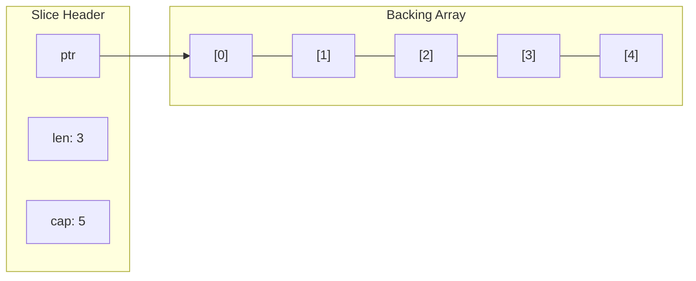
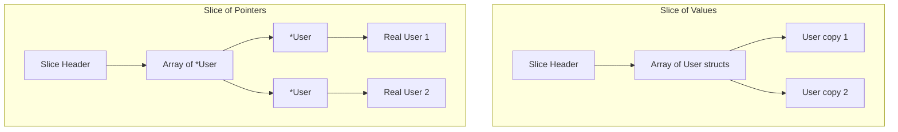

#Golang
---
---

## Summary

Maps and slices in Go have reference-like semantics because they contain internal pointers to underlying data structures. When passed to functions, modifications to their elements affect the original. However, operations that change the header itself (like slice append with reallocation) may not propagate. Understanding these semantics is crucial for avoiding bugs and knowing when explicit pointers are necessary.

## Detailed Explanation

### Slice Internals

A slice is a struct with three fields:

```go
// Conceptual representation (actual implementation in runtime)
type slice struct {
    array unsafe.Pointer // Pointer to underlying array
    len   int
    cap   int
}
```



### Slice: Modifications Are Shared

```go
package main

import "fmt"

func modifyElements(s []int) {
    s[0] = 999 // Modifies shared backing array
}

func main() {
    nums := []int{1, 2, 3}
    modifyElements(nums)
    fmt.Println(nums) // [999 2 3] - modified!
}
```

### Slice: Append May Not Propagate

```go
package main

import "fmt"

func appendItem(s []int) {
    s = append(s, 4) // May create new array
    fmt.Println("Inside:", s)
}

func main() {
    nums := []int{1, 2, 3}
    appendItem(nums)
    fmt.Println("Outside:", nums) // [1 2 3] - unchanged!
}
```

**Why?** When `append` exceeds capacity, it allocates a new array. The local `s` header points to the new array, but the caller's slice still points to the old one.

### Slice: When Append Works

```go
package main

import "fmt"

func appendWithCapacity(s []int) {
    s = append(s, 4)
    fmt.Println("Inside:", s)
}

func main() {
    // Create slice with extra capacity
    nums := make([]int, 3, 10)
    nums[0], nums[1], nums[2] = 1, 2, 3
    
    appendWithCapacity(nums)
    fmt.Println("Outside:", nums) // [1 2 3] - still 3 elements!
    
    // But the underlying array WAS modified:
    fullView := nums[:4]
    fmt.Println("Full view:", fullView) // [1 2 3 4]
}
```

### Slice: Solution with Pointer

```go
package main

import "fmt"

func appendWithPointer(s *[]int, val int) {
    *s = append(*s, val)
}

func main() {
    nums := []int{1, 2, 3}
    appendWithPointer(&nums, 4)
    fmt.Println(nums) // [1 2 3 4] - modified!
}
```

### Slice: Solution by Returning

```go
package main

import "fmt"

func appendReturning(s []int, val int) []int {
    return append(s, val)
}

func main() {
    nums := []int{1, 2, 3}
    nums = appendReturning(nums, 4)
    fmt.Println(nums) // [1 2 3 4]
}
```

### Map Internals

A map is essentially a pointer to a hash table:

```go
// Conceptual: map header is a pointer
var m map[string]int // nil - no hash table allocated
m = make(map[string]int) // Now points to allocated hash table
```

### Map: Always Reference Behavior

```go
package main

import "fmt"

func addEntry(m map[string]int) {
    m["new"] = 100
}

func deleteEntry(m map[string]int) {
    delete(m, "a")
}

func main() {
    data := map[string]int{"a": 1, "b": 2}
    
    addEntry(data)
    fmt.Println(data) // map[a:1 b:2 new:100]
    
    deleteEntry(data)
    fmt.Println(data) // map[b:2 new:100]
}
```

### Map: Nil Map Pitfall

```go
package main

import "fmt"

func addToMap(m map[string]int) {
    if m == nil {
        fmt.Println("Map is nil!")
        return
        // m["key"] = 1 // PANIC: assignment to entry in nil map
    }
    m["key"] = 1
}

func main() {
    var m map[string]int // nil
    addToMap(m)          // "Map is nil!"
    
    m = make(map[string]int)
    addToMap(m)
    fmt.Println(m) // map[key:1]
}
```

### Comparison Table

| Operation | Slice | Map |
|-----------|-------|-----|
| Modify element | ✅ Affects original | ✅ Affects original |
| Add/remove | ⚠️ May not propagate | ✅ Affects original |
| Nil safety | ✅ Read safe, write safe | ❌ Write panics |
| Pass to function | Header copied | Pointer copied |
| Need explicit `*` for append? | Yes, for reliability | No |

### Pointer to Map (Rarely Needed)

```go
package main

import "fmt"

func replaceMap(m *map[string]int) {
    *m = map[string]int{"replaced": 1}
}

func main() {
    data := map[string]int{"original": 1}
    replaceMap(&data)
    fmt.Println(data) // map[replaced:1]
}
```

### Slices of Pointers

```go
package main

import "fmt"

type User struct {
    Name string
    Age  int
}

func main() {
    // Slice of values - each element is a copy
    users := []User{
        {Name: "Alice", Age: 30},
        {Name: "Bob", Age: 25},
    }
    
    // Modifying requires index access
    users[0].Age = 31
    
    // Slice of pointers - modifications always work
    pUsers := []*User{
        {Name: "Alice", Age: 30},
        {Name: "Bob", Age: 25},
    }
    
    // Can modify through any reference
    u := pUsers[0]
    u.Age = 31
    fmt.Println(pUsers[0].Age) // 31
}
```

### Map Values: Structs vs Pointers

```go
package main

import "fmt"

type Counter struct {
    Count int
}

func main() {
    // Map of struct values - CANNOT modify in place
    m1 := map[string]Counter{
        "a": {Count: 1},
    }
    // m1["a"].Count++ // Compile error: cannot assign to struct field
    
    // Workaround: read, modify, write back
    c := m1["a"]
    c.Count++
    m1["a"] = c
    fmt.Println(m1["a"].Count) // 2
    
    // Map of pointers - CAN modify in place
    m2 := map[string]*Counter{
        "a": {Count: 1},
    }
    m2["a"].Count++
    fmt.Println(m2["a"].Count) // 2
}
```

### Memory Visualization



## Interview Questions

**Q: Why doesn't appending to a slice in a function always affect the original?**

**A:** A slice is a header (pointer, length, capacity). When passed, the header is copied. Both headers point to the same array initially. `append` may allocate a new array if capacity is exceeded, updating only the local header. The caller's header still points to the old array. Return the new slice or pass a pointer to the slice to solve this.

**Q: Why can you modify map entries in a function but not replace the entire map?**

**A:** A map variable is essentially a pointer to a hash table. When passed, the pointer is copied—both point to the same table. Modifications to entries work through this shared table. But assigning a new map to the parameter only changes the local copy of the pointer, not the caller's. Use a pointer to map (`*map`) to replace the entire map.

**Q: Why does `m["key"].Field++` fail for map values but work for map pointers?**

**A:** For `map[K]V` where V is a struct, `m["key"]` returns a copy, not a reference. You can't take the address of a map element (it might move during rehashing). With `map[K]*V`, `m["key"]` returns a pointer, and you can dereference and modify it. This is why maps of pointers are common when in-place modification is needed.

**Q: Is it safe to pass a nil slice to a function?**

**A:** Yes, for reading operations. `len(nil)` and `cap(nil)` return 0, and `range` over nil works (zero iterations). You can even `append` to a nil slice—it allocates as needed. A nil map is different: reading returns zero values, but writing panics. Always initialize maps before writing.
