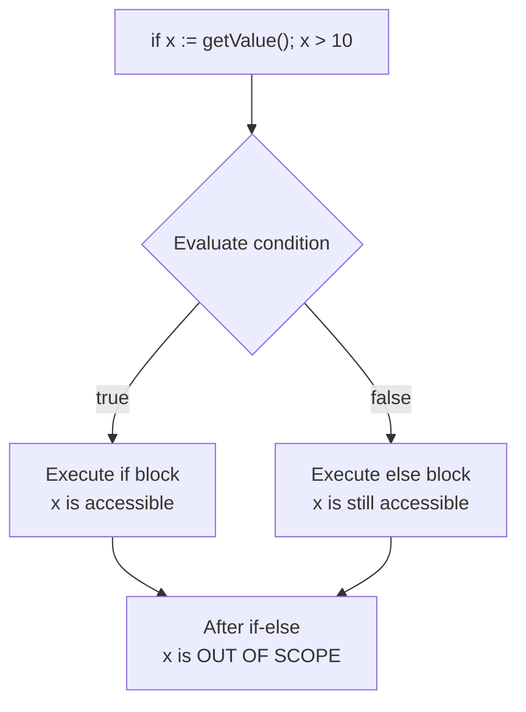

#Golang
---
---

## Summary

Go's `if` statement evaluates a boolean condition and executes code blocks accordingly. Unlike many languages, Go requires no parentheses around conditions but mandates braces around blocks. A unique feature is the "short statement"—an initialization statement before the condition that scopes variables to the if-else chain. Go has no ternary operator; conditional logic must use if-else.

## Detailed Explanation

### Basic Syntax

```go
if condition {
    // executed if condition is true
}

if condition {
    // true branch
} else {
    // false branch
}

if condition1 {
    // ...
} else if condition2 {
    // ...
} else {
    // ...
}
```

### Simple Examples

```go
package main

import "fmt"

func main() {
    x := 10
    
    if x > 5 {
        fmt.Println("x is greater than 5")
    }
    
    if x > 20 {
        fmt.Println("x is greater than 20")
    } else {
        fmt.Println("x is not greater than 20")
    }
    
    if x < 5 {
        fmt.Println("small")
    } else if x < 15 {
        fmt.Println("medium") // This prints
    } else {
        fmt.Println("large")
    }
}
```

### If with Short Statement

A powerful Go idiom: declare and initialize variables scoped to the if-else chain.

```go
package main

import (
    "fmt"
    "os"
)

func main() {
    // Short statement: err is scoped to if-else
    if err := doSomething(); err != nil {
        fmt.Println("Error:", err)
        return
    }
    // err is not accessible here
    
    // Common pattern: file operations
    if file, err := os.Open("config.json"); err != nil {
        fmt.Println("Failed to open:", err)
    } else {
        defer file.Close()
        // use file...
        fmt.Println("Opened:", file.Name())
    }
}

func doSomething() error {
    return nil
}
```

### Short Statement Flow



### No Ternary Operator

```go
// Other languages: result = condition ? valueIfTrue : valueIfFalse
// Go: Must use if-else

package main

import "fmt"

func main() {
    x := 10
    
    // Wrong: Go has no ternary
    // result := x > 5 ? "big" : "small"  // Compile error
    
    // Correct: use if-else
    var result string
    if x > 5 {
        result = "big"
    } else {
        result = "small"
    }
    fmt.Println(result)
    
    // Or use a helper function
    result = ternary(x > 5, "big", "small")
    fmt.Println(result)
}

// Generic ternary helper (Go 1.18+)
func ternary[T any](condition bool, ifTrue, ifFalse T) T {
    if condition {
        return ifTrue
    }
    return ifFalse
}
```

### Boolean Expressions

```go
package main

import "fmt"

func main() {
    a, b, c := true, false, true
    
    // AND: both must be true
    if a && b {
        fmt.Println("a AND b")
    }
    
    // OR: at least one true
    if a || b {
        fmt.Println("a OR b") // prints
    }
    
    // NOT: inverts
    if !b {
        fmt.Println("NOT b") // prints
    }
    
    // Complex conditions
    if (a || b) && c {
        fmt.Println("complex") // prints
    }
    
    // Short-circuit evaluation
    x := 0
    if x != 0 && 10/x > 1 { // Second part not evaluated, no panic
        fmt.Println("safe")
    }
}
```

### Idiomatic Patterns

#### Early Return (Guard Clauses)

```go
// Prefer: flat, early returns
func process(data *Data) error {
    if data == nil {
        return errors.New("data is nil")
    }
    if !data.Valid {
        return errors.New("data is invalid")
    }
    if data.Expired() {
        return errors.New("data expired")
    }
    // Main logic here (not nested)
    return nil
}

// Avoid: deep nesting
func processBad(data *Data) error {
    if data != nil {
        if data.Valid {
            if !data.Expired() {
                // Main logic buried in nesting
                return nil
            }
        }
    }
    return errors.New("failed")
}
```

#### Comma-Ok Idiom

```go
package main

import "fmt"

func main() {
    m := map[string]int{"a": 1, "b": 2}
    
    // Check if key exists
    if val, ok := m["a"]; ok {
        fmt.Println("Found:", val)
    }
    
    // Type assertion
    var i interface{} = "hello"
    if s, ok := i.(string); ok {
        fmt.Println("It's a string:", s)
    }
    
    // Channel receive
    ch := make(chan int, 1)
    ch <- 42
    if val, ok := <-ch; ok {
        fmt.Println("Received:", val)
    }
}
```

### Comparison Operators

| Operator | Description | Example |
|----------|-------------|---------|
| `==` | Equal | `x == 5` |
| `!=` | Not equal | `x != 5` |
| `<` | Less than | `x < 5` |
| `>` | Greater than | `x > 5` |
| `<=` | Less or equal | `x <= 5` |
| `>=` | Greater or equal | `x >= 5` |

### Common Mistakes

```go
// Mistake 1: Assignment instead of comparison
// if x = 5 { }  // Compile error: x = 5 used as value

// Mistake 2: Expecting truthiness
x := 1
// if x { }  // Compile error: non-bool used as condition
if x != 0 { } // Correct

// Mistake 3: Forgetting braces
// if x > 5
//     fmt.Println("big")  // Compile error: missing braces

// Mistake 4: Variable shadowing with :=
err := doFirst()
if err := doSecond(); err != nil { // Shadows outer err!
    return err
}
fmt.Println(err) // Still the error from doFirst (or nil)
```

## Interview Questions

**Q: Why doesn't Go have a ternary operator?**

**A:** Go's designers prioritized readability and simplicity. The ternary operator (`?:`) can lead to complex, hard-to-read one-liners. Explicit if-else is clearer, especially for non-trivial conditions. Rob Pike has stated that the simple form is never as clear as an if-else, and Go prefers explicit over clever.

**Q: What is the scope of variables declared in an if statement's short statement?**

**A:** Variables declared in the short statement are scoped to the entire if-else chain, including all `else if` and `else` blocks, but not beyond. This is useful for error handling where you want the error variable only available during the check, not polluting the outer scope.

**Q: How does Go's short-circuit evaluation work in boolean expressions?**

**A:** With `&&`, if the left operand is false, the right is not evaluated (result is already false). With `||`, if the left is true, the right is not evaluated (result is already true). This is important for guarding against nil dereferences: `if p != nil && p.Value > 0` safely checks nil first.

**Q: What's the difference between `if x := f(); x != nil` and `x := f(); if x != nil`?**

**A:** In the first form, `x` is scoped only to the if-else chain—it's not accessible afterward. In the second form, `x` remains accessible after the if statement. Use the short form when you only need the variable for the conditional check; use separate declaration when you need the variable later.
