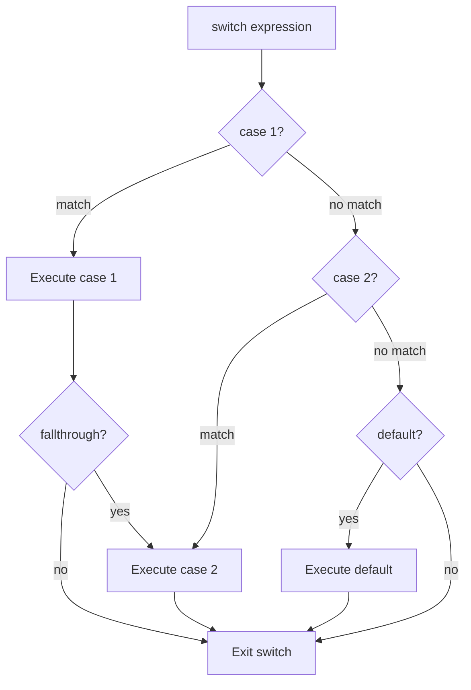

#Golang
---
---

## Summary

Go's switch statement is a cleaner alternative to if-else chains with automatic break (no fallthrough by default). It supports multiple values per case, expressions instead of just constants, and a powerful type switch for interface type assertions. Unlike C/Java, Go switch cases can be any comparable expressions, and a switch without an expression acts as a cleaner if-else-if chain.

## Detailed Explanation

### Basic Syntax

```go
switch expression {
case value1:
    // code
case value2, value3:
    // multiple values
default:
    // if no case matches
}
```

### Simple Switch

```go
package main

import "fmt"

func main() {
    day := "Tuesday"
    
    switch day {
    case "Monday":
        fmt.Println("Start of work week")
    case "Tuesday", "Wednesday", "Thursday":
        fmt.Println("Midweek")
    case "Friday":
        fmt.Println("TGIF!")
    case "Saturday", "Sunday":
        fmt.Println("Weekend!")
    default:
        fmt.Println("Invalid day")
    }
}
```

### No Automatic Fallthrough

```go
package main

import "fmt"

func main() {
    x := 1
    
    switch x {
    case 1:
        fmt.Println("One")
        // No automatic fallthrough - execution stops here
    case 2:
        fmt.Println("Two")
    }
    // Output: One
}
```

### Explicit Fallthrough

```go
package main

import "fmt"

func main() {
    x := 1
    
    switch x {
    case 1:
        fmt.Println("One")
        fallthrough // Explicitly fall into next case
    case 2:
        fmt.Println("Two")
        fallthrough
    case 3:
        fmt.Println("Three")
    }
    // Output:
    // One
    // Two
    // Three
}
```

### Switch with No Expression (True Switch)

Acts as a cleaner if-else-if chain:

```go
package main

import "fmt"

func main() {
    score := 85
    
    switch {
    case score >= 90:
        fmt.Println("A")
    case score >= 80:
        fmt.Println("B") // This prints
    case score >= 70:
        fmt.Println("C")
    case score >= 60:
        fmt.Println("D")
    default:
        fmt.Println("F")
    }
}
```

### Switch Control Flow



### Switch with Short Statement

```go
package main

import (
    "fmt"
    "runtime"
)

func main() {
    switch os := runtime.GOOS; os {
    case "darwin":
        fmt.Println("macOS")
    case "linux":
        fmt.Println("Linux")
    case "windows":
        fmt.Println("Windows")
    default:
        fmt.Printf("Unknown: %s\n", os)
    }
    // os is not accessible here
}
```

### Type Switch

Powerful pattern for handling interface{} values:

```go
package main

import "fmt"

func describe(i interface{}) {
    switch v := i.(type) {
    case int:
        fmt.Printf("Integer: %d\n", v)
    case string:
        fmt.Printf("String: %s (len=%d)\n", v, len(v))
    case bool:
        fmt.Printf("Boolean: %t\n", v)
    case []int:
        fmt.Printf("Int slice with %d elements\n", len(v))
    case nil:
        fmt.Println("nil value")
    default:
        fmt.Printf("Unknown type: %T\n", v)
    }
}

func main() {
    describe(42)          // Integer: 42
    describe("hello")     // String: hello (len=5)
    describe(true)        // Boolean: true
    describe([]int{1,2})  // Int slice with 2 elements
    describe(nil)         // nil value
    describe(3.14)        // Unknown type: float64
}
```

### Type Switch with Interface Check

```go
package main

import "fmt"

type Stringer interface {
    String() string
}

type MyInt int

func (m MyInt) String() string {
    return fmt.Sprintf("MyInt(%d)", m)
}

func process(i interface{}) {
    switch v := i.(type) {
    case Stringer:
        fmt.Println("Stringer:", v.String())
    case int:
        fmt.Println("Plain int:", v)
    default:
        fmt.Printf("Other: %T\n", v)
    }
}

func main() {
    process(MyInt(42))  // Stringer: MyInt(42)
    process(42)         // Plain int: 42
    process("hello")    // Other: string
}
```

### Comparison: Switch vs If-Else

| Feature | Switch | If-Else |
|---------|--------|---------|
| Multiple values | `case 1, 2, 3:` | `if x == 1 \|\| x == 2 \|\| x == 3` |
| Readability | Better for many conditions | Better for 2-3 conditions |
| Expressions | Any comparable expression | Any boolean expression |
| Type checking | `switch v := x.(type)` | Multiple type assertions |
| Performance | May optimize to jump table | Sequential checks |

### Break and Labels

```go
package main

import "fmt"

func main() {
OuterLoop:
    for i := 0; i < 3; i++ {
        switch i {
        case 0:
            fmt.Println("Zero")
        case 1:
            fmt.Println("One - breaking outer loop")
            break OuterLoop // Breaks the for loop, not just switch
        case 2:
            fmt.Println("Two")
        }
        fmt.Println("After switch")
    }
    fmt.Println("Done")
    // Output:
    // Zero
    // After switch
    // One - breaking outer loop
    // Done
}
```

### Empty Case Body

```go
switch x {
case 1, 2, 3:
    // Handle these cases
case 4:
    // Empty body is valid - does nothing
case 5:
    doSomething()
}
```

### Switch vs Map Lookup

For simple value mapping, consider maps:

```go
package main

import "fmt"

func main() {
    // Switch approach
    dayNum := 2
    var dayName string
    switch dayNum {
    case 1: dayName = "Monday"
    case 2: dayName = "Tuesday"
    // ... more cases
    }
    
    // Map approach - often cleaner for pure mapping
    days := map[int]string{
        1: "Monday",
        2: "Tuesday",
        // ... more entries
    }
    dayName = days[dayNum]
    fmt.Println(dayName)
}
```

## Interview Questions

**Q: How does Go's switch differ from C/Java switch?**

**A:** Go switch has automatic break—cases don't fall through by default, eliminating a common bug source. Use explicit `fallthrough` keyword when needed. Go cases can be expressions (not just constants), and multiple values per case (`case 1, 2, 3:`). Switch without expression (`switch { case x > 5: }`) acts as if-else-if chain.

**Q: What is a type switch and when would you use it?**

**A:** A type switch uses `switch v := x.(type)` to branch based on the dynamic type of an interface value. It's used when handling `interface{}` (any) parameters, implementing generic handlers, or in JSON/reflection code where the concrete type isn't known at compile time. Each case binds `v` to the matched type.

**Q: What happens if no case matches and there's no default?**

**A:** Nothing—the switch simply completes without executing any case body. This is valid and sometimes intentional. Unlike if-else where you might need an empty else, switch without default is common when you only care about specific cases. Add default when unhandled cases indicate a bug.

**Q: When should you use fallthrough?**

**A:** Rarely. `fallthrough` unconditionally executes the next case body—it doesn't recheck conditions. It's occasionally useful for cascading logic, but often indicates the cases should be combined (`case 1, 2, 3:`) or refactored. In most code, fallthrough is a code smell. The Go designers kept it only for backward compatibility with C-style code ports.
