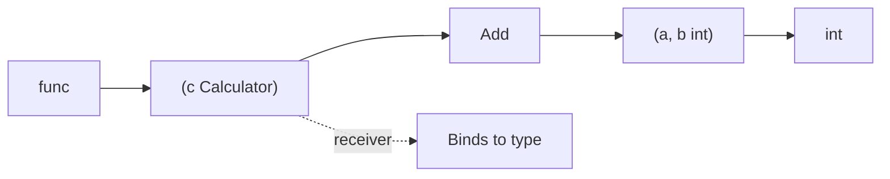

#Golang
---
---

## Summary

Methods in Go are functions with a special receiver argument that binds them to a type. While functions are standalone, methods enable object-oriented patterns by associating behavior with data types. The receiver appears between the `func` keyword and the method name. Methods allow types to satisfy interfaces, enable method chaining, and provide a natural way to organize code around data structures.

## Detailed Explanation

### Syntax Comparison

```go
// Function - standalone
func Add(a, b int) int {
    return a + b
}

// Method - bound to type
type Calculator struct {
    result int
}

func (c Calculator) Add(a, b int) int {
    return a + b
}
```

### Method Declaration

```go
func (receiver ReceiverType) MethodName(params) returnType {
    // body
}
```



### Basic Method Example

```go
package main

import "fmt"

type Rectangle struct {
    Width  float64
    Height float64
}

// Method on Rectangle
func (r Rectangle) Area() float64 {
    return r.Width * r.Height
}

func (r Rectangle) Perimeter() float64 {
    return 2 * (r.Width + r.Height)
}

func main() {
    rect := Rectangle{Width: 10, Height: 5}
    
    fmt.Println("Area:", rect.Area())           // Area: 50
    fmt.Println("Perimeter:", rect.Perimeter()) // Perimeter: 30
}
```

### Methods on Any Type

You can define methods on any type defined in the same package:

```go
package main

import "fmt"

// Method on custom type based on int
type Celsius float64

func (c Celsius) ToFahrenheit() float64 {
    return float64(c)*9/5 + 32
}

func (c Celsius) String() string {
    return fmt.Sprintf("%.2f°C", c)
}

// Method on slice type
type IntSlice []int

func (s IntSlice) Sum() int {
    total := 0
    for _, v := range s {
        total += v
    }
    return total
}

func main() {
    temp := Celsius(100)
    fmt.Println(temp)                // 100.00°C (String method)
    fmt.Println(temp.ToFahrenheit()) // 212
    
    nums := IntSlice{1, 2, 3, 4, 5}
    fmt.Println(nums.Sum()) // 15
}
```

### Function vs Method: When to Use

| Use Function | Use Method |
|--------------|------------|
| Stateless operation | Operation on type's data |
| Utility/helper logic | Behavior belongs to type |
| No specific type association | Implementing interfaces |
| Generic operations | Enabling method chaining |
| Package-level API | Type-specific API |

### Method Sets

The method set determines which methods are callable:

```go
package main

import "fmt"

type Counter struct {
    count int
}

func (c Counter) Value() int {
    return c.count
}

func (c *Counter) Increment() {
    c.count++
}

func main() {
    // Value type - can call value receiver methods
    c1 := Counter{}
    c1.Value()
    c1.Increment() // Go auto-converts to (&c1).Increment()
    
    // Pointer type - can call both value and pointer receiver methods
    c2 := &Counter{}
    c2.Value()     // Go auto-converts to (*c2).Value()
    c2.Increment()
    
    fmt.Println(c1.count, c2.count) // 1 1
}
```

### Method Set Rules

| Type | Method Set Includes |
|------|---------------------|
| `T` (value) | Methods with value receiver |
| `*T` (pointer) | Methods with value AND pointer receivers |

### Calling Methods Like Functions

Methods can be invoked as functions via the type:

```go
package main

import "fmt"

type Greeter struct {
    Name string
}

func (g Greeter) Greet() string {
    return "Hello, " + g.Name
}

func main() {
    g := Greeter{Name: "World"}
    
    // Normal method call
    fmt.Println(g.Greet()) // Hello, World
    
    // Method expression - type.Method returns a function
    greetFunc := Greeter.Greet
    fmt.Println(greetFunc(g)) // Hello, World
    
    // Method value - bound to specific receiver
    boundGreet := g.Greet
    fmt.Println(boundGreet()) // Hello, World
}
```

### Methods Cannot Be Defined on External Types

```go
package main

// Cannot define method on built-in or external type
// func (s string) Reverse() string { } // Compile error!

// Solution: create your own type
type MyString string

func (s MyString) Reverse() string {
    runes := []rune(s)
    for i, j := 0, len(runes)-1; i < j; i, j = i+1, j-1 {
        runes[i], runes[j] = runes[j], runes[i]
    }
    return string(runes)
}

func main() {
    s := MyString("hello")
    println(s.Reverse()) // olleh
}
```

## Interview Questions

**Q: What is the difference between a method and a function in Go?**

**A:** A function is standalone: `func name(params) returns`. A method has a receiver: `func (r Type) name(params) returns`. The receiver binds the method to a type, allowing it to access the receiver's data and enabling the type to satisfy interfaces. Methods are called on values (`v.Method()`), while functions are called directly (`Function(v)`).

**Q: Can you define methods on built-in types like int or string?**

**A:** No. You can only define methods on types declared in the same package. Built-in types are declared in the universe block, not your package. The solution is to create a custom type: `type MyInt int`, then define methods on `MyInt`. This is type aliasing for behavior extension.

**Q: What is a method set and why does it matter?**

**A:** A method set is the collection of methods callable on a type. For type T, it includes value receiver methods. For *T, it includes both value and pointer receiver methods. This matters for interface satisfaction: if an interface requires a pointer receiver method, only *T (not T) satisfies it. It determines what can be assigned to interface variables.

**Q: What are method expressions and method values?**

**A:** A method expression (`Type.Method`) returns a function where the receiver becomes the first parameter: `f := Counter.Value; f(c)`. A method value (`instance.Method`) binds a method to a specific receiver, returning a function that needs no arguments for the receiver: `f := c.Value; f()`. Method values are useful for callbacks and goroutines.
