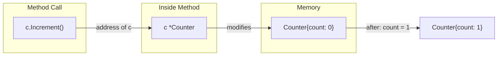

#Golang
---
---

## Summary

Pointer receivers use `*T` as the receiver type, allowing methods to modify the receiver's state. When you call a method with a pointer receiver, changes persist after the method returns. Pointer receivers are essential for mutation, required for large structs to avoid copying overhead, and necessary when the type contains fields that shouldn't be copied (like `sync.Mutex`). Go automatically takes addresses when calling pointer receiver methods on values.

## Detailed Explanation

### Pointer Receiver Syntax

```go
func (r *ReceiverType) MethodName(params) returnType {
    // Can modify r's fields
    r.Field = newValue
}
```

### Basic Example

```go
package main

import "fmt"

type Counter struct {
    count int
}

// Pointer receiver - can modify
func (c *Counter) Increment() {
    c.count++
}

func (c *Counter) Add(n int) {
    c.count += n
}

func (c *Counter) Reset() {
    c.count = 0
}

// Value receiver for read-only
func (c Counter) Value() int {
    return c.count
}

func main() {
    c := Counter{}
    c.Increment()
    c.Increment()
    c.Add(10)
    fmt.Println(c.Value()) // 12
    
    c.Reset()
    fmt.Println(c.Value()) // 0
}
```

### How Pointer Receivers Work



### Auto-Address Taking

Go automatically takes the address for pointer receiver calls:

```go
package main

import "fmt"

type Point struct {
    X, Y int
}

func (p *Point) Move(dx, dy int) {
    p.X += dx
    p.Y += dy
}

func main() {
    // Value - Go takes address automatically
    p1 := Point{0, 0}
    p1.Move(5, 10)        // Equivalent to (&p1).Move(5, 10)
    fmt.Println(p1)       // {5 10}
    
    // Pointer - works directly
    p2 := &Point{0, 0}
    p2.Move(5, 10)
    fmt.Println(*p2)      // {5 10}
}
```

### When Pointer Receivers Are Required

```go
package main

import (
    "fmt"
    "sync"
)

// 1. Modifying state
type Account struct {
    balance int
}

func (a *Account) Deposit(amount int) {
    a.balance += amount
}

// 2. Large structs (avoid copy)
type LargeConfig struct {
    Data [1024]byte
    // ... many fields
}

func (c *LargeConfig) Process() {
    // Pointer avoids copying 1KB+ on each call
}

// 3. Types with sync primitives (must not copy)
type SafeCounter struct {
    mu    sync.Mutex
    count int
}

func (c *SafeCounter) Inc() {
    c.mu.Lock()
    defer c.mu.Unlock()
    c.count++
}

func main() {
    acc := Account{}
    acc.Deposit(100)
    fmt.Println(acc.balance) // 100
}
```

### Nil Pointer Receivers

Methods can handle nil receivers gracefully:

```go
package main

import "fmt"

type List struct {
    Value int
    Next  *List
}

func (l *List) Sum() int {
    if l == nil {
        return 0
    }
    return l.Value + l.Next.Sum()
}

func (l *List) String() string {
    if l == nil {
        return "nil"
    }
    return fmt.Sprintf("%d -> %s", l.Value, l.Next.String())
}

func main() {
    list := &List{1, &List{2, &List{3, nil}}}
    fmt.Println(list.String()) // 1 -> 2 -> 3 -> nil
    fmt.Println(list.Sum())    // 6
    
    var empty *List
    fmt.Println(empty.Sum()) // 0 (safe!)
}
```

### Pointer Receivers and Interfaces

```go
package main

import "fmt"

type Incrementer interface {
    Increment()
}

type Counter struct {
    n int
}

func (c *Counter) Increment() {
    c.n++
}

func main() {
    c := Counter{}
    
    // *Counter implements Incrementer
    var i Incrementer = &c  // OK
    i.Increment()
    fmt.Println(c.n) // 1
    
    // Counter does NOT implement Incrementer
    // var i2 Incrementer = c  // Compile error!
}
```

### Consistency Rule

If any method needs a pointer receiver, use pointer receivers for all methods:

```go
// Consistent - all pointer receivers
type Buffer struct {
    data []byte
}

func (b *Buffer) Write(p []byte) (int, error) {
    b.data = append(b.data, p...)
    return len(p), nil
}

func (b *Buffer) String() string {
    return string(b.data)
}

func (b *Buffer) Reset() {
    b.data = b.data[:0]
}

func (b *Buffer) Len() int {
    return len(b.data)
}
```

### Pointer vs Value Receiver Decision Table

| Criterion | Pointer Receiver | Value Receiver |
|-----------|------------------|----------------|
| Modifies receiver? | Yes → Pointer | No → Either |
| Large struct? | Yes → Pointer | No → Either |
| Has sync.Mutex? | Yes → Pointer | N/A |
| Consistency | If others use pointer | If others use value |
| Interface with mutation | Required | Won't satisfy |

## Interview Questions

**Q: Why would you choose a pointer receiver over a value receiver?**

**A:** Use pointer receivers when: (1) the method needs to modify the receiver's state, (2) the receiver is a large struct and copying would be expensive, (3) the type contains fields that must not be copied like `sync.Mutex`, or (4) for consistency when other methods on the type use pointer receivers. The Go standard library convention is to use pointer receivers for all methods if any method needs one.

**Q: What happens when you call a pointer receiver method on a value?**

**A:** Go automatically takes the address of the value if it's addressable. So `v.Method()` becomes `(&v).Method()`. However, this only works for addressable values—you cannot call a pointer receiver method on a literal like `Point{1, 2}.Move()` because you can't take the address of a literal.

**Q: Can a nil pointer receiver cause issues?**

**A:** Calling a method on a nil pointer doesn't automatically panic—the method executes normally until it tries to dereference a nil pointer. Well-designed methods can check `if r == nil` and return safely. This is useful for recursive data structures like linked lists. However, careless nil dereference inside the method will panic.

**Q: Why does *T satisfy an interface but T might not?**

**A:** The method set of T includes only value receiver methods, while *T includes both value and pointer receiver methods. If an interface requires a method with pointer receiver, only *T has that method in its method set, so only *T satisfies the interface. This is why you often see `var i Interface = &value` instead of passing by value.
