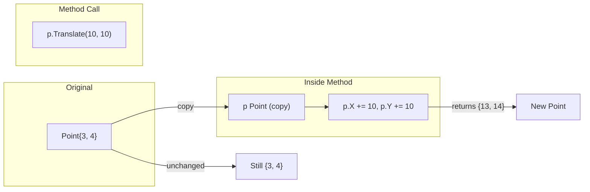

#Golang
---
---

## Summary

Value receivers use a copy of the receiver, meaning modifications inside the method don't affect the original. They're ideal for small, immutable types, read-only operations, and when you want to guarantee the original data won't change. Value receivers signal intent: this method observes but doesn't mutate. Go automatically dereferences pointers when calling value receiver methods.

## Detailed Explanation

### Value Receiver Syntax

```go
func (r ReceiverType) MethodName(params) returnType {
    // Works on a copy of r
    // Modifications don't affect original
}
```

### Basic Example

```go
package main

import "fmt"

type Point struct {
    X, Y int
}

// Value receiver - works on copy
func (p Point) Distance() float64 {
    return math.Sqrt(float64(p.X*p.X + p.Y*p.Y))
}

// Value receiver - modification doesn't persist
func (p Point) Translate(dx, dy int) Point {
    p.X += dx
    p.Y += dy
    return p // Return new value
}

func main() {
    p := Point{3, 4}
    fmt.Println(p.Distance()) // 5
    
    p2 := p.Translate(10, 10)
    fmt.Println(p)  // {3 4} - unchanged!
    fmt.Println(p2) // {13 14} - new point
}
```

### How Value Receivers Work



### Auto-Dereference for Value Receivers

```go
package main

import "fmt"

type Rectangle struct {
    Width, Height float64
}

func (r Rectangle) Area() float64 {
    return r.Width * r.Height
}

func main() {
    r := Rectangle{10, 5}
    fmt.Println(r.Area()) // 50
    
    // Pointer - Go auto-dereferences
    rp := &Rectangle{10, 5}
    fmt.Println(rp.Area()) // 50 (equivalent to (*rp).Area())
}
```

### When to Use Value Receivers

```go
package main

import (
    "fmt"
    "time"
)

// 1. Small, immutable types
type Money struct {
    Amount   int64
    Currency string
}

func (m Money) Add(other Money) Money {
    if m.Currency != other.Currency {
        panic("currency mismatch")
    }
    return Money{m.Amount + other.Amount, m.Currency}
}

// 2. Built-in type wrappers
type Celsius float64

func (c Celsius) String() string {
    return fmt.Sprintf("%.1f°C", c)
}

// 3. Time-like immutable values
type Duration time.Duration

func (d Duration) Hours() float64 {
    return float64(d) / float64(time.Hour)
}

func main() {
    m1 := Money{100, "USD"}
    m2 := Money{50, "USD"}
    m3 := m1.Add(m2)
    fmt.Println(m3) // {150 USD}
    
    temp := Celsius(23.5)
    fmt.Println(temp) // 23.5°C
}
```

### Value Receivers for Functional Style

```go
package main

import "fmt"

type IntSlice []int

// Value receiver - returns new slice, original unchanged
func (s IntSlice) Map(f func(int) int) IntSlice {
    result := make(IntSlice, len(s))
    for i, v := range s {
        result[i] = f(v)
    }
    return result
}

func (s IntSlice) Filter(pred func(int) bool) IntSlice {
    var result IntSlice
    for _, v := range s {
        if pred(v) {
            result = append(result, v)
        }
    }
    return result
}

func (s IntSlice) Reduce(init int, f func(int, int) int) int {
    result := init
    for _, v := range s {
        result = f(result, v)
    }
    return result
}

func main() {
    nums := IntSlice{1, 2, 3, 4, 5}
    
    result := nums.
        Map(func(n int) int { return n * 2 }).
        Filter(func(n int) bool { return n > 4 }).
        Reduce(0, func(a, b int) int { return a + b })
    
    fmt.Println(result) // 24 (6 + 8 + 10)
    fmt.Println(nums)   // [1 2 3 4 5] - unchanged
}
```

### Value Receiver Gotcha with Interfaces

```go
package main

import "fmt"

type Counter struct {
    n int
}

func (c Counter) Increment() {
    c.n++ // Modifies copy, useless!
}

func (c Counter) Value() int {
    return c.n
}

func main() {
    c := Counter{}
    c.Increment()
    c.Increment()
    fmt.Println(c.Value()) // 0 - increments had no effect!
}
```

### Comparison Table

| Aspect | Value Receiver | Pointer Receiver |
|--------|----------------|------------------|
| Receives | Copy of value | Pointer to value |
| Modifications | Don't affect original | Affect original |
| Nil handling | Cannot be nil | Can be nil |
| Memory | May copy large structs | Only copies pointer |
| Interface | T satisfies | *T required |
| Semantics | Immutable/read-only | Mutable |

### Standard Library Examples

Many standard library types use value receivers:

```go
// time.Time uses value receivers
func (t Time) Add(d Duration) Time
func (t Time) Format(layout string) string
func (t Time) Before(u Time) bool

// strings.Builder uses pointer receivers (mutation)
func (b *Builder) WriteString(s string) (int, error)
func (b *Builder) String() string
```

### Copying Cost Consideration

```go
package main

// Small struct - value receiver is fine
type Point struct {
    X, Y float64
}

func (p Point) Distance() float64 { /* ... */ }

// Large struct - prefer pointer receiver
type Image struct {
    Pixels [1920 * 1080 * 4]byte
    Width  int
    Height int
}

// Even for read-only, use pointer to avoid copying ~8MB
func (img *Image) PixelAt(x, y int) byte {
    return img.Pixels[y*img.Width+x]
}
```

## Interview Questions

**Q: When should you use a value receiver instead of a pointer receiver?**

**A:** Use value receivers when: (1) the type is small (a few words or less), (2) the method doesn't need to modify the receiver, (3) you want to signal immutability, (4) the type is inherently value-like (time.Time, complex numbers), or (5) you're implementing a functional/fluent API that returns new values. Basic types, small structs, and slices/maps (which already contain references) often use value receivers for read-only methods.

**Q: What happens when a value receiver method tries to modify the receiver?**

**A:** The modification only affects the copy inside the method—the original value remains unchanged. This is a common bug: defining a method like `func (c Counter) Increment() { c.n++ }` has no effect on the actual counter. The fix is to use a pointer receiver or return the modified value.

**Q: Can you call a value receiver method on a pointer?**

**A:** Yes. Go automatically dereferences the pointer. If `p` is a pointer and `Method` has a value receiver, `p.Method()` is equivalent to `(*p).Method()`. This convenience works in both directions: Go takes addresses for pointer receivers and dereferences for value receivers.

**Q: Why does time.Time use value receivers even though it's not tiny?**

**A:** `time.Time` is designed to be an immutable value type—operations return new `Time` values rather than modifying in place. This makes it safe for concurrent use without locks and easier to reason about. The copy cost (24 bytes) is acceptable for the safety and clarity benefits. It's similar to how strings are immutable in Go.
