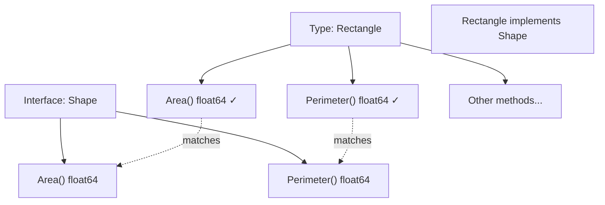
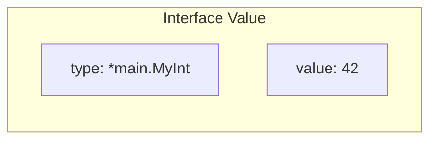

#Golang
---
---

## Summary

Interfaces in Go define behavior as a set of method signatures. A type implicitly implements an interface by implementing all its methods—no `implements` keyword needed. This enables duck typing: "if it walks like a duck and quacks like a duck, it's a duck." Interfaces are the primary abstraction mechanism in Go, enabling polymorphism, dependency injection, and testable code. They're typically small, often with just one or two methods.

## Detailed Explanation

### Interface Declaration

```go
type InterfaceName interface {
    Method1(params) returnType
    Method2(params) returnType
}
```

### Basic Example

```go
package main

import (
    "fmt"
    "math"
)

// Interface definition
type Shape interface {
    Area() float64
    Perimeter() float64
}

// Rectangle implements Shape (implicitly)
type Rectangle struct {
    Width, Height float64
}

func (r Rectangle) Area() float64 {
    return r.Width * r.Height
}

func (r Rectangle) Perimeter() float64 {
    return 2 * (r.Width + r.Height)
}

// Circle also implements Shape
type Circle struct {
    Radius float64
}

func (c Circle) Area() float64 {
    return math.Pi * c.Radius * c.Radius
}

func (c Circle) Perimeter() float64 {
    return 2 * math.Pi * c.Radius
}

// Function accepting interface
func PrintShapeInfo(s Shape) {
    fmt.Printf("Area: %.2f, Perimeter: %.2f\n", s.Area(), s.Perimeter())
}

func main() {
    rect := Rectangle{10, 5}
    circle := Circle{7}
    
    PrintShapeInfo(rect)   // Area: 50.00, Perimeter: 30.00
    PrintShapeInfo(circle) // Area: 153.94, Perimeter: 43.98
}
```

### Interface Satisfaction



### Implicit Implementation

```go
package main

import "fmt"

type Writer interface {
    Write([]byte) (int, error)
}

// ConsoleWriter implements Writer without declaring it
type ConsoleWriter struct{}

func (cw ConsoleWriter) Write(data []byte) (int, error) {
    n, err := fmt.Println(string(data))
    return n, err
}

func main() {
    var w Writer = ConsoleWriter{}
    w.Write([]byte("Hello, Interface!"))
}
```

### Common Standard Library Interfaces

| Interface | Methods | Package |
|-----------|---------|---------|
| `io.Reader` | `Read(p []byte) (n int, err error)` | io |
| `io.Writer` | `Write(p []byte) (n int, err error)` | io |
| `fmt.Stringer` | `String() string` | fmt |
| `error` | `Error() string` | builtin |
| `sort.Interface` | `Len()`, `Less(i, j int)`, `Swap(i, j int)` | sort |
| `io.Closer` | `Close() error` | io |

### Interface Values (Two Components)

An interface value holds: (type, value)

```go
package main

import "fmt"

type Stringer interface {
    String() string
}

type MyInt int

func (m MyInt) String() string {
    return fmt.Sprintf("MyInt: %d", m)
}

func main() {
    var s Stringer
    fmt.Printf("nil interface: (%v, %T)\n", s, s)
    // nil interface: (<nil>, <nil>)
    
    s = MyInt(42)
    fmt.Printf("with value: (%v, %T)\n", s, s)
    // with value: (MyInt: 42, main.MyInt)
}
```



### Accept Interfaces, Return Structs

A key Go proverb:

```go
package main

// Good: accept interface
func Process(r io.Reader) error {
    // Can work with any Reader: files, network, strings...
    data, err := io.ReadAll(r)
    // ...
}

// Good: return concrete type
func NewBuffer() *bytes.Buffer {
    return &bytes.Buffer{}
}

// Avoid: returning interface (hides implementation)
func NewReader() io.Reader {
    return &bytes.Buffer{} // Caller can't access Buffer-specific methods
}
```

### Small Interfaces

Go favors small, focused interfaces:

```go
// Good: single-method interfaces
type Reader interface {
    Read(p []byte) (n int, err error)
}

type Writer interface {
    Write(p []byte) (n int, err error)
}

// Compose when needed
type ReadWriter interface {
    Reader
    Writer
}

// Avoid: large interfaces
type DoEverything interface {
    Read(p []byte) (n int, err error)
    Write(p []byte) (n int, err error)
    Close() error
    Seek(offset int64, whence int) (int64, error)
    // ... 10 more methods
}
```

### Interface for Testing

```go
package main

// Define interface for what you need
type UserStore interface {
    GetUser(id int) (*User, error)
    SaveUser(u *User) error
}

// Real implementation
type PostgresStore struct {
    db *sql.DB
}

func (s *PostgresStore) GetUser(id int) (*User, error) {
    // Real database query
}

// Mock for testing
type MockStore struct {
    users map[int]*User
}

func (m *MockStore) GetUser(id int) (*User, error) {
    if u, ok := m.users[id]; ok {
        return u, nil
    }
    return nil, errors.New("not found")
}

// Service depends on interface, not concrete type
type UserService struct {
    store UserStore // Can be real or mock
}
```

## Interview Questions

**Q: How is Go's interface implementation different from Java/C#?**

**A:** Go uses implicit/structural interfaces—a type implements an interface automatically by having the required methods. No `implements` keyword is needed. This enables retroactive interface satisfaction: you can define an interface that existing types already satisfy. It promotes decoupling because the implementer doesn't need to know about the interface.

**Q: What does "accept interfaces, return structs" mean?**

**A:** Functions should accept interface parameters (flexibility) but return concrete types (clarity). Accepting interfaces lets callers pass any type that satisfies the interface. Returning concrete types lets callers access type-specific methods and makes the API explicit. This maximizes flexibility for callers while keeping implementations clear.

**Q: What is the zero value of an interface?**

**A:** The zero value of an interface is `nil`, meaning both its type and value components are nil. Calling a method on a nil interface panics. However, an interface holding a nil pointer of a concrete type is NOT nil—it has a type but nil value. This subtle distinction is a common source of bugs.

**Q: Why are Go interfaces typically small?**

**A:** Small interfaces (1-3 methods) are easier to implement, compose, and mock. The io.Reader interface with one method is implemented by dozens of types. Large interfaces create tight coupling and make testing harder. Go encourages defining the minimum interface needed, composing larger interfaces from smaller ones when necessary.
