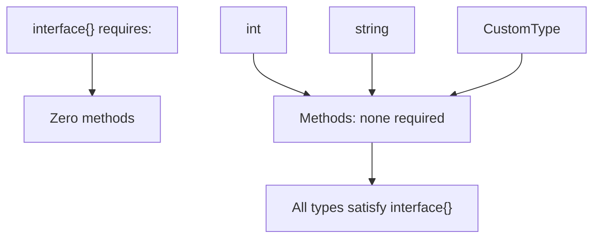

#Golang
---
---

## Summary

The empty interface `interface{}` (or `any` since Go 1.18) has no methods, so every type satisfies it. It's Go's way of accepting values of any type, similar to `Object` in Java or `void*` in C. Empty interfaces are used in generic containers, JSON parsing, and formatting functions. However, they sacrifice type safety, requiring type assertions or reflection to use the underlying value.

## Detailed Explanation

### Empty Interface Declaration

```go
interface{}  // Traditional syntax
any          // Alias since Go 1.18 (preferred)
```

### Basic Usage

```go
package main

import "fmt"

func PrintAnything(v any) {
    fmt.Printf("Value: %v, Type: %T\n", v, v)
}

func main() {
    PrintAnything(42)           // Value: 42, Type: int
    PrintAnything("hello")      // Value: hello, Type: string
    PrintAnything(true)         // Value: true, Type: bool
    PrintAnything([]int{1,2,3}) // Value: [1 2 3], Type: []int
    PrintAnything(nil)          // Value: <nil>, Type: <nil>
}
```

### Why Every Type Satisfies Empty Interface



### Common Use Cases

#### 1. Generic Containers (Pre-Generics)

```go
package main

import "fmt"

type Stack struct {
    items []any
}

func (s *Stack) Push(item any) {
    s.items = append(s.items, item)
}

func (s *Stack) Pop() any {
    if len(s.items) == 0 {
        return nil
    }
    item := s.items[len(s.items)-1]
    s.items = s.items[:len(s.items)-1]
    return item
}

func main() {
    s := &Stack{}
    s.Push(1)
    s.Push("hello")
    s.Push(3.14)
    
    fmt.Println(s.Pop()) // 3.14
    fmt.Println(s.Pop()) // hello
    fmt.Println(s.Pop()) // 1
}
```

#### 2. JSON with Dynamic Structure

```go
package main

import (
    "encoding/json"
    "fmt"
)

func main() {
    jsonData := `{
        "name": "Alice",
        "age": 30,
        "active": true,
        "scores": [95, 87, 92]
    }`
    
    var data map[string]any
    json.Unmarshal([]byte(jsonData), &data)
    
    fmt.Println(data["name"])   // Alice
    fmt.Println(data["age"])    // 30 (float64!)
    fmt.Println(data["scores"]) // [95 87 92]
    
    // Type assertion needed for operations
    if age, ok := data["age"].(float64); ok {
        fmt.Println("Age in 10 years:", age+10)
    }
}
```

#### 3. Variadic Functions

```go
package main

import "fmt"

// fmt.Println signature
// func Println(a ...any) (n int, err error)

func LogValues(prefix string, values ...any) {
    fmt.Print(prefix, ": ")
    for i, v := range values {
        if i > 0 {
            fmt.Print(", ")
        }
        fmt.Printf("%v (%T)", v, v)
    }
    fmt.Println()
}

func main() {
    LogValues("Debug", 42, "test", true, 3.14)
    // Debug: 42 (int), test (string), true (bool), 3.14 (float64)
}
```

### Type Assertions with Empty Interface

```go
package main

import "fmt"

func process(v any) {
    // Type assertion with ok check
    if s, ok := v.(string); ok {
        fmt.Println("String length:", len(s))
        return
    }
    
    if n, ok := v.(int); ok {
        fmt.Println("Integer doubled:", n*2)
        return
    }
    
    fmt.Printf("Unhandled type: %T\n", v)
}

func main() {
    process("hello")  // String length: 5
    process(42)       // Integer doubled: 84
    process(3.14)     // Unhandled type: float64
}
```

### Empty Interface Pitfalls

```go
package main

import "fmt"

func main() {
    // Pitfall 1: Nil comparison
    var p *int = nil
    var i any = p
    
    fmt.Println(p == nil) // true
    fmt.Println(i == nil) // false! (interface has type, value is nil)
    
    // Pitfall 2: Losing type information
    var nums any = []int{1, 2, 3}
    // nums[0] // Compile error: cannot index any
    
    // Must type assert first
    if slice, ok := nums.([]int); ok {
        fmt.Println(slice[0]) // 1
    }
    
    // Pitfall 3: JSON numbers become float64
    var data any
    json.Unmarshal([]byte(`{"n": 42}`), &data)
    m := data.(map[string]any)
    n := m["n"].(float64) // Not int!
    fmt.Printf("%T: %v\n", n, n) // float64: 42
}
```

### `any` vs Generics

```go
package main

import "fmt"

// With any - loses type safety
func FirstAny(items []any) any {
    if len(items) == 0 {
        return nil
    }
    return items[0]
}

// With generics - type safe
func First[T any](items []T) (T, bool) {
    var zero T
    if len(items) == 0 {
        return zero, false
    }
    return items[0], true
}

func main() {
    // any version - requires type assertion
    items := []any{1, 2, 3}
    first := FirstAny(items)
    n := first.(int) // Must assert
    
    // Generic version - type safe
    nums := []int{1, 2, 3}
    first2, _ := First(nums)
    // first2 is already int, no assertion needed
    
    fmt.Println(n, first2)
}
```

### When to Use Empty Interface

| Use Case | Recommendation |
|----------|---------------|
| Generic containers | Prefer generics (Go 1.18+) |
| JSON with unknown structure | `map[string]any` appropriate |
| Printf-style functions | `...any` is idiomatic |
| Truly heterogeneous data | Empty interface acceptable |
| Type-specific operations | Avoid, use concrete types |

## Interview Questions

**Q: What is the difference between `interface{}` and `any`?**

**A:** They are identical—`any` is a type alias for `interface{}` introduced in Go 1.18. `any` is more readable and preferred in new code. Both represent the empty interface that all types satisfy. The alias was added to make generic code cleaner: `func Print[T any](v T)` reads better than `func Print[T interface{}](v T)`.

**Q: Why is `any` considered an anti-pattern in many cases?**

**A:** Empty interface discards type information, requiring runtime type assertions that can panic if wrong. It bypasses compile-time type checking, moving errors to runtime. With Go 1.18+ generics, most uses of `any` can be replaced with type parameters that maintain type safety. Use `any` only when truly any type is acceptable or when interfacing with untyped data like JSON.

**Q: Why is a nil pointer wrapped in an interface not equal to nil?**

**A:** An interface value has two components: (type, value). A nil interface has both as nil. An interface holding a nil pointer has (concreteType, nil)—the type is set. When comparing to nil, Go checks if BOTH components are nil. This is a common bug source. Always check `v == nil` before wrapping in interfaces, or use type assertions to check for nil pointers.

**Q: How does JSON unmarshaling use empty interface?**

**A:** When unmarshaling into `any` or `map[string]any`, the JSON decoder maps: objects→`map[string]any`, arrays→`[]any`, strings→`string`, booleans→`bool`, numbers→`float64`, null→`nil`. Note that all JSON numbers become float64, which requires assertion and conversion for integers. For known structures, define concrete types for type safety.
