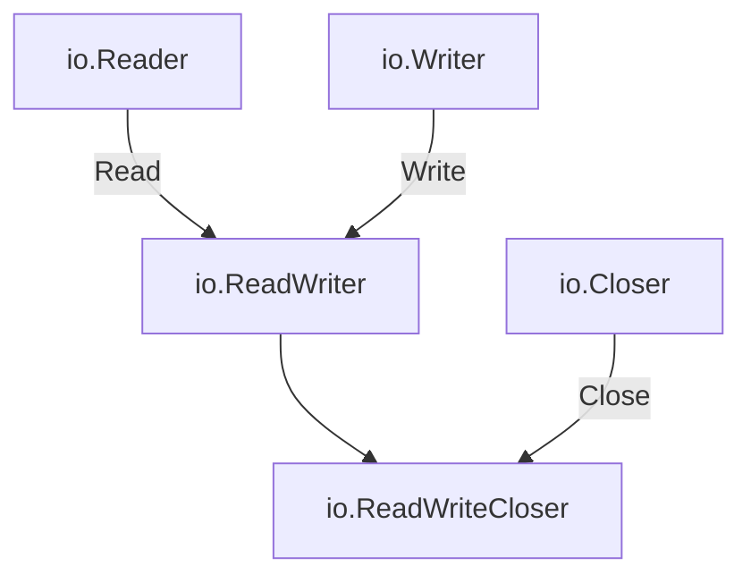

#Golang
---
---

## Summary

Interface embedding composes interfaces by including one interface inside another. The embedding interface inherits all methods from the embedded interface(s). This is Go's mechanism for building larger interfaces from smaller, focused ones. The standard library uses this extensively: `io.ReadWriter` embeds both `io.Reader` and `io.Writer`. Embedding promotes interface reuse and follows the composition-over-inheritance principle.

## Detailed Explanation

### Basic Embedding Syntax

```go
type Reader interface {
    Read(p []byte) (n int, err error)
}

type Writer interface {
    Write(p []byte) (n int, err error)
}

// ReadWriter embeds both Reader and Writer
type ReadWriter interface {
    Reader
    Writer
}

// Equivalent to:
type ReadWriter interface {
    Read(p []byte) (n int, err error)
    Write(p []byte) (n int, err error)
}
```

### Embedding Visualization



### Standard Library Examples

```go
// From the io package
type Reader interface {
    Read(p []byte) (n int, err error)
}

type Writer interface {
    Write(p []byte) (n int, err error)
}

type Closer interface {
    Close() error
}

type Seeker interface {
    Seek(offset int64, whence int) (int64, error)
}

// Composed interfaces
type ReadWriter interface {
    Reader
    Writer
}

type ReadCloser interface {
    Reader
    Closer
}

type WriteCloser interface {
    Writer
    Closer
}

type ReadWriteCloser interface {
    Reader
    Writer
    Closer
}

type ReadWriteSeeker interface {
    Reader
    Writer
    Seeker
}
```

### Custom Interface Composition

```go
package main

import "fmt"

// Small, focused interfaces
type Identifier interface {
    ID() string
}

type Namer interface {
    Name() string
}

type Saver interface {
    Save() error
}

type Deleter interface {
    Delete() error
}

// Composed interfaces
type Entity interface {
    Identifier
    Namer
}

type Persistable interface {
    Entity
    Saver
    Deleter
}

// Implementation
type User struct {
    id   string
    name string
}

func (u User) ID() string   { return u.id }
func (u User) Name() string { return u.name }
func (u User) Save() error  { fmt.Println("Saving", u.name); return nil }
func (u User) Delete() error { fmt.Println("Deleting", u.name); return nil }

func main() {
    user := User{id: "123", name: "Alice"}
    
    // User satisfies all these interfaces
    var e Entity = user
    var p Persistable = user
    
    fmt.Println(e.ID(), e.Name())
    p.Save()
}
```

### Embedding with Additional Methods

```go
package main

type Logger interface {
    Log(message string)
}

type ErrorLogger interface {
    Logger                      // Embedded
    LogError(err error)         // Additional method
    LogFatal(err error)         // Additional method
}

// Satisfying ErrorLogger requires all three methods
type ConsoleLogger struct{}

func (c ConsoleLogger) Log(msg string)     { fmt.Println("[INFO]", msg) }
func (c ConsoleLogger) LogError(err error) { fmt.Println("[ERROR]", err) }
func (c ConsoleLogger) LogFatal(err error) { fmt.Println("[FATAL]", err); os.Exit(1) }
```

### Interface Embedding Rules

| Rule | Example |
|------|---------|
| Can embed multiple interfaces | `type A interface { B; C; D }` |
| Methods must not conflict | Same name = same signature required |
| Embedding is transitive | If A embeds B which embeds C, A has C's methods |
| Can add own methods | `type A interface { B; OwnMethod() }` |

### Method Collision

```go
// Valid: same signature
type A interface {
    Method() string
}

type B interface {
    Method() string
}

type AB interface {
    A
    B  // OK: Method() string is identical
}

// Invalid: different signatures would conflict
type X interface {
    Method() string
}

type Y interface {
    Method() int  // Different return type
}

// type XY interface {
//     X
//     Y  // Compile error: duplicate method Method
// }
```

### Practical Example: Repository Pattern

```go
package main

type Finder[T any] interface {
    Find(id string) (T, error)
    FindAll() ([]T, error)
}

type Creator[T any] interface {
    Create(entity T) error
}

type Updater[T any] interface {
    Update(entity T) error
}

type Deleter interface {
    Delete(id string) error
}

// Compose for different use cases
type ReadOnlyRepository[T any] interface {
    Finder[T]
}

type WriteOnlyRepository[T any] interface {
    Creator[T]
    Updater[T]
    Deleter
}

type Repository[T any] interface {
    Finder[T]
    Creator[T]
    Updater[T]
    Deleter
}

// Service can depend on minimal interface
type ReportService[T any] struct {
    repo ReadOnlyRepository[T]  // Only needs read access
}

type AdminService[T any] struct {
    repo Repository[T]  // Needs full access
}
```

### Embedding vs Type Assertion

```go
package main

import "io"

func process(r io.Reader) {
    // Check if r also implements Closer
    if rc, ok := r.(io.ReadCloser); ok {
        defer rc.Close()
        // Use rc which has both Read and Close
    }
    
    // Or check for specific interface
    if closer, ok := r.(io.Closer); ok {
        defer closer.Close()
    }
    
    // Read data
    data, _ := io.ReadAll(r)
    fmt.Println(string(data))
}
```

### Anti-Pattern: Overly Large Interfaces

```go
// Bad: monolithic interface
type Repository interface {
    Find(id string) (*Entity, error)
    FindAll() ([]*Entity, error)
    FindByName(name string) (*Entity, error)
    FindByEmail(email string) (*Entity, error)
    Create(e *Entity) error
    Update(e *Entity) error
    Delete(id string) error
    Count() (int, error)
    Exists(id string) (bool, error)
    // ... 10 more methods
}

// Good: composed small interfaces
type EntityFinder interface {
    Find(id string) (*Entity, error)
}

type EntityCreator interface {
    Create(e *Entity) error
}

// Functions accept minimal interface they need
func GetEntity(f EntityFinder, id string) (*Entity, error) {
    return f.Find(id)
}
```

## Interview Questions

**Q: Why does Go prefer small interfaces over large ones?**

**A:** Small interfaces are easier to implement, mock, and compose. A type satisfying `io.Reader` (one method) is simpler than satisfying a 10-method interface. Small interfaces promote the Interface Segregation Principle—clients shouldn't depend on methods they don't use. Composition via embedding builds larger interfaces only when needed.

**Q: What happens when embedded interfaces have methods with the same name?**

**A:** If the signatures are identical, the method is included once in the embedding interface—no conflict. If signatures differ (same name, different parameters or return types), it's a compile error. Go doesn't support method overloading, so conflicting method signatures cannot coexist in one interface.

**Q: How does interface embedding relate to struct embedding?**

**A:** Both are composition mechanisms. Interface embedding includes method signatures from embedded interfaces. Struct embedding includes fields and methods from embedded types. Interface embedding is about combining behaviors; struct embedding is about combining data and implementations. Both avoid the complexity of traditional inheritance.

**Q: Can you embed a concrete type in an interface?**

**A:** No. Interfaces can only embed other interfaces, not concrete types. An interface defines behavior (methods), not data. To require a specific type, you'd need type assertions at runtime. The separation keeps interfaces focused on what types can do, not what they are.
