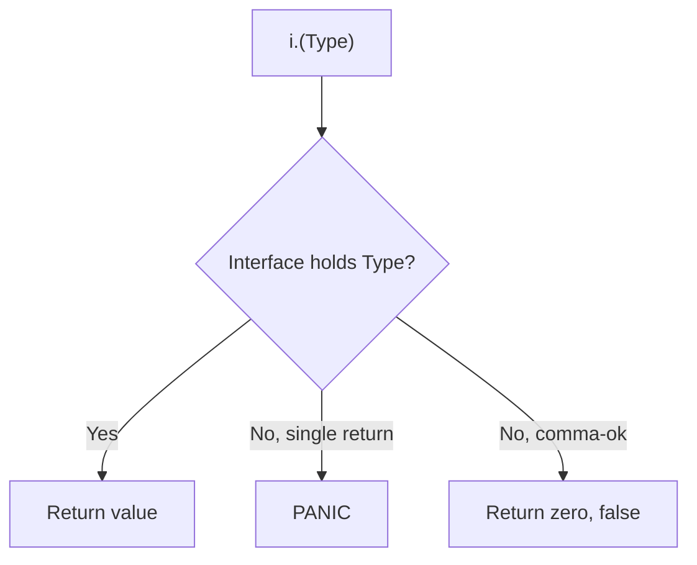

#Golang
---
---

## Summary

Type assertions extract the concrete value from an interface variable. The syntax `value := i.(Type)` asserts that interface `i` holds a value of `Type`. If wrong, it panics. The safe form `value, ok := i.(Type)` returns a boolean indicating success. Type assertions are essential for working with empty interfaces (`any`) and for accessing type-specific methods not in the interface.

## Detailed Explanation

### Type Assertion Syntax

```go
// Unsafe - panics if wrong type
value := interfaceVar.(ConcreteType)

// Safe - returns ok boolean
value, ok := interfaceVar.(ConcreteType)
```

### Basic Example

```go
package main

import "fmt"

func main() {
    var i any = "hello"
    
    // Safe assertion
    s, ok := i.(string)
    if ok {
        fmt.Println("String:", s, "Length:", len(s))
    }
    
    // Unsafe assertion - works
    s2 := i.(string)
    fmt.Println(s2)
    
    // Unsafe assertion - panics!
    // n := i.(int) // panic: interface conversion: interface {} is string, not int
    
    // Safe assertion - doesn't panic
    n, ok := i.(int)
    if !ok {
        fmt.Println("Not an int, n is zero value:", n)
    }
}
```

### Type Assertion Flow



### Working with Empty Interface

```go
package main

import "fmt"

func processValue(v any) {
    // Try string
    if s, ok := v.(string); ok {
        fmt.Printf("String: %q (len=%d)\n", s, len(s))
        return
    }
    
    // Try int
    if n, ok := v.(int); ok {
        fmt.Printf("Int: %d (doubled=%d)\n", n, n*2)
        return
    }
    
    // Try slice
    if nums, ok := v.([]int); ok {
        sum := 0
        for _, n := range nums {
            sum += n
        }
        fmt.Printf("Slice: %v (sum=%d)\n", nums, sum)
        return
    }
    
    fmt.Printf("Unknown type: %T\n", v)
}

func main() {
    processValue("hello")      // String: "hello" (len=5)
    processValue(42)           // Int: 42 (doubled=84)
    processValue([]int{1,2,3}) // Slice: [1 2 3] (sum=6)
    processValue(3.14)         // Unknown type: float64
}
```

### Asserting to Interface

You can assert to another interface type:

```go
package main

import (
    "fmt"
    "io"
    "strings"
)

func main() {
    var r io.Reader = strings.NewReader("hello")
    
    // Assert Reader to the more specific ReadSeeker
    if rs, ok := r.(io.ReadSeeker); ok {
        rs.Seek(0, io.SeekEnd)
        fmt.Println("Is a ReadSeeker")
    }
    
    // Assert to check for additional interface
    if closer, ok := r.(io.Closer); ok {
        defer closer.Close()
    } else {
        fmt.Println("Reader is not a Closer")
    }
}
```

### Common Patterns

#### Pattern 1: Conditional Method Access

```go
package main

type Namer interface {
    Name() string
}

type Greeter interface {
    Greet() string
}

func process(n Namer) {
    fmt.Println("Name:", n.Name())
    
    // Check if also implements Greeter
    if g, ok := n.(Greeter); ok {
        fmt.Println("Greeting:", g.Greet())
    }
}
```

#### Pattern 2: Error Handling

```go
package main

import (
    "errors"
    "fmt"
    "net"
)

func handleError(err error) {
    // Check for specific error types
    if netErr, ok := err.(net.Error); ok {
        if netErr.Timeout() {
            fmt.Println("Network timeout")
            return
        }
        if netErr.Temporary() {
            fmt.Println("Temporary network error")
            return
        }
    }
    
    // Check for wrapped errors
    var pathErr *os.PathError
    if errors.As(err, &pathErr) {
        fmt.Println("Path error:", pathErr.Path)
        return
    }
    
    fmt.Println("Unknown error:", err)
}
```

#### Pattern 3: JSON Dynamic Parsing

```go
package main

import (
    "encoding/json"
    "fmt"
)

func main() {
    jsonStr := `{"name": "Alice", "age": 30, "scores": [95, 87]}`
    
    var data map[string]any
    json.Unmarshal([]byte(jsonStr), &data)
    
    // Assert each field
    if name, ok := data["name"].(string); ok {
        fmt.Println("Name:", name)
    }
    
    if age, ok := data["age"].(float64); ok { // JSON numbers are float64!
        fmt.Println("Age:", int(age))
    }
    
    if scores, ok := data["scores"].([]any); ok {
        fmt.Print("Scores: ")
        for _, s := range scores {
            if score, ok := s.(float64); ok {
                fmt.Printf("%.0f ", score)
            }
        }
        fmt.Println()
    }
}
```

### Assertion vs Conversion

| Concept | Syntax | Use Case |
|---------|--------|----------|
| Type Assertion | `v.(Type)` | Extract from interface |
| Type Conversion | `Type(v)` | Convert between compatible types |

```go
// Type conversion (between compatible types)
var i int = 42
var f float64 = float64(i)

// Type assertion (from interface)
var any interface{} = 42
var n int = any.(int)
```

### Panic Behavior

```go
package main

func main() {
    var i any = "hello"
    
    defer func() {
        if r := recover(); r != nil {
            fmt.Println("Recovered:", r)
        }
    }()
    
    n := i.(int) // Panics!
    fmt.Println(n)
}
// Output: Recovered: interface conversion: interface {} is string, not int
```

### Best Practices

| Practice | Recommendation |
|----------|---------------|
| Unknown type | Always use comma-ok form |
| Known type (guaranteed) | Single-value form acceptable |
| Multiple possible types | Use type switch instead |
| Production code | Prefer comma-ok for safety |

## Interview Questions

**Q: What is the difference between type assertion and type conversion?**

**A:** Type assertion (`v.(Type)`) extracts a concrete value from an interface—it doesn't change the value, just reveals what's inside. Type conversion (`Type(v)`) transforms a value between compatible types (like int to float64). Assertions work on interfaces; conversions work on concrete types. Assertions can panic; conversions are checked at compile time.

**Q: When should you use the comma-ok form vs the single-value form?**

**A:** Use comma-ok (`v, ok := i.(T)`) when the type isn't guaranteed—it prevents panics and lets you handle unexpected types gracefully. Use single-value (`v := i.(T)`) only when you're certain of the type, typically after a type check or in controlled code paths. Production code should default to comma-ok for safety.

**Q: Can you assert an interface to another interface type?**

**A:** Yes. You can assert to any interface type. If the underlying concrete value satisfies the target interface, the assertion succeeds. This is useful for checking if a value implements additional interfaces beyond what's declared. Example: asserting an `io.Reader` to `io.ReadCloser` to check for `Close()` capability.

**Q: What happens when a type assertion fails with the comma-ok form?**

**A:** The value variable gets the zero value of the asserted type, and `ok` is `false`. No panic occurs. For example, if `i.(string)` fails, you get `("", false)`. This allows graceful fallback handling without exception-style error handling.
