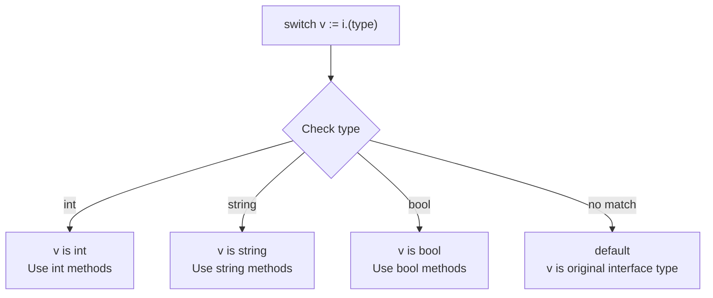

#Golang
---
---

## Summary

A type switch is a switch statement that branches based on the type of an interface value rather than its value. It uses the syntax `switch v := i.(type)` where `v` is bound to the matched concrete type in each case. Type switches provide a clean way to handle multiple types, avoiding chains of type assertions. They're essential for processing `any` values, implementing polymorphic behavior, and handling dynamic data.

## Detailed Explanation

### Type Switch Syntax

```go
switch v := interfaceVar.(type) {
case Type1:
    // v is Type1 here
case Type2:
    // v is Type2 here
case Type3, Type4:
    // v is interface type (original)
default:
    // v is interface type
}
```

### Basic Example

```go
package main

import "fmt"

func describe(i any) {
    switch v := i.(type) {
    case int:
        fmt.Printf("Integer: %d (doubled: %d)\n", v, v*2)
    case string:
        fmt.Printf("String: %q (length: %d)\n", v, len(v))
    case bool:
        fmt.Printf("Boolean: %t (negated: %t)\n", v, !v)
    case []int:
        fmt.Printf("Int slice with %d elements\n", len(v))
    default:
        fmt.Printf("Unknown type: %T\n", v)
    }
}

func main() {
    describe(42)           // Integer: 42 (doubled: 84)
    describe("hello")      // String: "hello" (length: 5)
    describe(true)         // Boolean: true (negated: false)
    describe([]int{1,2,3}) // Int slice with 3 elements
    describe(3.14)         // Unknown type: float64
}
```

### Type Switch Flow



### Variable Binding Per Case

```go
package main

import "fmt"

func process(i any) {
    switch v := i.(type) {
    case int:
        // v is int - can use int operations
        fmt.Println(v + 100)
    case string:
        // v is string - can use string operations
        fmt.Println(v + " world")
    case []byte:
        // v is []byte - can use slice operations
        fmt.Println(string(v))
    }
}

func main() {
    process(42)           // 142
    process("hello")      // hello world
    process([]byte("hi")) // hi
}
```

### Multiple Types Per Case

```go
package main

import "fmt"

func classify(i any) {
    switch v := i.(type) {
    case int, int8, int16, int32, int64:
        // v is 'any' here (original interface type)
        // Cannot use as specific int type
        fmt.Printf("Signed integer: %v\n", v)
    case uint, uint8, uint16, uint32, uint64:
        fmt.Printf("Unsigned integer: %v\n", v)
    case float32, float64:
        fmt.Printf("Floating point: %v\n", v)
    case string:
        // Single type: v is string
        fmt.Printf("String of length %d: %s\n", len(v), v)
    case nil:
        fmt.Println("nil value")
    default:
        fmt.Printf("Other: %T\n", v)
    }
}

func main() {
    classify(42)        // Signed integer: 42
    classify(uint(42))  // Unsigned integer: 42
    classify(3.14)      // Floating point: 3.14
    classify("hi")      // String of length 2: hi
    classify(nil)       // nil value
}
```

### Type Switch on Interface Types

```go
package main

import (
    "fmt"
    "io"
    "strings"
)

type Greeter interface {
    Greet() string
}

type Person struct{ Name string }
func (p Person) Greet() string { return "Hello, " + p.Name }

func analyze(i any) {
    switch v := i.(type) {
    case io.Reader:
        data, _ := io.ReadAll(v)
        fmt.Printf("Reader content: %s\n", data)
    case Greeter:
        fmt.Printf("Greeter says: %s\n", v.Greet())
    case error:
        fmt.Printf("Error: %s\n", v.Error())
    default:
        fmt.Printf("Other: %T\n", v)
    }
}

func main() {
    analyze(strings.NewReader("test"))  // Reader content: test
    analyze(Person{Name: "Alice"})       // Greeter says: Hello, Alice
    analyze(fmt.Errorf("oops"))          // Error: oops
}
```

### JSON Processing Example

```go
package main

import (
    "encoding/json"
    "fmt"
)

func printJSON(prefix string, v any) {
    switch val := v.(type) {
    case map[string]any:
        fmt.Printf("%sObject:\n", prefix)
        for k, v := range val {
            fmt.Printf("%s  %s: ", prefix, k)
            printJSON(prefix+"  ", v)
        }
    case []any:
        fmt.Printf("%sArray:\n", prefix)
        for i, v := range val {
            fmt.Printf("%s  [%d]: ", prefix, i)
            printJSON(prefix+"  ", v)
        }
    case string:
        fmt.Printf("string(%q)\n", val)
    case float64:
        fmt.Printf("number(%v)\n", val)
    case bool:
        fmt.Printf("bool(%t)\n", val)
    case nil:
        fmt.Println("null")
    }
}

func main() {
    jsonStr := `{"name": "Alice", "age": 30, "active": true}`
    var data any
    json.Unmarshal([]byte(jsonStr), &data)
    printJSON("", data)
}
```

### Type Switch vs Type Assertions

| Aspect | Type Switch | Type Assertions |
|--------|-------------|-----------------|
| Multiple types | Clean, one statement | Chain of if-else |
| Variable binding | Automatic per case | Manual per assertion |
| Fallback | `default` case | Final else clause |
| Readability | Better for 3+ types | OK for 1-2 types |
| Performance | Similar | Similar |

### Order Matters for Interfaces

```go
package main

import (
    "fmt"
    "io"
    "os"
)

func identify(i any) {
    switch i.(type) {
    case io.ReadWriteCloser:
        fmt.Println("ReadWriteCloser")
    case io.ReadWriter:
        fmt.Println("ReadWriter")
    case io.Reader:
        fmt.Println("Reader")
    default:
        fmt.Println("Unknown")
    }
}

func main() {
    var f *os.File
    // os.File implements all three interfaces
    // First matching case wins
    identify(f) // ReadWriteCloser (most specific first)
}
```

### Without Variable (Type Check Only)

```go
package main

import "fmt"

func checkType(i any) {
    switch i.(type) {
    case int:
        fmt.Println("It's an int")
    case string:
        fmt.Println("It's a string")
    default:
        fmt.Println("Something else")
    }
}
```

## Interview Questions

**Q: What is the difference between a type switch and a regular switch?**

**A:** A regular switch compares values (`switch x { case 1: }`). A type switch compares types (`switch v := x.(type) { case int: }`). The type switch extracts the concrete type from an interface and binds the typed value to `v` in each case. You can only use `.(type)` inside a switch statement, not standalone.

**Q: What type does the variable have in a case with multiple types?**

**A:** When a case lists multiple types (`case int, string:`), the variable has the original interface type, not a specific type. The compiler can't determine which type matched, so it uses the common interface. For type-specific operations, use single-type cases.

**Q: Why does order matter when switching on interface types?**

**A:** Cases are evaluated in order, and the first match wins. If a type implements multiple interfaces (e.g., `io.ReadWriteCloser` implements `io.Reader`), list more specific interfaces first. Otherwise, a more general interface will match first and you'll never reach the specific case.

**Q: Can you use fallthrough in a type switch?**

**A:** No. Unlike regular switches, `fallthrough` is not allowed in type switches. Each case binds the variable to a specific type, and falling through would create type ambiguity. If you need shared logic, extract it to a function and call it from multiple cases, or use a case with multiple types.
