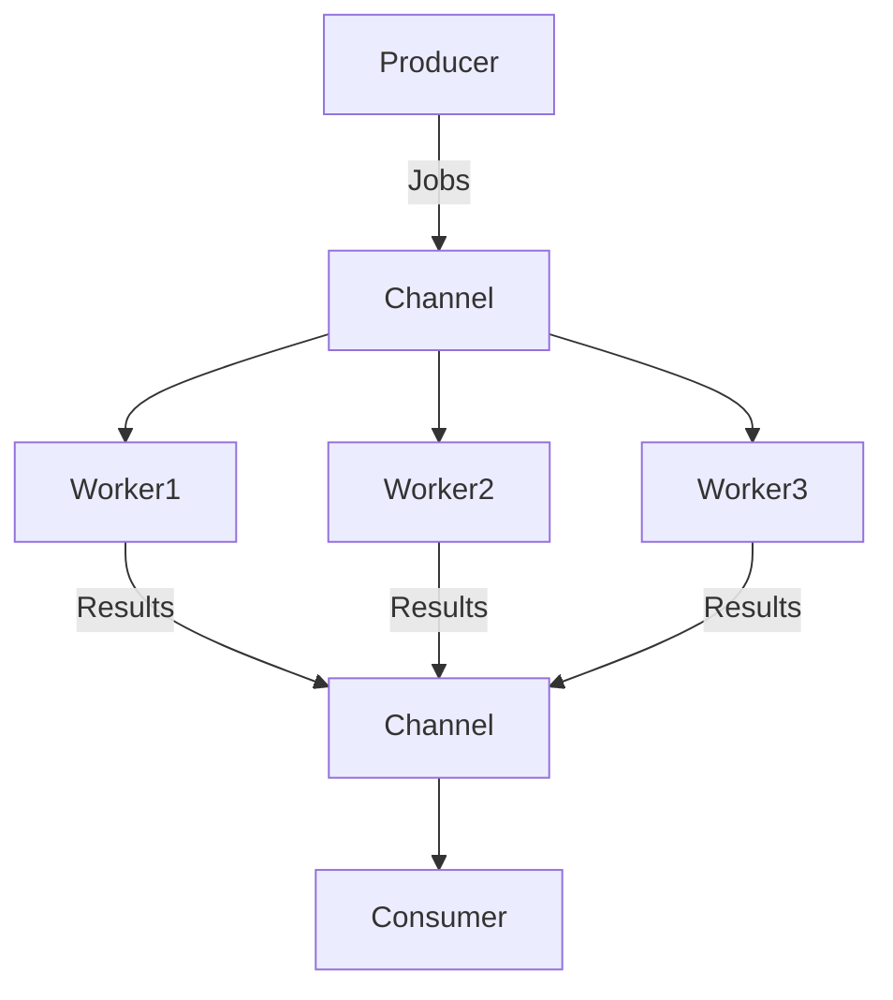

#Golang
---
---

## Summary

A Worker Pool is a concurrency pattern used to limit the number of active goroutines processing tasks. Instead of spawning a new goroutine for every task (which can exhaust resources), a fixed number of "worker" goroutines consume tasks from a shared channel. This controls concurrency, manages resource usage (CPU/Memory/Network connections), and improves stability under load.

## Detailed Explanation

### Architecture

1.  **Job Channel**: Buffered channel holding tasks to be done.
2.  **Result Channel**: Buffered channel collecting outputs.
3.  **Workers**: Fixed number of goroutines looping over the Job Channel.

### Implementation

```go
package main

import (
    "fmt"
    "time"
)

// The "work" to be done
func worker(id int, jobs <-chan int, results chan<- int) {
    for j := range jobs {
        fmt.Println("worker", id, "started  job", j)
        time.Sleep(time.Second) // Simulate expensive work
        fmt.Println("worker", id, "finished job", j)
        results <- j * 2
    }
}

func main() {
    const numJobs = 5
    const numWorkers = 3
    
    jobs := make(chan int, numJobs)
    results := make(chan int, numJobs)

    // 1. Start workers
    for w := 1; w <= numWorkers; w++ {
        go worker(w, jobs, results)
    }

    // 2. Send jobs
    for j := 1; j <= numJobs; j++ {
        jobs <- j
    }
    close(jobs) // Signal no more jobs

    // 3. Collect results
    for a := 1; a <= numJobs; a++ {
        <-results
    }
}
```

### Visual Flow



### Benefits

*   **Throttling**: Prevents overwhelming external services (DB, API) by limiting concurrent connections.
*   **Resource Control**: Predictable memory and CPU usage.
*   **Backpressure**: If the job channel fills up, the producer blocks, naturally slowing down the intake of new work.

### Dynamic Worker Pools

Sometimes you want the pool to scale. A semaphore pattern is often simpler than resizing a fixed pool:

```go
// Semaphore pattern (max 10 concurrent)
sem := make(chan struct{}, 10)

for _, job := range allJobs {
    sem <- struct{}{} // Acquire token (blocks if full)
    go func(j Job) {
        defer func() { <-sem }() // Release token
        process(j)
    }(job)
}
```

## Interview Questions

**Q: Why use a worker pool instead of `go func()` for every request?**

**A:** While goroutines are cheap, they are not free. Spawning 100,000 goroutines that all try to access a database or external API simultaneously will likely crash the application (OOM) or the external service (connection limits, timeouts). A worker pool bounds concurrency to a safe limit (e.g., 50 workers), ensuring efficient resource usage and system stability.

**Q: How do you gracefully shut down a worker pool?**

**A:** You close the `jobs` channel. The worker goroutines loop over the channel using `range`. When the channel is closed and empty, the loop terminates, and the goroutine exits. You typically use a `sync.WaitGroup` to wait for all workers to finish their current tasks and exit before terminating the program.

**Q: How do you handle errors in a worker pool?**

**A:** Workers typically send results to a `results` channel. You can define a Result struct containing both the Value and an Error (`struct { Val T; Err error }`). The consumer reads from the results channel and checks the error field for each job. Alternatively, you can have a separate `errChan` to collect errors, but synchronizing it can be trickier.

**Q: What determines the optimal number of workers?**

**A:** It depends on the workload. For **CPU-bound** tasks, `num_workers = num_cpu_cores` is usually optimal (context switching overhead wastes time otherwise). For **I/O-bound** tasks (network/DB calls), you can have many more workers (e.g., 50-100) because most are blocked waiting for I/O, allowing the scheduler to keep the CPU busy with others.
