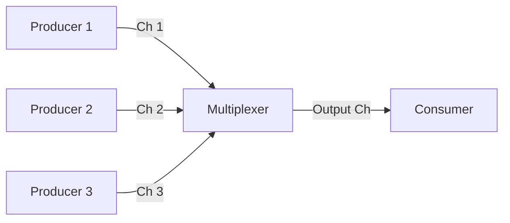

#Golang
---
---

## Summary

**Fan-In** is a concurrency pattern where multiple input channels are consolidated into a single output channel. It allows a consumer to read from multiple producers seamlessly, processing data as soon as it arrives from *any* source. This is essential for aggregating results from parallel tasks or merging streams of events.

## Detailed Explanation

### The Concept

You have multiple producers (goroutines) sending data. You want one consumer to read it all.



### Implementation 1: Using Select (Fixed number of inputs)

Good for merging exactly 2 channels.

```go
func fanIn(input1, input2 <-chan string) <-chan string {
    c := make(chan string)
    go func() {
        for {
            select {
            case s := <-input1:  c <- s
            case s := <-input2:  c <- s
            }
        }
    }()
    return c
}
```

### Implementation 2: Using WaitGroup (Dynamic inputs)

Best for merging `N` channels where `N` is variable.

```go
package main

import (
    "fmt"
    "sync"
)

func merge(cs ...<-chan int) <-chan int {
    out := make(chan int)
    var wg sync.WaitGroup

    // Start a goroutine for each input channel
    output := func(c <-chan int) {
        defer wg.Done()
        for n := range c {
            out <- n
        }
    }

    wg.Add(len(cs))
    for _, c := range cs {
        go output(c)
    }

    // Closer goroutine: wait for all inputs to finish, then close out
    go func() {
        wg.Wait()
        close(out)
    }()

    return out
}

func main() {
    // Assume gen() returns a channel
    c1 := gen(1, 2)
    c2 := gen(3, 4)
    
    // Fan-in
    out := merge(c1, c2)
    
    for n := range out {
        fmt.Println(n) // Prints 1, 2, 3, 4 (order undefined)
    }
}
```

### Use Cases

1.  **Search Aggregation**: Querying 3 different search engines in parallel and merging results.
2.  **Sensor Data**: Collecting readings from multiple sensors into a single processing stream.
3.  **Result Collection**: Gathering results from a Fan-Out worker pool.

## Interview Questions

**Q: Why do you need a separate goroutine to close the output channel in Fan-In?**

**A:** You cannot close the output channel until **all** input channels are drained. The `output` goroutines run concurrently. You need a mechanism to know when they are *all* done. A `sync.WaitGroup` tracks this. However, `wg.Wait()` blocks. If you put `wg.Wait()` in the main flow, it would block returning the channel. So, you wrap `wg.Wait(); close(out)` in its own background goroutine. This allows the `merge` function to return the channel immediately while the closure logic waits in the background.

**Q: What is the main difference between Fan-In using `select` vs goroutines?**

**A:** Using `select` is ideal when the number of channels is small and fixed at compile time (e.g., merging exactly two streams). Using multiple goroutines (one per input channel) is necessary when the number of input channels is dynamic (e.g., a slice of channels) or large. The goroutine approach scales better for N inputs.

**Q: How does Fan-In relate to the "Producer-Consumer" problem?**

**A:** Fan-In is a specific topology of Producer-Consumer where you have **Many Producers** (the inputs) and **One Consumer** (the reader of the merged channel). It solves the problem of "how does the consumer read from everyone at once without blocking on a slow producer?"
