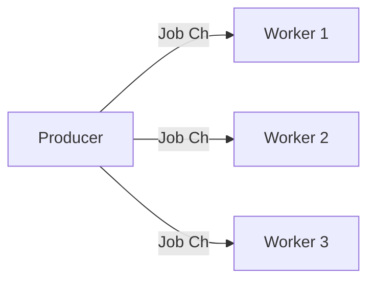

#Golang
---
---

## Summary

**Fan-Out** is a concurrency pattern where a single input stream of jobs is distributed among multiple worker goroutines to handle them in parallel. This is the exact inverse of Fan-In. It allows you to process a large backlog of work faster by utilizing multiple CPU cores or handling blocking I/O concurrently.

## Detailed Explanation

### The Concept

One Producer distributes work to Many Workers.



### Implementation

This is effectively the **Worker Pool** pattern.

```go
func main() {
    jobs := make(chan int, 100)
    
    // Fan-Out: Launch 3 workers reading from the SAME channel
    for i := 0; i < 3; i++ {
        go worker(i, jobs)
    }
    
    // Produce
    for i := 0; i < 10; i++ {
        jobs <- i
    }
    close(jobs)
    
    // Wait... (needs WaitGroup in real code)
}

func worker(id int, jobs <-chan int) {
    // Workers compete for items from the channel
    for j := range jobs {
        fmt.Printf("Worker %d processed job %d\n", id, j)
    }
}
```

### Why it works

Go channels are safe for concurrent access. When multiple goroutines try to receive from the same channel (`<-jobs`), the runtime guarantees that **only one** worker receives a specific item. This provides automatic load balancing.

### Scalability

Fan-Out allows you to scale processing throughput linearly with the number of workers (up to the limit of CPU cores or external resource capacity).

### Combining Fan-Out and Fan-In

A common architecture is **Fan-Out/Fan-In**:
1.  **Fan-Out**: Distribute tasks to workers.
2.  **Process**: Workers do the job.
3.  **Fan-In**: Workers send results to a single results channel, which is merged and read by a consumer.

```go
// 1. Generate jobs
in := producer()

// 2. Fan-out to workers
// 3. Fan-in results
// (Conceptually)
c1 := worker(in)
c2 := worker(in)
c3 := worker(in)
out := merge(c1, c2, c3)
```

## Interview Questions

**Q: How does the Go channel ensure tasks aren't processed twice in Fan-Out?**

**A:** Go channels are thread-safe (goroutine-safe) and atomic. The channel implementation uses internal locking (mutexes) to ensure that a value sent to the channel is received by exactly **one** receiver. Even if 100 workers try to read simultaneously, the runtime serializes access so that each item is handed off to one worker only.

**Q: What limits the effectiveness of Fan-Out?**

**A:**
1.  **CPU Cores**: If tasks are CPU-bound, adding more workers than cores will just increase context switching overhead.
2.  **External Resources**: If workers hit a DB or API, that downstream system might become the bottleneck.
3.  **Channel Contention**: If tasks are extremely small (nanoseconds), the locking overhead of the single job channel might become a bottleneck.
4.  **Order**: Fan-Out does not guarantee order. Job 1 might finish after Job 2.

**Q: Is Fan-Out suitable for ordered data?**

**A:** No. Since workers run in parallel, they will finish at different times. If you input `[1, 2, 3]`, you might output `[2, 3, 1]`. If strict ordering is required, you either need a sequential processor (no Fan-Out), or you need to tag jobs with IDs and re-sort them at the Fan-In stage (Re-sequencing pattern), which adds complexity and latency.
