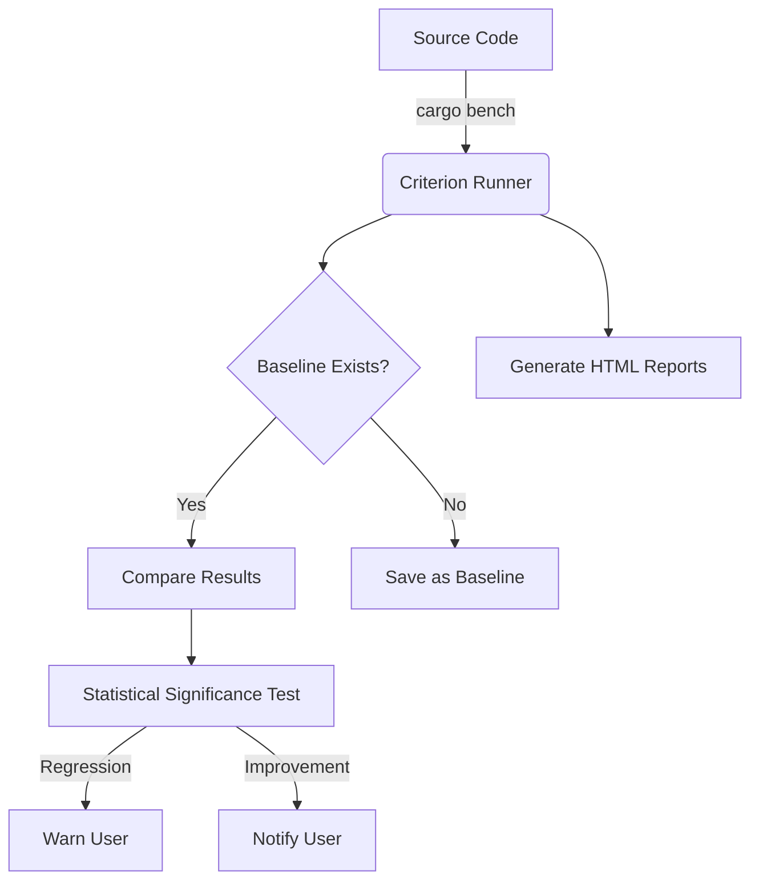

# Criterion.rs
---
---

## Summary
**Criterion.rs** is a statistics-driven microbenchmarking library for Rust. It is designed to provide accurate, reliable, and detailed performance measurements of Rust code. Unlike the built-in `cargo bench`, Criterion uses sophisticated statistical analysis to filter out noise, detects performance regressions (or improvements) by comparing against previous runs, and generates comprehensive HTML reports with visualizations.

## Detailed Explanation

### Key Features
- **Statistical Analysis**: It calculates mean, median, and standard deviation, providing a much clearer picture of performance than a single time measurement.
- **Regression Detection**: Criterion saves "baselines" (previous results). When you run benchmarks again, it automatically compares the new results and warns you if there is a significant performance drop.
- **HTML Reports**: It generates interactive graphs (using `gnuplot` or `plotters`) that show throughput, latency, and distribution.
- **Stable Rust Support**: While the built-in `cargo bench` requires nightly Rust, Criterion works on stable Rust.
- **Compiler Optimization Prevention**: Uses `black_box` to prevent the compiler from optimizing away the code being measured.

### Criterion.rs vs. `cargo bench`
| Feature | `cargo bench` (Built-in) | Criterion.rs |
| :--- | :--- | :--- |
| **Stability** | Requires Nightly Rust | Works on Stable |
| **Stats** | Minimal (basic time) | Deep (mean, std dev, outliers) |
| **Comparison** | No built-in baseline comparison | Automatic regression/improvement detection |
| **Output** | Textual summary only | Text + Rich HTML Reports with graphs |
| **Noise Filtering** | Minimal | High (advanced statistical models) |

### Process Flow


### Implementation Example
To use Criterion, add it to `dev-dependencies` in `Cargo.toml`:
```toml
[dev-dependencies]
criterion = "0.5"

[[bench]]
name = "my_benchmark"
harness = false
```

#### Code Example: Benchmark Group
```rust
use criterion::{black_box, criterion_group, criterion_main, Criterion};

// Function to benchmark
fn fibonacci(n: u64) -> u64 {
    match n {
        0 => 1,
        1 => 1,
        _ => fibonacci(n - 1) + fibonacci(n - 2),
    }
}

fn bench_fibonaccis(c: &mut Criterion) {
    let mut group = c.benchmark_group("Fibonacci");
    
    // Benchmark with different inputs
    for i in [10, 20].iter() {
        group.bench_with_input(format!("recursive_{}", i), i, |b, &i| {
            b.iter(|| fibonacci(black_box(i)))
        });
    }
    
    group.finish();
}

criterion_group!(benches, bench_fibonaccis);
criterion_main!(benches);
```

## Interview Questions

**Q: Why would you choose Criterion over the built-in `cargo bench`?**
**A:** Criterion works on stable Rust, whereas `cargo bench` requires nightly. Additionally, Criterion provides statistical analysis (mean, median, standard deviation) and automatic regression detection by comparing against saved baselines, which `cargo bench` lacks.

**Q: What is the purpose of `black_box` in a benchmark?**
**A:** `black_box` prevents the Rust compiler from optimizing away code that it perceives as having no side effects. Without it, the compiler might pre-calculate a value or remove the loop entirely, leading to unrealistically fast (and incorrect) benchmark results.

**Q: How does Criterion detect performance regressions?**
**A:** It stores the results of previous benchmark runs in a `target/criterion` directory. When a new benchmark is run, it compares the new distribution of results against the saved "baseline" and uses statistical significance testing to determine if a change in performance is real or just noise.

**Q: What do you need to add to `Cargo.toml` to use Criterion?**
**A:** You need to add `criterion` to `[dev-dependencies]` and define a `[[bench]]` section with `harness = false` to tell Cargo not to use the default benchmarking harness.
