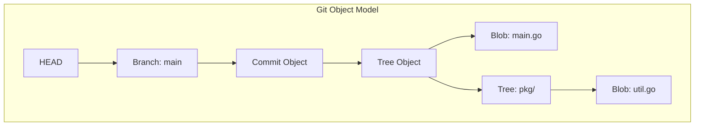

---
---

# Git for Senior Backend Developers

## Summary
Git is a content-addressable filesystem and a distributed version control system (DVCS). For senior backend developers, understanding Git goes beyond `commit`, `push`, and `pull`. It involves mastering its internal object model, designing scalable workflows for large teams, managing performance in multi-gigabyte repositories, and leveraging automation through hooks and APIs.

## Detailed Explanation

### 1. Git Internals: The Content-Addressable Filesystem
At its core, Git is a simple key-value data store. The key is a SHA-1 hash of the content, and the value is the content itself.

#### Core Object Types
*   **Blob (Binary Large Object)**: Stores file content. It does not store the filename or metadata.
*   **Tree**: Equivalent to a directory. It maps filenames to blobs or other trees and stores file modes (permissions).
*   **Commit**: Points to a root tree, capturing the state of the repository at a specific time. It includes metadata like author, committer, timestamp, and parent commit(s).
*   **Tag**: A permanent reference to a specific commit, often used for releases.

#### Refs and Symbolic Refs
*   **Refs**: Pointers to commit SHAs (e.g., `refs/heads/main`).
*   **HEAD**: A symbolic reference to the branch you are currently on.



### 2. Advanced Workflows
Choosing the right workflow affects CI/CD speed and release reliability.

| Workflow | Description | Best For |
| :--- | :--- | :--- |
| **Gitflow** | Uses `develop`, `master`, `feature/*`, `hotfix/*`, and `release/*` branches. | Products with scheduled release cycles. |
| **Trunk-based** | Developers collaborate on a single branch (`main`) with short-lived feature branches. | High-frequency deployment, microservices, DevOps maturity. |
| **GitHub Flow** | Simple feature branching with Pull Requests and immediate deployment from `main`. | Web applications with continuous delivery. |

### 3. Dangerous Commands & History Recovery
Seniors must know how to fix "broken" repositories without losing data.

*   **`git reflog`**: The safety net. It records every time `HEAD` changes. If you accidentally `reset --hard` or delete a branch, `reflog` allows you to find the lost commit SHA.
*   **`git bisect`**: A binary search tool to find the commit that introduced a bug.
*   **`git filter-repo`**: The modern, fast alternative to the deprecated `filter-branch`. Used for rewriting history (e.g., removing secrets or shrinking repo size).
*   **`git rebase -i`**: Interactive rebasing for cleaning up commit history before merging. **Caution**: Never rebase commits that have been pushed to a shared branch.

### 4. Performance & Large Repositories
Large monorepos require specific optimizations to stay performant.

*   **Shallow Clone (`--depth <n>`)**: Downloads only the last `n` commits.
*   **Partial Clone (`--filter=blob:none`)**: Downloads only the objects needed to fulfill the checkout, fetching blobs on demand.
*   **Sparse Checkout**: Allows checking out only a subset of directories in a large repository.
    ```bash
    git sparse-checkout set /pkg/api /internal/auth
    ```
*   **Git LFS (Large File Storage)**: Replaces large binary files with text pointers, storing the actual content on a separate server.

### 5. Git Hooks
Automation at the git level.
*   **Client-side**: `pre-commit` (linting, secrets detection), `prepare-commit-msg`.
*   **Server-side**: `pre-receive` (enforcing commit message standards, branch protection), `post-receive` (triggering CI/CD).

### 6. Go-Specific Integration: `go-git`
For building internal tools (e.g., custom CI, auto-updaters), Go developers often use [go-git](https://github.com/go-git/go-git), a highly extensible, pure Go implementation of Git.

```go
package main

import (
	"fmt"
	"os"

	"github.com/go-git/go-git/v5"
	"github.com/go-git/go-git/v5/plumbing/object"
)

// Example: Programmatically listing commits in Go
func main() {
	// Open an existing repository
	repo, err := git.PlainOpen(".")
	if err != nil {
		fmt.Printf("Failed to open repo: %v\n", err)
		os.Exit(1)
	}

	// Retrieve the commit history
	ref, _ := repo.Head()
	cIter, _ := repo.Log(&git.LogOptions{From: ref.Hash()})

	// Iterate over the commits
	err = cIter.ForEach(func(c *object.Commit) error {
		fmt.Printf("Commit: %s\nAuthor: %s\nMessage: %s\n\n", c.Hash, c.Author.Name, c.Message)
		return nil
	})
}
```

## Interview Preparation

**Q: What is the difference between `git reset --soft`, `--mixed`, and `--hard`?**
**A:** 
- `--soft`: Moves HEAD to a commit. Changes stay in the Staging Area.
- `--mixed` (default): Moves HEAD and resets the Staging Area. Changes stay in the Working Directory.
- `--hard`: Moves HEAD and resets both Staging Area and Working Directory. All unstaged changes are lost.

**Q: Why would you prefer `rebase` over `merge`?**
**A:** Rebase creates a clean, linear history by moving the entire feature branch to begin on the tip of the main branch. It avoids "merge commits" that can clutter the history. However, it should only be used on local branches to avoid breaking others' history.

**Q: How does Git store a file that is modified many times? Does it store diffs or full snapshots?**
**A:** Internally, Git stores full snapshots (as blobs). However, to save space, it periodically runs `git gc` which creates "Packfiles". In these packfiles, Git uses "delta compression" to store objects as a base plus subsequent differences.

**Q: Explain the "Detached HEAD" state.**
**A:** It occurs when you check out a specific commit, tag, or remote branch instead of a local branch. You are no longer on a branch. Commits made in this state are not tracked by any branch and can be lost during garbage collection if not referenced by a new branch.

**Q: How would you remove a 1GB file that was accidentally committed 10 commits ago and pushed?**
**A:** Use `git filter-repo --path large_file --invert-paths`. This rewrites the entire history to remove all traces of the file. Afterward, a force push (`git push --force`) is required, and all team members must re-clone or reset their local branches.
