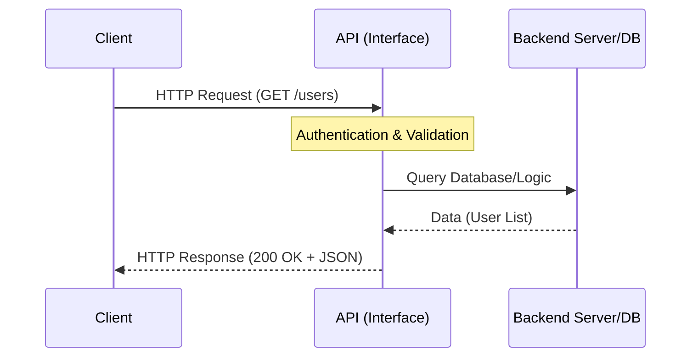

# API
---
---

## Summary
An **Application Programming Interface (API)** is a set of defined rules and protocols that allow different software applications to communicate with each other. It acts as a bridge, enabling a **Client** (the requester) to access data or functionality from a **Server** (the provider) without needing to understand the underlying implementation details.

## Detailed Explanation

### What and Why?
In modern software development, applications are rarely monolithic. They rely on distributed systems, microservices, and third-party integrations. APIs provide a standardized way to:
- **Abstract Complexity**: Users don't need to know how the database works; they just call an endpoint.
- **Interoperability**: Different languages (Go, Python, JS) can talk to each other over HTTP.
- **Security**: APIs can enforce authentication and rate limiting before granting access to data.

### Key Concepts

#### 1. Client-Server Architecture
- **Client**: The application making the request (e.g., a mobile app, a frontend web app, or another backend service).
- **Server**: The application that processes the request and provides a response.

#### 2. The Request-Response Cycle
Every interaction follows a standard cycle:
1.  **Request**: The client sends a message containing a **URL/Endpoint**, an **HTTP Method** (GET, POST, etc.), **Headers** (metadata), and optionally a **Body** (data).
2.  **Processing**: The API receives the request, validates it (auth, schema), performs logic, and interacts with resources (databases, other APIs).
3.  **Response**: The server sends back a **Status Code** (e.g., 200 OK, 404 Not Found) and data (usually in **JSON** or XML format).

#### 3. Endpoints
An endpoint is a specific URL path (e.g., `/api/v1/users`) that represents a resource or a service within the API.

### Visualization: Client-API-Server Interaction



---

## Go Application

In Go, building APIs is a first-class citizen thanks to the powerful `net/http` standard library. Go's concurrency model (Goroutines) makes it exceptionally efficient for handling thousands of concurrent API requests.

### Basic API Implementation in Go

```go
package main

import (
	"encoding/json"
	"fmt"
	"net/http"
)

// User represents the data structure for our API
type User struct {
	ID    int    `json:"id"`
	Name  string `json:"name"`
	Email string `json:"email"`
}

func main() {
	// Define an endpoint and its handler
	http.HandleFunc("/api/user", func(w http.ResponseWriter, r *http.Request) {
		// Set Content-Type header to application/json
		w.Header().Set("Content-Type", "application/json")

		if r.Method == http.MethodGet {
			user := User{ID: 1, Name: "Gopher", Email: "gopher@golang.org"}
			
			// Encode the struct into JSON and write to the response
			json.NewEncoder(w).Encode(user)
		} else {
			// Handle unsupported methods
			w.WriteHeader(http.StatusMethodNotAllowed)
			fmt.Fprintf(w, `{"error": "Method not allowed"}`)
		}
	})

	fmt.Println("Server starting on :8080...")
	// Start the server
	if err := http.ListenAndServe(":8080", nil); err != nil {
		fmt.Printf("Error starting server: %s\n", err)
	}
}
```

---

## Interview Questions

**Q: What is the difference between an API and a Web Service?**
**A:** All web services are APIs, but not all APIs are web services. An API is a broader term for any interface that allows software interaction (e.g., an OS API or a library API). A Web Service specifically requires a network (usually HTTP) to communicate.

**Q: What does it mean for an API to be "Stateless"?**
**A:** In a stateless API (like REST), each request from a client must contain all the information necessary to understand and process that request. The server does not store any "session" information about the client between requests.

**Q: How do you handle concurrent requests in a Go API?**
**A:** Go's `net/http` server automatically handles each incoming request in its own **Goroutine**. This allows the server to process multiple requests simultaneously without blocking, leveraging all available CPU cores efficiently.

**Q: What is the purpose of HTTP Status Codes in an API response?**
**A:** They provide a standardized way to communicate the outcome of a request. Categories include 2xx (Success), 3xx (Redirection), 4xx (Client Error), and 5xx (Server Error). This allows the client to programmatically decide how to handle the result.
