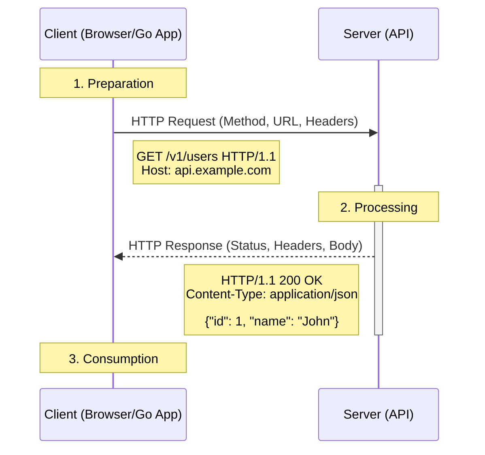

#API #HTTP
---
---

## Summary
**HTTP (Hypertext Transfer Protocol)** is the foundational application-layer protocol used for transmitting hypermedia documents, such as HTML. Designed for communication between web browsers and web servers, it follows a classic **client-server model** where a client opens a connection to make a request, then waits until it receives a response. It is **stateless**, meaning the server does not keep any data (state) between two requests.

## Detailed Explanation

### The Request/Response Cycle
The primary function of HTTP is to facilitate the exchange of resources through a request-response cycle.

#### 1. The HTTP Request
An HTTP request is sent by the client and consists of:
- **Request Line**: The HTTP method (e.g., `GET`, `POST`), the target resource (URL/Path), and the HTTP version.
- **Headers**: Key-value pairs providing metadata (e.g., `User-Agent`, `Accept`, `Content-Type`).
- **Empty Line**: Separates headers from the body.
- **Body**: (Optional) Data sent to the server, typical in `POST` or `PUT` requests.

#### 2. The HTTP Response
The server processes the request and returns a response:
- **Status Line**: The HTTP version, a **Status Code** (e.g., `200`, `404`), and a reason phrase.
- **Headers**: Metadata about the response (e.g., `Server`, `Content-Length`, `Cache-Control`).
- **Empty Line**: Separates headers from the body.
- **Body**: (Optional) The requested resource or an error message.

### Statelessness and Connections
HTTP is inherently **stateless**. Each request is independent. To manage state (like user sessions), developers use **Cookies** or **Tokens** (JWT) passed in headers. Modern versions (HTTP/2 and HTTP/3) improve performance by multiplexing multiple requests over a single connection, but the application-level semantics remain stateless.

### HTTP in Go (net/http)
Go provides a powerful standard library for both HTTP clients and servers.

```go
package main

import (
	"fmt"
	"io"
	"log"
	"net/http"
	"time"
)

func main() {
	// 1. Defining a simple HTTP Client with Timeout
	client := &http.Client{
		Timeout: 10 * time.Second,
	}

	// 2. Making a GET Request
	resp, err := client.Get("https://jsonplaceholder.typicode.com/posts/1")
	if err != nil {
		log.Fatalf("Error making request: %v", err)
	}
	
	// CRITICAL: Always close the body to avoid resource leaks
	defer resp.Body.Close()

	// 3. Checking the Status Code
	fmt.Printf("Status Code: %d\n", resp.StatusCode)

	// 4. Reading the Response Body
	body, err := io.ReadAll(resp.Body)
	if err != nil {
		log.Fatalf("Error reading body: %v", err)
	}

	fmt.Printf("Response Body: %s\n", string(body))
}
```

## Interview Questions

**Q: Why is HTTP described as a "stateless" protocol?**
**A:** HTTP is stateless because the server is not required to retain session information or status about each communications partner for the duration of multiple requests. Each request is handled as a completely new event, independent of any previous requests.

**Q: What are the three main parts of an HTTP Response?**
**A:** 1. The **Status Line** (Protocol version, Status code, Status text). 2. **Headers** (Metadata about the response/server). 3. The **Message Body** (The actual data being returned).

**Q: What is the difference between a persistent connection and a stateless protocol?**
**A:** A persistent connection (Keep-Alive) is a transport-layer optimization (TCP) that allows multiple HTTP requests/responses to be sent over the same connection to save time on handshakes. This does *not* make the protocol stateful; the application-layer (HTTP) still treats each request as independent.

**Q: Explain the concept of Idempotency.**
**A:** An HTTP method is idempotent if multiple identical requests have the same effect as a single request. `GET`, `PUT`, and `DELETE` are idempotent, while `POST` is generally not (multiple POSTs may result in multiple resource creations).

## Diagram


