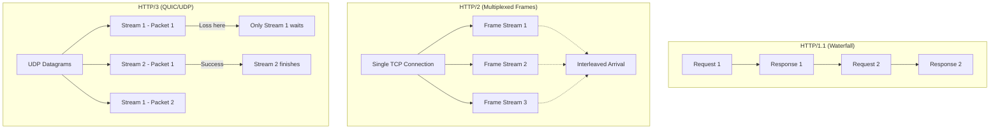

# HTTP Versions

---

## **Summary**
The Hypertext Transfer Protocol (HTTP) has evolved from a simple one-line text protocol to a complex, binary-based system optimized for modern web performance. The major shifts (HTTP/1.1 → HTTP/2 → HTTP/3) focus on reducing latency, improving concurrency, and overcoming the limitations of the underlying transport layers (TCP vs. UDP/QUIC).

---

## **Detailed Development**

### **1. HTTP/1.1: The Textual Veteran (1997)**
HTTP/1.1 served as the web standard for nearly two decades. It introduced **persistent connections** (`Keep-Alive`), allowing multiple requests over the same TCP connection.
- **Mechanism**: Text-based protocol. Requests and responses are human-readable.
- **Concurrency**: Only one request can be handled at a time per connection.
- **Bottleneck: Head-of-Line (HOL) Blocking**: If a request (e.g., a large image) is slow, all subsequent requests on that connection are blocked.
- **Workarounds**: Developers used domain sharding (multiple subdomains), image spriting, and file concatenation to mimic parallelism.

### **2. HTTP/2: Binary and Multiplexed (2015)**
Based on Google's SPDY protocol, HTTP/2 aimed to solve the concurrency issues of HTTP/1.1 without changing HTTP semantics (methods, status codes, headers).
- **Binary Framing**: Data is broken into binary "frames" (HEADERS, DATA, SETTINGS).
- **Multiplexing**: Multiple streams of requests/responses can be interleaved over a **single TCP connection**.
- **HPACK Compression**: Headers are compressed using a static/dynamic Huffman coding to reduce overhead (mitigating the CRIME attack).
- **Server Push**: Servers can proactively send resources (CSS/JS) to the client before they are requested.
- **The Residual Problem**: While it solves application-level HOL blocking, **TCP-level HOL blocking** remains. If one TCP packet is lost, the entire connection stalls until it is retransmitted.

### **3. HTTP/3: The QUIC Revolution (2022+)**
HTTP/3 replaces TCP with **QUIC** (Quick UDP Internet Connections), a protocol built on top of UDP.
- **Independent Streams**: In QUIC, each stream is independent. If a packet for "Stream A" is lost, "Stream B" continues unaffected. This finally solves **TCP Head-of-Line blocking**.
- **Faster Handshake**: Combines transport and cryptographic (TLS 1.3) handshakes.
  - **1-RTT**: New connections established in one round trip.
  - **0-RTT**: Reconnections can send data immediately (Zero Round-Trip Time).
- **Connection Migration**: Connections are identified by a **Connection ID** rather than the IP/Port tuple (4-tuple). This allows a mobile device to switch from Wi-Fi to 5G without dropping the connection.

---

## **Connection Handling Comparison**



---

## **Go Implementation & Support**

Go has first-class support for HTTP/2 and experimental but maturing support for HTTP/3.

### **HTTP/2 Support**
Since Go 1.6, `net/http` automatically enables HTTP/2 if the server supports it and TLS is used.
- **Source**: The implementation is bundled from `golang.org/x/net/http2`.
- **Reference**: [src/net/http/h2_bundle.go](https://github.com/golang.org/go/blob/master/src/net/http/h2_bundle.go)
```go
// Example: HTTP/2 is transparently handled
server := &http.Server{
    Addr:    ":443",
    Handler: myHandler,
}
// If TLS is configured, HTTP/2 is enabled by default
log.Fatal(server.ListenAndServeTLS("cert.pem", "key.pem"))
```

### **HTTP/3 Support (Current State 2026)**
- **Standard Library**: Not yet in `net/http`. The official path is through `golang.org/x/net/quic` (Proposal [#32204](https://github.com/golang/go/issues/32204)).
- **Industry Standard**: Most Go developers use [quic-go/quic-go](https://github.com/quic-go/quic-go).
```go
// Using quic-go for HTTP/3
import "github.com/quic-go/quic-go/http3"

err := http3.ListenAndServeQUIC(":443", "cert.pem", "key.pem", handler)
```

---

## **Interview Preparation**

### **Questions**
1. **Explain Head-of-Line (HOL) blocking in the context of HTTP/1.1 vs. HTTP/2 vs. HTTP/3.**
   - *Answer*: HTTP/1.1 has HOL blocking because only one request can be processed at a time per connection. HTTP/2 solves this with multiplexing (interleaving frames) but still suffers from TCP-level HOL blocking (one lost packet stalls all streams). HTTP/3 solves TCP-level HOL blocking by using QUIC, where packet loss only affects the specific stream it belongs to.

2. **Why does HTTP/3 use UDP instead of TCP?**
   - *Answer*: TCP has built-in features (ordered delivery, congestion control) that are "hardwired" into the OS kernel, making them hard to evolve. By building QUIC on top of UDP, developers can implement connection migration, 0-RTT handshakes, and independent streams in user-space, bypassing TCP's limitations.

3. **What is HPACK and why is it used in HTTP/2?**
   - *Answer*: HPACK is a compression algorithm specifically designed for HTTP headers. It uses static and dynamic Huffman coding to reduce metadata overhead. It was created to replace GZIP/ZLIB compression which was vulnerable to the **CRIME** security attack.

4. **What is "Connection Migration" in HTTP/3?**
   - *Answer*: In TCP, a connection is tied to the 4-tuple (Source IP, Source Port, Dest IP, Dest Port). If you change networks (Wi-Fi to LTE), the connection drops. QUIC uses a unique **Connection ID**, allowing the connection to survive IP changes.

5. **When would you NOT want to use HTTP/2 or HTTP/3?**
   - *Answer*: Rarely, but for extremely simple APIs with very few requests where the overhead of a single binary connection (or UDP complexity/firewall blocks) isn't justified. Also, some legacy corporate firewalls still block UDP port 443, forcing a fallback to TCP (HTTP/2).

---

## **References**
- [High Performance Browser Networking - HTTP/2](https://hpbn.co/http2/)
- [Roadmap.sh - Journey to HTTP/2](https://roadmap.sh/guides/journey-to-http2)
- [RFC 9114: HTTP/3](https://www.rfc-editor.org/rfc/rfc9114.html)
- [Go net/http Source](https://github.com/golang/go/tree/master/src/net/http)
