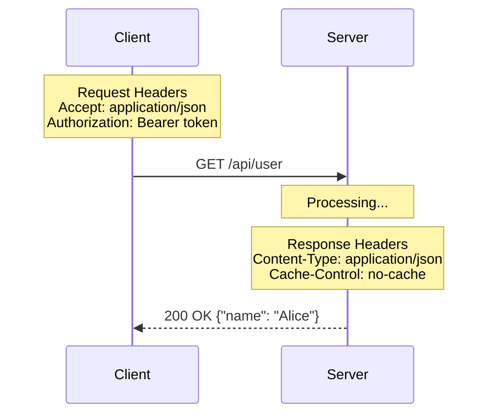

# HTTP Headers

## Summary
HTTP headers are metadata key-value pairs sent between a client and a server in HTTP requests and responses. They provide essential context about the message, such as the content type, authentication credentials, caching instructions, and client information, without being part of the message body itself.

## Detailed Explanation

### What are Headers?
Headers are the "envelope" information for HTTP messages. They follow a simple `Name: Value` format. While the message body contains the actual data (like JSON or HTML), headers tell the receiver how to interpret and handle that data.

### Types of HTTP Headers
Historically, headers were categorized into four main types, though modern specifications (RFC 7230) have slightly refined these:

1.  **General Headers**: Apply to both requests and responses but do not relate to the data in the body (e.g., `Date`, `Connection`).
2.  **Request Headers**: Provide context about the resource being fetched or the client itself (e.g., `User-Agent`, `Accept`, `Authorization`).
3.  **Response Headers**: Provide additional information about the server's response (e.g., `Server`, `Location`, `Access-Control-Allow-Origin`).
4.  **Representation Headers**: (Formerly Entity Headers) Describe the specific representation of the resource being sent (e.g., `Content-Type`, `Content-Length`, `Content-Encoding`).

### Common HTTP Headers
-   **Content-Type**: Informs the receiver about the media type of the body (e.g., `application/json`, `text/html`).
-   **Authorization**: Carries credentials (like Bearer tokens or Basic auth) to authenticate the client.
-   **User-Agent**: Identifies the client application, operating system, and version.
-   **Accept**: Communicates which content types the client is willing to receive.
-   **Cache-Control**: Specifies directives for caching mechanisms in both requests and responses.

### Go Implementation
In Go's `net/http` package, headers are managed via the `http.Header` type, which is essentially a `map[string][]string`.

#### Accessing Headers in a Request
When building a middleware or handler, you access request headers via `r.Header`.

```go
func handler(w http.ResponseWriter, r *http.Request) {
    // Get a header (returns the first value associated with the key)
    apiKey := r.Header.Get("X-API-Key")
    
    // Check if a header exists
    if userAgent := r.Header.Get("User-Agent"); userAgent != "" {
        fmt.Println("Request from:", userAgent)
    }
}
```

#### Setting Headers in a Response
Use `w.Header()` to modify the headers before calling `w.WriteHeader()` or `w.Write()`.

```go
func handler(w http.ResponseWriter, r *http.Request) {
    // Set a header (overwrites existing values)
    w.Header().Set("Content-Type", "application/json")
    w.Header().Set("X-Custom-Header", "MyValue")
    
    // Add a header (appends to existing values)
    w.Header().Add("Set-Cookie", "session=123")
    
    w.WriteHeader(http.StatusOK)
    w.Write([]byte(`{"status": "ok"}`))
}
```

### Flow Diagram


## Interview Questions

**Q: What is the difference between `Accept` and `Content-Type`?**
**A:** `Accept` is a request header used by the client to tell the server what type of data it can handle (e.g., "I want JSON"). `Content-Type` is used in both requests and responses to indicate the actual format of the data being sent in the body (e.g., "This body is JSON").

**Q: Why was the `X-` prefix for custom headers deprecated?**
**A:** RFC 6648 deprecated it because when non-standard `X-` headers became standardized, it caused interoperability issues. Developers had to support both the `X-` version and the new standard version. Modern practice is to use meaningful names without the `X-` prefix.

**Q: What are "hop-by-hop" headers?**
**A:** These are headers intended for a single transport-level connection and must not be retransmitted by proxies or caches. Examples include `Connection`, `Keep-Alive`, and `Transfer-Encoding`. Most other headers are "end-to-end".

**Q: How does Go handle header key casing?**
**A:** Go's `http.Header` methods (`Get`, `Set`, `Add`, `Del`) use `http.CanonicalHeaderKey`, which converts headers to a standard format (e.g., `content-type` becomes `Content-Type`). If you need to bypass this, you can access the map directly using the exact case.
