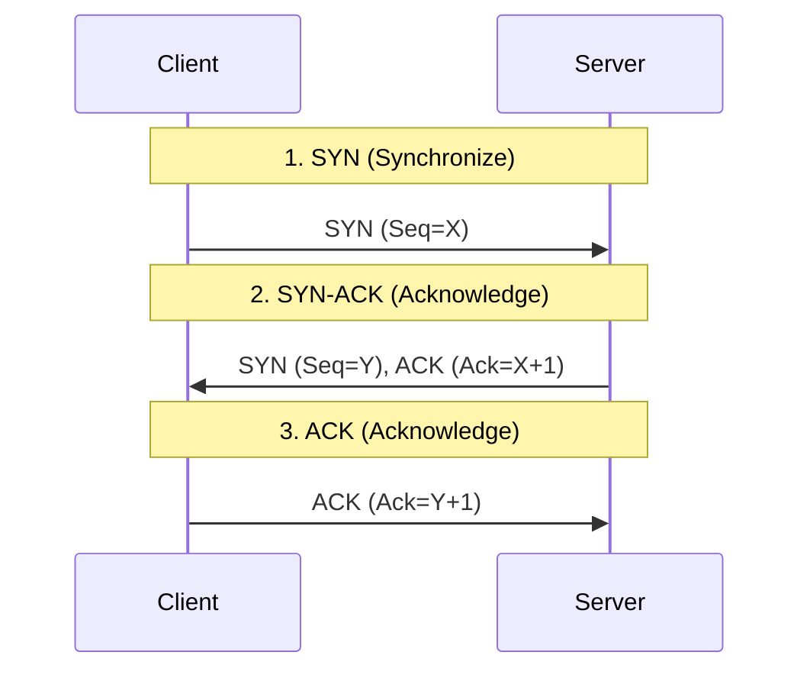

#API
---
---

## Summary
The **Internet Protocol Suite**, commonly known as **TCP/IP**, is the foundational framework for communication on the Internet. It organizes protocols into four functional layers that define how data is packetized, addressed, transmitted, and received across networks. For API developers, understanding TCP/IP is crucial as it provides the underlying transport for high-level protocols like HTTP, WebSockets, and gRPC.

## Detailed Explanation

### 1. TCP/IP Model Layers
The TCP/IP model consists of four abstraction layers:

| Layer | Purpose | Key Protocols |
| :--- | :--- | :--- |
| **Application** | Provides network services to applications. | HTTP, DNS, SMTP, FTP |
| **Transport** | Handles host-to-host communication and data flow. | TCP, UDP, QUIC |
| **Internet** | Routes packets across independent networks. | IP (IPv4/IPv6), ICMP |
| **Link** | Defines how data is physically sent over the medium. | Ethernet, Wi-Fi, ARP |

### 2. TCP 3-Way Handshake
TCP is connection-oriented, meaning a formal connection must be established before data exchange. This is done via the 3-way handshake:



1.  **SYN**: The client sends a packet with the SYN flag set and a random sequence number (X).
2.  **SYN-ACK**: The server responds with SYN and ACK flags set. It acknowledges the client's sequence number (X+1) and sends its own random sequence number (Y).
3.  **ACK**: The client sends a final ACK packet (Y+1), establishing the connection.

### 3. Reliability and Control
TCP provides several features that distinguish it from UDP:
*   **Reliable Delivery**: Every packet is acknowledged. If an ACK isn't received within a timeout, the packet is retransmitted.
*   **Ordering**: Each packet has a sequence number. The receiving end uses these to reassemble the data in the correct order, even if packets arrive out of sequence.
*   **Flow Control**: Uses a "sliding window" to ensure the sender doesn't overwhelm the receiver's buffer.
*   **Congestion Control**: Detects network saturation and slows down transmission rates (e.g., via Slow Start and Congestion Avoidance algorithms).

### 4. Go Implementation: `net` Package
In Go, the `net` package provides low-level networking primitives.

#### TCP Server (`net.Listen`)
```go
package main

import (
	"bufio"
	"fmt"
	"net"
)

func main() {
	// 1. Listen on a port
	ln, _ := net.Listen("tcp", ":8080")
	fmt.Println("Server listening on :8080")

	for {
		// 2. Accept new connections
		conn, _ := ln.Accept()
		
		go func(c net.Conn) {
			defer c.Close()
			// 3. Read data
			message, _ := bufio.NewReader(c).ReadString('\n')
			fmt.Printf("Received: %s", message)
			// 4. Send response
			c.Write([]byte("ACK\n"))
		}(conn)
	}
}
```

#### TCP Client (`net.Dial`)
```go
package main

import (
	"fmt"
	"net"
)

func main() {
	// 1. Connect to server
	conn, _ := net.Dial("tcp", "localhost:8080")
	defer conn.Close()

	// 2. Write data
	fmt.Fprintf(conn, "Hello Server\n")

	// 3. Read response
	buffer := make([]byte, 1024)
	n, _ := conn.Read(buffer)
	fmt.Printf("Server says: %s\n", string(buffer[:n]))
}
```

## Interview Questions

**Q: What is the main difference between TCP and UDP?**
**A:** TCP is connection-oriented, reliable, and guarantees packet ordering but has higher overhead. UDP is connectionless, faster, and has lower overhead but doesn't guarantee delivery or ordering.

**Q: Why do we need the 3-way handshake?**
**A:** To synchronize sequence numbers and acknowledge that both sides are ready to send and receive data before the actual payload transmission begins.

**Q: What is the "Sliding Window" in TCP?**
**A:** It is a flow control mechanism where the receiver tells the sender how much data it can buffer. The sender only sends up to that amount before waiting for an acknowledgment.

**Q: How does TCP handle congestion?**
**A:** It uses algorithms like Tahoe, Reno, or Cubic to monitor packet loss. When loss is detected, it reduces the congestion window size (halving it or resetting to 1) to reduce network load.
