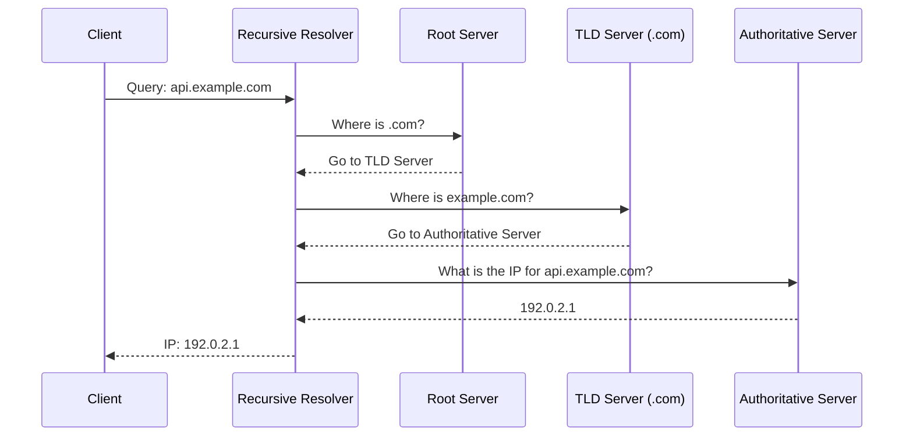

#API
---
---

## Summary
The Domain Name System (DNS) is the "phonebook of the internet," responsible for translating human-readable domain names (e.g., `google.com`) into machine-readable IP addresses (e.g., `142.250.190.46`). For API developers, understanding DNS is crucial for managing service discovery, load balancing, and connectivity between microservices.

## Detailed Explanation

### What is DNS?
DNS is a hierarchical and decentralized naming system for computers, services, or other resources connected to the internet or a private network. It eliminates the need for humans to memorize numerical IP addresses. When you make an API call to `api.example.com`, your system first queries the DNS to find where that request should be routed.

### DNS Record Types
API developers frequently interact with several key DNS records:

| Record Type | Name | Purpose |
| :--- | :--- | :--- |
| **A** | Address Record | Maps a hostname to an **IPv4** address. |
| **AAAA** | IPv6 Address Record | Maps a hostname to an **IPv6** address. |
| **CNAME** | Canonical Name | Creates an alias (e.g., `api.example.com` points to `lb-123.aws.com`). |
| **MX** | Mail Exchange | Specifies mail servers for the domain. |
| **NS** | Name Server | Indicates which servers are authoritative for the domain. |
| **TXT** | Text Record | Arbitrary text (used for SPF, DKIM, or site verification). |

### The DNS Resolution Process
The resolution process involves multiple steps to find the authoritative answer:

1.  **Recursive Resolver**: Usually provided by your ISP or a public provider (like Cloudflare's `1.1.1.1`). It initiates the search.
2.  **Root Name Server**: The first step in the hierarchy. It directs the resolver to the appropriate TLD server.
3.  **TLD Name Server**: Handles specific top-level domains (like `.com`, `.org`, `.io`).
4.  **Authoritative Name Server**: The final stop that holds the actual DNS records for the domain.



## DNS in Go
Go's `net` package provides built-in functions for DNS lookups.

### LookupHost
`net.LookupHost` returns a slice of strings representing the host's addresses.

```go
package main

import (
	"fmt"
	"net"
	"os"
)

func main() {
	addrs, err := net.LookupHost("google.com")
	if err != nil {
		fmt.Fprintf(os.Stderr, "Error: %v\n", err)
		os.Exit(1)
	}

	for _, addr := range addrs {
		fmt.Println(addr)
	}
}
```

### LookupIP
`net.LookupIP` returns a slice of `net.IP` types, allowing for easier distinction between IPv4 and IPv6.

```go
package main

import (
	"fmt"
	"net"
)

func main() {
	ips, err := net.LookupIP("google.com")
	if err != nil {
		fmt.Println("Lookup error:", err)
		return
	}

	for _, ip := range ips {
		fmt.Printf("IP: %s (IPv4: %v)\n", ip, ip.To4() != nil)
	}
}
```

## Interview Questions

**Q: What is the difference between an A record and a CNAME record?**
**A:** An A record points a domain directly to an IP address. A CNAME (Canonical Name) points a domain to another domain name (an alias). CNAMEs are useful for pointing multiple subdomains to a single entry but require an extra DNS lookup.

**Q: What is "DNS Propagation" and why does it happen?**
**A:** Propagation is the time it takes for DNS changes to be updated across the internet. It happens because DNS results are cached by resolvers to improve performance. The duration is controlled by the **TTL (Time To Live)** value in the DNS record.

**Q: How does DNS load balancing work?**
**A:** DNS load balancing (specifically Round Robin DNS) involves configuring multiple A records for a single hostname. When a client requests the IP, the DNS server rotates through the list, distributing traffic across multiple servers.

**Q: What is a "Recursive Resolver" vs an "Authoritative DNS Server"?**
**A:** A Recursive Resolver is the server that receives the client's request and does the work of querying other servers to find the answer. The Authoritative DNS Server is the server that actually "owns" and provides the original records for a specific domain.
