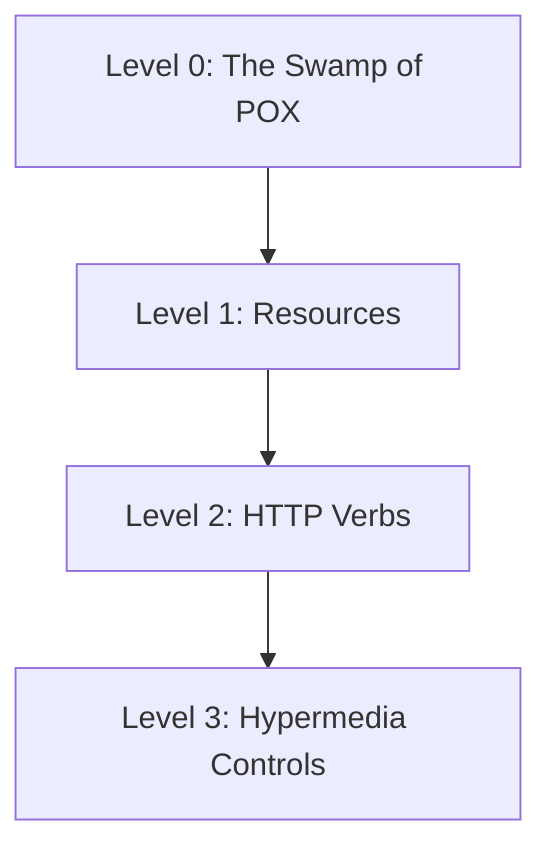

## Summary
**REST** (REpresentational State Transfer) is an architectural style for providing standards between computer systems on the web, making it easier for systems to communicate with each other. It is resource-based, stateless, and typically uses HTTP as its underlying protocol.

## Detailed Explanation

### 1. Definition
Coined by Roy Fielding in his 2000 doctoral dissertation, REST is not a protocol or a standard, but a set of architectural constraints. When an API follows these constraints, it is called **RESTful**.

### 2. The 6 Constraints of REST
To be truly RESTful, an API must adhere to these six guiding principles:

1.  **Client-Server**: Separation of concerns. The user interface (client) is separate from the data storage (server), allowing them to evolve independently.
2.  **Stateless**: Each request from a client to a server must contain all the information necessary to understand and complete the request. The server does not store any session state about the client.
3.  **Cacheable**: Responses must define themselves as cacheable or not to prevent clients from reusing stale or inappropriate data.
4.  **Uniform Interface**: This is the most critical constraint. It simplifies the architecture and includes:
    *   Identification of resources (URIs).
    *   Manipulation of resources through representations (e.g., JSON, XML).
    *   Self-descriptive messages (Media types).
    *   **HATEOAS** (Hypermedia As The Engine Of Application State).
5.  **Layered System**: A client cannot ordinarily tell whether it is connected directly to the end server or to an intermediary (like a load balancer or proxy).
6.  **Code on Demand (Optional)**: Servers can temporarily extend or customize the functionality of a client by transferring executable code (e.g., JavaScript).

### 3. Richardson Maturity Model
The Richardson Maturity Model breaks down the principal elements of a REST approach into four levels:



*   **Level 0 (The Swamp of POX)**: Uses HTTP purely as a transport for remote interaction, typically using a single URI and one HTTP method (usually POST). Examples: SOAP, XML-RPC.
*   **Level 1 (Resources)**: Introduces individual URIs for different resources. Instead of one endpoint, you have `/users`, `/orders`, etc.
*   **Level 2 (HTTP Verbs)**: Uses HTTP verbs (GET, POST, PUT, DELETE) and status codes correctly. GET is safe and idempotent; POST is for creation.
*   **Level 3 (Hypermedia Controls)**: The "Glory of REST". Responses include links (HATEOAS) that tell the client what they can do next, making the API discoverable.

### 4. Go: Designing a RESTful Handler Structure
In Go, a clean way to organize RESTful handlers is to use a struct to hold dependencies and define methods for different resource actions.

```go
package main

import (
	"encoding/json"
	"net/http"
	"strings"
)

// User represents our resource
type User struct {
	ID   string `json:"id"`
	Name string `json:"name"`
}

// UserHandler manages user resources
type UserHandler struct {
	// Add dependencies here (e.g., db *sql.DB)
}

// ServeHTTP implements the http.Handler interface
func (h *UserHandler) ServeHTTP(w http.ResponseWriter, r *http.Request) {
	// Simple routing based on method
	switch r.Method {
	case http.MethodGet:
		if strings.HasPrefix(r.URL.Path, "/users/") {
			h.getOne(w, r)
		} else {
			h.getAll(w, r)
		}
	case http.MethodPost:
		h.create(w, r)
	default:
		w.Header().Set("Allow", "GET, POST")
		http.Error(w, "Method Not Allowed", http.StatusMethodNotAllowed)
	}
}

func (h *UserHandler) getAll(w http.ResponseWriter, r *http.Request) {
	users := []User{{ID: "1", Name: "Alice"}, {ID: "2", Name: "Bob"}}
	w.Header().Set("Content-Type", "application/json")
	json.NewEncoder(w).Encode(users)
}

func (h *UserHandler) getOne(w http.ResponseWriter, r *http.Request) {
	// Logic to extract ID and fetch user
	user := User{ID: "1", Name: "Alice"}
	w.Header().Set("Content-Type", "application/json")
	json.NewEncoder(w).Encode(user)
}

func (h *UserHandler) create(w http.ResponseWriter, r *http.Request) {
	var u User
	if err := json.NewDecoder(r.Body).Decode(&u); err != nil {
		http.Error(w, "Invalid request payload", http.StatusBadRequest)
		return
	}
	// Logic to save user...
	w.WriteHeader(http.StatusCreated)
	json.NewEncoder(w).Encode(u)
}

func main() {
	handler := &UserHandler{}
	http.Handle("/users", handler)
	http.Handle("/users/", handler)
	http.ListenAndServe(":8080", nil)
}
```

## Interview Questions

**Q: What are the main constraints of a RESTful architecture?**
**A:** The six constraints are: Client-Server, Stateless, Cacheable, Uniform Interface, Layered System, and Code on Demand (optional).

**Q: Explain the difference between PUT and PATCH.**
**A:** `PUT` is used to replace the entire resource with a new representation. It is idempotent. `PATCH` is used for partial updates to a resource and is not necessarily idempotent (though it can be designed to be).

**Q: What is HATEOAS and why is it important?**
**A:** Hypermedia As The Engine Of Application State. It means the server provides links in the response that guide the client on what actions are possible next. It decouples the client from the server's URI structure, making the API more flexible and discoverable.

**Q: Why is REST considered "stateless"?**
**A:** Because the server does not store any information about the client's session. Every request must be self-contained and carry all necessary data (like auth tokens) to be processed. This improves scalability as any server in a cluster can handle any request.

**Q: What is the Richardson Maturity Model?**
**A:** It's a model that grades an API's RESTfulness across four levels: Level 0 (HTTP as transport), Level 1 (Resources), Level 2 (HTTP Verbs), and Level 3 (Hypermedia Controls).
