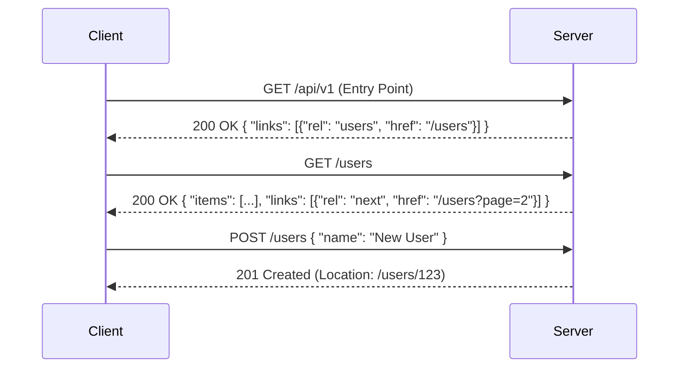

# REST Principles: A Deep Dive

## Summary
REpresentational State Transfer (REST) is an architectural style for distributed hypermedia systems, first introduced by Roy Fielding in his 2000 doctoral dissertation. Unlike strict protocols, REST provides a set of six architectural constraints that, when followed, enable the creation of highly scalable, evolvable, and loosely coupled web services. This note explores the core principles of REST, the transition from pragmatic usage to dogmatic adherence, and how to implement resource-oriented architectures in Go.

## Detailed Explanation

### 1. "REST Style" vs. "REST Principles" in Practice
In the industry, "RESTful" is often used loosely to describe any API that uses HTTP and JSON. However, a distinction exists:
- **REST Style (Pragmatic REST):** Often refers to APIs that use HTTP methods (GET, POST, PUT, DELETE) and JSON but might ignore constraints like HATEOAS or strict statelessness. This usually corresponds to Level 2 of the **Richardson Maturity Model**.
- **REST Principles (Dogmatic REST):** Strictly follows all six constraints, including HATEOAS (Level 3). This ensures the API is truly "hypertext-driven," allowing clients to discover functionality dynamically.

### 2. Resource Identification (URIs)
In REST, everything is a **resource**.
- **Identification:** Resources are identified by **URIs** (Uniform Resource Identifiers).
- **Naming:** URIs should represent **nouns**, not actions (verbs). Actions are handled by HTTP methods.
- **Example:** `/users/123/orders` (Correct) vs `/getUserOrders?id=123` (RPC Style).

### 3. Representation (JSON)
A resource is an abstract concept; what the client receives is a **representation**.
- **Format Agnostic:** A resource can be represented as JSON, XML, HTML, or even ProtoBuf.
- **Content Negotiation:** Clients use the `Accept` header to request a specific representation, and the server responds with the `Content-Type` header.
- **JSON in Go:** Go's `encoding/json` package is the standard for mapping resources to representations.

### 4. Self-descriptive Messages (Media Types)
Messages must contain enough information for the recipient to understand how to process them.
- **Media Types:** Using standard media types (e.g., `application/json`) or vendor-specific types (e.g., `application/vnd.myapi.user+json`).
- **HTTP Methods:** The method (GET, POST, etc.) defines the semantics of the operation.
- **Status Codes:** Standardized codes (200 OK, 201 Created, 404 Not Found) describe the outcome.

### 5. Hypermedia (HATEOAS)
**HATEOAS** (Hypermedia as the Engine of Application State) is the most debated constraint.
- **Dogmatic View:** The client should enter the API through a single entry point and discover all available actions via links. No URIs should be hardcoded by the client.
- **Pragmatic View:** Using links for pagination (`next`, `prev`) or related resources while allowing clients to hardcode some base resource paths for simplicity and performance.

### 6. Go: Implementing a Resource-Oriented Architecture
In Go, we model resources as data structures and use routers to map URIs to handlers.

#### Example: Resource Definition and Handler
```go
package main

import (
	"encoding/json"
	"net/http"
	"strconv"
	"github.com/go-chi/chi/v5"
)

// User represents a Resource
type User struct {
	ID    int    `json:"id"`
	Name  string `json:"name"`
	Email string `json:"email"`
	Links []Link `json:"links,omitempty"` // HATEOAS
}

type Link struct {
	Rel  string `json:"rel"`
	Href string `json:"href"`
}

// UserResource handles HTTP requests for User resources
type UserResource struct{}

func (rs UserResource) Routes() chi.Router {
	r := chi.NewRouter()
	r.Get("/{id}", rs.Get)
	r.Post("/", rs.Create)
	return r
}

func (rs UserResource) Get(w http.ResponseWriter, r *http.Request) {
	id, _ := strconv.Atoi(chi.URLParam(r, "id"))
	
	// Mock fetching resource
	user := User{
		ID:    id,
		Name:  "John Doe",
		Email: "john@example.com",
		Links: []Link{
			{Rel: "self", Href: "/users/" + strconv.Itoa(id)},
			{Rel: "orders", Href: "/users/" + strconv.Itoa(id) + "/orders"},
		},
	}

	w.Header().Set("Content-Type", "application/json")
	json.NewEncoder(w).Encode(user)
}

func (rs UserResource) Create(w http.ResponseWriter, r *http.Request) {
	var user User
	if err := json.NewDecoder(r.Body).Decode(&user); err != nil {
		http.Error(w, err.Error(), http.StatusBadRequest)
		return
	}
	// Logic to save user...
	w.WriteHeader(http.StatusCreated)
}

func main() {
	r := chi.NewRouter()
	r.Mount("/users", UserResource{}.Routes())
	http.ListenAndServe(":8080", r)
}
```

### 7. Mermaid Diagram: REST Interaction Flow


## Interview Questions

**Q: What are the 6 architectural constraints of REST?**
**A:** 1. Uniform Interface, 2. Client-Server, 3. Statelessness, 4. Cacheability, 5. Layered System, 6. Code on Demand (Optional).

**Q: What is the difference between PUT and PATCH?**
**A:** PUT is used to replace a resource entirely (idempotent), while PATCH is used for partial updates (not necessarily idempotent, though often implemented as such).

**Q: Why is "Statelessness" important in REST?**
**A:** It improves scalability because the server doesn't need to store client context between requests. Each request contains all information needed to process it, allowing any server instance to handle any request.

**Q: What does HATEOAS stand for and why is it used?**
**A:** Hypermedia as the Engine of Application State. It allows a client to interact with a network application entirely through hypermedia provided dynamically by the server, reducing coupling between client and server.

**Q: How do you handle versioning in a REST API?**
**A:** Common methods include URI versioning (`/v1/resource`), Custom Request Headers (`X-API-Version: 1`), or Media Type versioning (Accept: `application/vnd.myapi.v1+json`).
