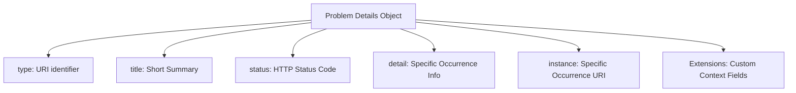

#API
---
---

## Summary
RFC 7807 (updated by RFC 9457) defines a standardized "problem detail" JSON object to carry machine-readable error information in HTTP responses. By providing a consistent schema for errors, it avoids the need for every API to define its own unique error format, enabling better client-side error handling, standardized logging, and improved tooling interoperability.

## Detailed Explanation

### What is RFC 7807?
Standard HTTP status codes are often insufficient to describe complex application errors. For example, a `403 Forbidden` status code tells generic software that access is denied, but it doesn't explain to the API consumer *why* (e.g., account suspended vs. insufficient permissions). RFC 7807 addresses this by defining a structured format for detailed error reports using the `application/problem+json` or `application/problem+xml` media types.

### Standard Structure
A Problem Details object consists of the following members:

*   **`type`** (string, URI): A URI reference that identifies the problem type. It should provide human-readable documentation when dereferenced. If not present, it defaults to `about:blank`.
*   **`title`** (string): A short, human-readable summary of the problem type (e.g., "Out of Credit"). It should not change between occurrences.
*   **`status`** (number): The HTTP status code generated by the origin server for this occurrence.
*   **`detail`** (string): A human-readable explanation specific to this occurrence of the problem.
*   **`instance`** (string, URI): A URI reference that identifies the specific occurrence of the problem (e.g., a unique request ID for log correlation).



### Benefits of Standard Error Formats
1.  **Consistency**: Reduces "API friction" by allowing consumers to use a single error-handling logic across multiple endpoints or services.
2.  **Tooling Support**: Developer tools, proxies, and API gateways can automatically parse and log errors in a structured way.
3.  **Machine-Readable Extensions**: APIs can add custom fields (e.g., `balance` or `invalid_params`) to provide machine-readable context for specific error types.
4.  **Graceful Degradation**: Generic HTTP clients that don't understand the format still receive the correct HTTP status code.

### Go Implementation: Generic ErrorResponse Struct
In Go, we can implement RFC 7807 by creating a `ProblemDetails` struct with appropriate JSON tags.

```go
package errors

import (
	"encoding/json"
	"net/http"
)

// ProblemDetails represents an RFC 7807 problem detail object.
type ProblemDetails struct {
	Type     string `json:"type"`
	Title    string `json:"title"`
	Status   int    `json:"status"`
	Detail   string `json:"detail,omitempty"`
	Instance string `json:"instance,omitempty"`
	// Extension fields can be added here or via map[string]interface{}
}

// WriteResponse sends the problem detail to the client.
func (p ProblemDetails) WriteResponse(w http.ResponseWriter) {
	w.Header().Set("Content-Type", "application/problem+json")
	w.WriteHeader(p.Status)
	json.NewEncoder(w).Encode(p)
}
```

### Go-Specific Applications
When building RESTful APIs in Go (using `net/http`, `Gin`, or `Echo`), you can centralize error handling to ensure all errors adhere to the standard.

```go
func HandleValidationError(w http.ResponseWriter, r *http.Request, field string) {
    prob := ProblemDetails{
        Type:     "https://api.myapp.com/probs/validation-error",
        Title:    "Your request parameters didn't validate.",
        Status:   http.StatusBadRequest,
        Detail:   "The field '" + field + "' is mandatory.",
        Instance: r.URL.Path,
    }
    prob.WriteResponse(w)
}
```

## Interview Questions

**Q: What is the main problem RFC 7807 tries to solve?**
**A:** It solves the lack of a standardized format for returning detailed, machine-readable error information in HTTP APIs, preventing "error format fragmentation" where every API defines its own way to represent errors.

**Q: Which media type should be used for an RFC 7807 JSON response?**
**A:** `application/problem+json`.

**Q: What is the difference between `type` and `title` in a Problem Details object?**
**A:** `type` is a URI that uniquely identifies the *class* of the problem and points to documentation, while `title` is a short, human-readable summary that stays consistent for all errors of that type.

**Q: How does RFC 7807 handle custom error data?**
**A:** It allows for "Extension Members"—additional fields added to the JSON object that provide extra context (e.g., a list of validation errors or an account balance).

**Q: Does RFC 7807 replace HTTP status codes?**
**A:** No. It complements them. The HTTP status code remains the primary indicator of the error class for generic HTTP software, while the Problem Details object provides granular context for the API client.
