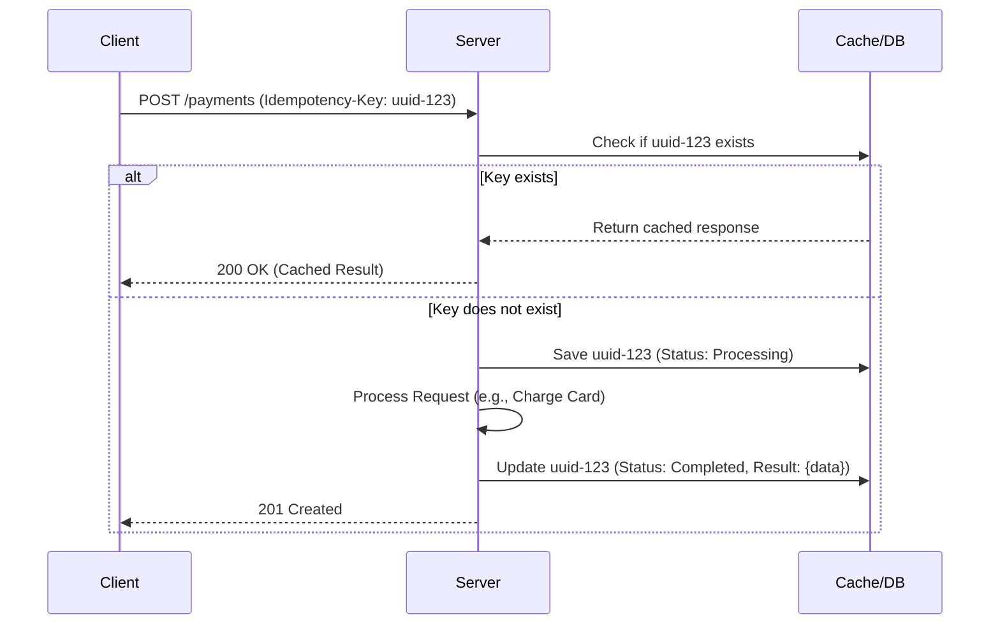

#API
---
---

## Summary
Idempotency is the property of certain operations where multiple identical requests have the same effect as a single request. In REST APIs, it ensures that if a client retries a request (due to network failure or timeout), the server does not perform the same action twice (e.g., charging a credit card twice). Mathematically, it is expressed as $f(f(x)) = f(x)$.

## Detailed Explanation

### Safe vs Idempotent Methods
In HTTP semantics, we distinguish between **Safe** and **Idempotent** methods:

| Method | Safe | Idempotent | Description |
| :--- | :--- | :--- | :--- |
| **GET** | Yes | Yes | Retrieves data; no state change. |
| **HEAD** | Yes | Yes | Retrieves headers; no state change. |
| **OPTIONS** | Yes | Yes | Retrieves communication options. |
| **PUT** | No | Yes | Replaces a resource. Multiple identical PUTs result in the same state. |
| **DELETE** | No | Yes | Removes a resource. Deleting twice has the same final state (gone). |
| **POST** | No | No | Creates resources. Multiple POSTs usually create multiple resources. |
| **PATCH** | No | No* | Partially updates. Can be idempotent but is not guaranteed by spec. |

### Handling POST with Idempotency Keys
Since `POST` is not inherently idempotent, APIs use **Idempotency Keys** (typically sent in the `Idempotency-Key` HTTP header) to allow safe retries.

1.  **Client Generation**: The client generates a unique identifier (UUID v4) for the operation.
2.  **Server Storage**: The server stores the result of the operation indexed by this key for a specific period (e.g., 24 hours).
3.  **Atomic Processing**: The server must use a distributed lock or database constraint to ensure that concurrent requests with the same key don't trigger duplicate processing.

### Implementation Workflow


### Go Implementation
In Go, idempotency is best implemented as a middleware that interacts with a fast storage layer like Redis.

```go
package middleware

import (
	"context"
	"crypto/sha256"
	"encoding/json"
	"fmt"
	"net/http"
	"time"

	"github.com/redis/go-redis/v9"
)

type ResponseRecord struct {
	StatusCode int               `json:"status_code"`
	Body       []byte            `json:"body"`
	Headers    map[string]string `json:"headers"`
}

func IdempotencyMiddleware(rdb *redis.Client) func(http.Handler) http.Handler {
	return func(next http.Handler) http.Handler {
		return http.HandlerFunc(func(w http.ResponseWriter, r *http.Request) {
			key := r.Header.Get("Idempotency-Key")
			if key == "" {
				next.ServeHTTP(w, r)
				return
			}

			// Use a composite key to prevent collisions across different endpoints/users
			cacheKey := fmt.Sprintf("idempotency:%s", key)

			// 1. Check cache
			val, err := rdb.Get(r.Context(), cacheKey).Result()
			if err == nil {
				var record ResponseRecord
				json.Unmarshal([]byte(val), &record)
				
				for k, v := range record.Headers {
					w.Header().Set(k, v)
				}
				w.Header().Set("X-Idempotency-Cache", "HIT")
				w.WriteHeader(record.StatusCode)
				w.Write(record.Body)
				return
			}

			// 2. Set "Processing" lock (NX = Set if Not Exists)
			success, _ := rdb.SetNX(r.Context(), cacheKey+":lock", "true", 30*time.Second).Result()
			if !success {
				http.Error(w, "Request already in progress", http.StatusConflict)
				return
			}
			defer rdb.Del(r.Context(), cacheKey+":lock")

			// 3. Custom ResponseWriter to capture the output
			rec := &responseRecorder{ResponseWriter: w, body: []byte{}, statusCode: http.StatusOK}
			next.ServeHTTP(rec, r)

			// 4. Cache the result
			record := ResponseRecord{
				StatusCode: rec.statusCode,
				Body:       rec.body,
				Headers:    map[string]string{"Content-Type": w.Header().Get("Content-Type")},
			}
			data, _ := json.Marshal(record)
			rdb.Set(r.Context(), cacheKey, data, 24*time.Hour)
		})
	}
}

type responseRecorder struct {
	http.ResponseWriter
	body       []byte
	statusCode int
}

func (rec *responseRecorder) WriteHeader(code int) {
	rec.statusCode = code
	rec.ResponseWriter.WriteHeader(code)
}

func (rec *responseRecorder) Write(b []byte) (int, error) {
	rec.body = append(rec.body, b...)
	return rec.ResponseWriter.Write(b)
}
```

## Interview Questions

**Q: What is the difference between a Safe and an Idempotent method?**
**A:** A Safe method (like GET) does not change the state of the server at all. An Idempotent method (like PUT or DELETE) may change state, but performing it multiple times with the same parameters results in the same final state as performing it once. All Safe methods are Idempotent, but not all Idempotent methods are Safe.

**Q: How do you handle a scenario where two identical requests with the same Idempotency-Key arrive at the exact same time?**
**A:** You must implement a distributed lock (e.g., using Redis `SET NX` or a database transaction). The first request acquires the lock and starts processing. The second request fails to acquire the lock and should return a `409 Conflict` status code, indicating that a request is already in progress.

**Q: Why is PATCH not always idempotent?**
**A:** It depends on the payload. If the PATCH payload is `{"increment": 1}`, every call increases the value, making it non-idempotent. However, if the payload is `{"status": "active"}`, it is idempotent because multiple calls keep the status as "active".

**Q: What status code should you return if a client reuses an Idempotency-Key with a different request body?**
**A:** You should return `422 Unprocessable Entity` (or `400 Bad Request`), as per the IETF draft. Reusing a key with different data is a violation of the idempotency contract and indicates a client-side error.
