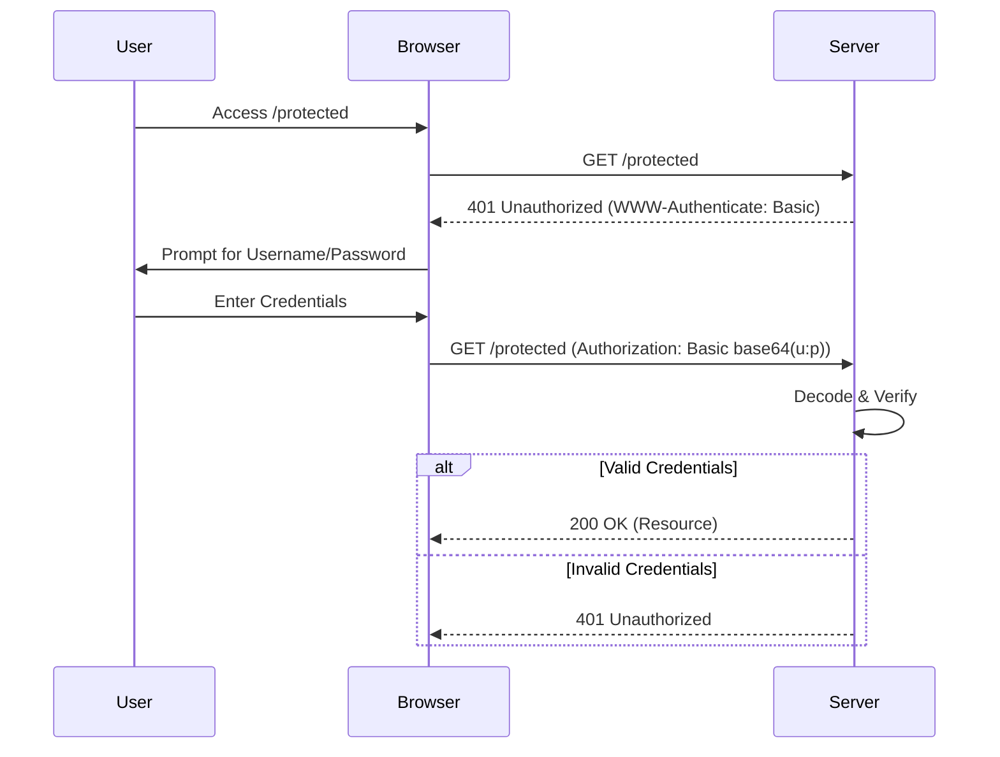

# Basic Authentication

## Summary
Basic Authentication (HTTP Basic Auth) is a simple authentication scheme built into the HTTP protocol. It involves transmitting the user's credentials (username and password) as a Base64-encoded string in the `Authorization` header of every HTTP request. While easy to implement and supported by almost all web servers and clients, it is insecure unless used over HTTPS, as the credentials can be easily decoded if intercepted.

## Detailed Explanation

### How it Works
1.  **Client Request**: The client sends a request to a protected resource.
2.  **Server Challenge**: If no credentials are provided, the server responds with `401 Unauthorized` and a `WWW-Authenticate: Basic realm="Access to the staging site"` header.
3.  **Client Response**: The client prompts the user for a username and password, concatenates them with a colon (`username:password`), Base64 encodes the result, and sends it in the `Authorization` header.
    *   Header format: `Authorization: Basic <Base64String>`
4.  **Verification**: The server decodes the Base64 string, validates the username and password, and grants or denies access.

### Security Considerations
*   **No Encryption**: Base64 is encoding, not encryption. `dXNlcm5hbWU6cGFzc3dvcmQ=` is easily decoded to `username:password`.
*   **HTTPS Required**: MUST always be used over HTTPS (TLS) to encrypt the transport layer.
*   **CSRF**: Vulnerable to CSRF attacks if the browser caches the credentials (which it usually does).
*   **No Logout**: Browsers cache Basic Auth credentials until the browser is closed, making "logout" difficult to implement.

### Implementation in Go (Golang)

In Go, the `net/http` package provides built-in support for parsing Basic Auth credentials.

#### Server-Side Verification

```go
package main

import (
	"crypto/subtle"
	"fmt"
	"net/http"
)

func basicAuth(next http.HandlerFunc) http.HandlerFunc {
	return func(w http.ResponseWriter, r *http.Request) {
		// Get the Basic Authentication credentials
		user, pass, ok := r.BasicAuth()

		if ok {
			// Verify credentials (IN PRODUCTION: Check against DB/Hash)
			// Use constant time comparison to prevent timing attacks
			usernameMatch := (subtle.ConstantTimeCompare([]byte(user), []byte("admin")) == 1)
			passwordMatch := (subtle.ConstantTimeCompare([]byte(pass), []byte("secret123")) == 1)

			if usernameMatch && passwordMatch {
				next(w, r)
				return
			}
		}

		// If validation fails, request authentication
		w.Header().Set("WWW-Authenticate", `Basic realm="Restricted"`)
		http.Error(w, "Unauthorized", http.StatusUnauthorized)
	}
}

func handler(w http.ResponseWriter, r *http.Request) {
	fmt.Fprintf(w, "Welcome, %s!", "admin")
}

func main() {
	http.HandleFunc("/", basicAuth(handler))
	http.ListenAndServe(":8080", nil)
}
```

#### Client-Side Request

```go
package main

import (
	"fmt"
	"io/ioutil"
	"net/http"
)

func main() {
	req, err := http.NewRequest("GET", "http://localhost:8080", nil)
	if err != nil {
		panic(err)
	}

	// Set Basic Auth header
	req.SetBasicAuth("admin", "secret123")

	client := &http.Client{}
	resp, err := client.Do(req)
	if err != nil {
		panic(err)
	}
	defer resp.Body.Close()

	body, _ := ioutil.ReadAll(resp.Body)
	fmt.Println("Response Status:", resp.Status)
	fmt.Println("Response Body:", string(body))
}
```

### Sequence Diagram



## Interview Questions

**Q: Why is Basic Authentication considered insecure over HTTP?**
**A:** Because it transmits credentials encoded in Base64, which is easily reversible. If the traffic is intercepted (Man-in-the-Middle), the attacker can instantly decode the username and password. HTTPS is mandatory to encrypt the channel.

**Q: How does the server challenge the client for Basic Auth credentials?**
**A:** The server responds with a `401 Unauthorized` status code and a `WWW-Authenticate` header specifying the scheme (`Basic`) and a `realm` (a string identifying the protection space).

**Q: What is the difference between Basic Auth and Bearer Token authentication?**
**A:** Basic Auth sends the actual user credentials (username/password) with every request. Bearer Token authentication involves exchanging credentials for a temporary access token (like a JWT) and sending that token instead. Tokens can expire and have limited scopes, limiting the damage if compromised.

**Q: How do you handle "logout" with Basic Auth?**
**A:** True logout is difficult because browsers cache the credentials and automatically resend them. Common workarounds involve sending a 401 response to force the browser to clear the cache (though this often prompts the login dialog again) or using JavaScript to clear the session state if using an SPA.
