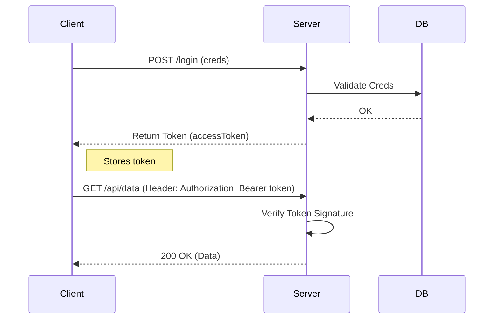

# Token-Based Authentication

## Summary
Token-based authentication is a stateless security mechanism where a user verifies their identity once, and the server issues a signed token (typically a JWT or opaque string). For all subsequent requests, the client sends this token in the `Authorization` header (usually with the `Bearer` scheme) to prove identity. This approach is highly scalable and widely used in Modern Web Apps (SPAs) and Mobile Apps as it decouples the client from the server and doesn't require server-side session storage.

## Detailed Explanation

### The Flow
1.  **User Login**: Client sends credentials (username/password) to the server.
2.  **Validation**: Server validates credentials against the database.
3.  **Token Issuance**: Server generates a signed token (containing user ID and expiration) and sends it back.
4.  **Storage**: Client stores the token (e.g., in `localStorage`, `sessionStorage`, or a secure cookie).
5.  **Access**: For subsequent requests, the client includes the token in the HTTP Header: `Authorization: Bearer <token>`.
6.  **Verification**: Server extracts the token, verifies its signature/validity, and processes the request.

### Advantages over Session-Based
*   **Statelessness**: The server doesn't need to store session state in memory or Redis. All info is self-contained in the token (if using JWT).
*   **Scalability**: Easier to scale horizontally; any server instance can verify the token without shared state.
*   **Cross-Domain**: Cookies don't play well with CORS/cross-domains; tokens can be sent to any domain.
*   **Mobile Ready**: Native mobile apps handle tokens better than cookies.

### Implementation in Go (Golang)

A common pattern is using Middleware to extract and validate the token.

#### Middleware Implementation

```go
package main

import (
	"fmt"
	"net/http"
	"strings"
)

// AuthMiddleware checks for the "Bearer <token>" header
func AuthMiddleware(next http.HandlerFunc) http.HandlerFunc {
	return func(w http.ResponseWriter, r *http.Request) {
		// 1. Get the Authorization header
		authHeader := r.Header.Get("Authorization")
		if authHeader == "" {
			http.Error(w, "Authorization header required", http.StatusUnauthorized)
			return
		}

		// 2. Check for "Bearer " prefix
		const prefix = "Bearer "
		if !strings.HasPrefix(authHeader, prefix) {
			http.Error(w, "Invalid authorization format", http.StatusUnauthorized)
			return
		}

		// 3. Extract the token
		tokenString := strings.TrimPrefix(authHeader, prefix)

		// 4. Validate the token (Mock validation here)
		// In production, you would verify signature, expiration, etc.
		if !validateToken(tokenString) {
			http.Error(w, "Invalid token", http.StatusUnauthorized)
			return
		}

		// 5. Pass execution to the next handler
		next(w, r)
	}
}

func validateToken(token string) bool {
	// Simplified validation logic
	return token == "valid-secret-token"
}

func protectedHandler(w http.ResponseWriter, r *http.Request) {
	fmt.Fprintf(w, "Access granted to protected resource!")
}

func main() {
	http.HandleFunc("/protected", AuthMiddleware(protectedHandler))
	http.ListenAndServe(":8080", nil)
}
```

### Sequence Diagram



## Interview Questions

**Q: What is the purpose of the "Bearer" keyword in the Authorization header?**
**A:** "Bearer" is an authentication scheme indicating that the client is presenting a "bearer token"—meaning "give access to the bearer of this token". It distinguishes the token type from others like `Basic` or `Digest`.

**Q: Where should you store tokens on the client side?**
**A:** It depends on security requirements. `localStorage` is vulnerable to XSS (cross-site scripting) as JS can read it. `httpOnly` cookies are safer against XSS but vulnerable to CSRF (though SameSite attributes help). For high security, `httpOnly` cookies are often recommended over `localStorage`.

**Q: What happens if a token is stolen?**
**A:** If a bearer token is stolen, the attacker can impersonate the user until the token expires. This is why tokens should have short lifespans (e.g., 15 mins) and be used with Refresh Tokens. You can also implement "token revocation" (blacklisting), but that introduces state, negating some stateless benefits.

**Q: How do you invalidate a stateless token (logout)?**
**A:** You can't strictly "delete" a stateless token from the server side. You can: 1) Delete it from the client (logout). 2) Keep a "blacklist" of revoked tokens (Redis) with short expiry. 3) Wait for it to expire naturally.
