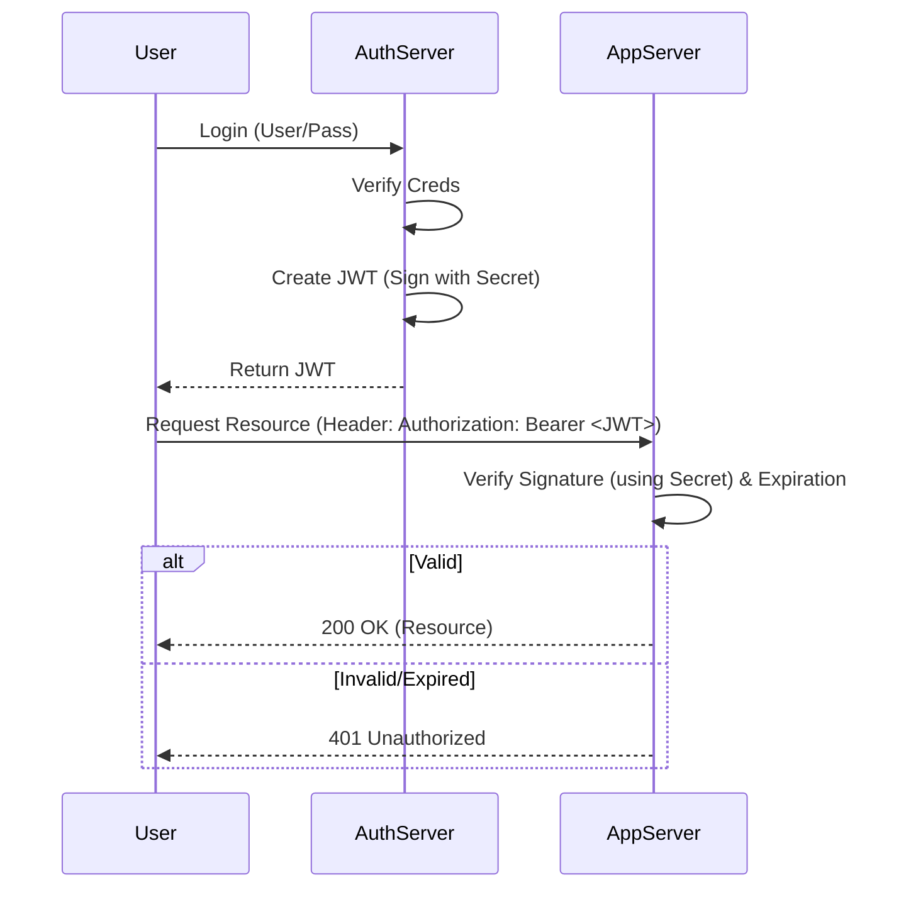

# JSON Web Tokens (JWT)

## Summary
JSON Web Token (JWT) is an open standard (RFC 7519) that defines a compact and self-contained way for securely transmitting information between parties as a JSON object. This information can be verified and trusted because it is digitally signed. JWTs are commonly used for **Authentication** (logging in) and **Information Exchange**.

## Detailed Explanation

### Structure of a JWT
A JWT is essentially a string with three parts separated by dots (`.`): `Header.Payload.Signature`

1.  **Header**: Algorithm and token type.
    ```json
    {
      "alg": "HS256",
      "typ": "JWT"
    }
    ```
2.  **Payload**: Claims (data).
    *   **Registered Claims**: Predefined (e.g., `iss` (issuer), `exp` (expiration), `sub` (subject)).
    *   **Public Claims**: Custom claims (e.g., `role: "admin"`).
    *   **Private Claims**: Custom claims relevant to the application.
3.  **Signature**: Used to verify the message wasn't changed along the way.
    ```
    HMACSHA256(
      base64UrlEncode(header) + "." +
      base64UrlEncode(payload),
      secret)
    ```

### Why use JWT?
*   **Self-contained**: The token contains all the necessary user info (ID, role), so the server doesn't need to query the database on every request.
*   **Compact**: Small size, easy to pass in URL, POST parameter, or HTTP Header.
*   **Security**: Digitally signed. If anyone tampers with the payload, the signature won't match.

### Implementation in Go (Golang)

Using the popular library `github.com/golang-jwt/jwt/v5`.

#### Generating a Token

```go
package main

import (
	"fmt"
	"time"

	"github.com/golang-jwt/jwt/v5"
)

var mySigningKey = []byte("secret")

func GenerateJWT() (string, error) {
	// Create the Claims
	claims := &jwt.RegisteredClaims{
		ExpiresAt: jwt.NewNumericDate(time.Now().Add(24 * time.Hour)),
		Issuer:    "test",
		Subject:   "user123",
	}

	// Create a new token object, specifying signing method and the claims
	token := jwt.NewWithClaims(jwt.SigningMethodHS256, claims)

	// Sign and get the complete encoded token as a string using the secret
	return token.SignedString(mySigningKey)
}

func main() {
	tokenString, err := GenerateJWT()
	if err != nil {
		fmt.Println("Error generating token:", err)
		return
	}
	fmt.Println("Generated Token:", tokenString)
}
```

#### Validating a Token

```go
func ParseJWT(tokenString string) (*jwt.Token, error) {
	token, err := jwt.Parse(tokenString, func(token *jwt.Token) (interface{}, error) {
		// Don't forget to validate the alg is what you expect:
		if _, ok := token.Method.(*jwt.SigningMethodHMAC); !ok {
			return nil, fmt.Errorf("Unexpected signing method: %v", token.Header["alg"])
		}
		// hmacSampleSecret is a []byte containing your secret, e.g. []byte("my_secret_key")
		return mySigningKey, nil
	})

	if err != nil {
		return nil, err
	}

	if claims, ok := token.Claims.(jwt.MapClaims); ok && token.Valid {
		fmt.Println("Claims:", claims)
		return token, nil
	} else {
		return nil, fmt.Errorf("Invalid token")
	}
}
```

### JWT Sequence Diagram



## Interview Questions

**Q: Can I store sensitive data in a JWT?**
**A:** No. The payload is Base64 encoded, not encrypted. Anyone who has the token can decode it and read the payload. Do not put passwords or social security numbers in the JWT claims.

**Q: What happens if the secret key is compromised?**
**A:** The attacker can generate valid tokens for any user (including admins). You must rotate the secret key immediately, which invalidates all existing tokens signed with the old key.

**Q: How do you handle JWT expiration?**
**A:** JWTs should have a short expiration time (e.g., 15 minutes) to limit the window of opportunity if stolen. To maintain a session, use a "Refresh Token" (a long-lived opaque string stored in the DB) to request new access tokens when the current one expires.

**Q: What is the "None" algorithm attack?**
**A:** In the past, some libraries allowed tokens with `alg: "none"`, meaning no signature verification was performed. Attackers could forge tokens by setting `alg` to `none` and stripping the signature. Modern libraries disable this by default, and your verification logic should always check the algorithm matches expectation.
